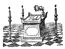
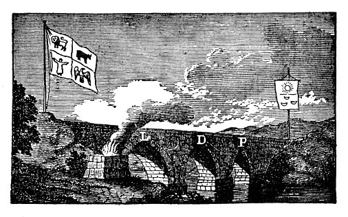
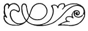

  
[Intangible Textual Heritage](../../index)  [Freemasonry](../index) 
[Index](index)  [Previous](md15)  [Next](md17) 

------------------------------------------------------------------------

[Buy this Book at
Amazon.com](https://www.amazon.com/exec/obidos/ASIN/B0022NGNCW/internetsacredte)

------------------------------------------------------------------------

  
*Morals and Dogma*, by Albert Pike, \[1871\], at Intangible Textual
Heritage

------------------------------------------------------------------------

p. 237

# MORALS AND DOGMA

# CHAPTER OF ROSE CROIX

 

### XV.

### KNIGHT OF THE EAST OR OF THE SWORD.

### \[Knight of the East, of the Sword, or of the Eagle.\]

THIS Degree, like all others in Masonry, is symbolical. Based upon
historical truth and authentic tradition, it is still an allegory. The
leading lesson of this Degree is Fidelity to obligation, and Constancy
and Perseverance under difficulties and discouragement.

Masonry is engaged in her crusade, against ignorance, intolerance,
fanaticism, superstition, uncharitableness, and error. She does not sail
with the trade-winds, upon a smooth sea, with a steady free breeze, fair
for a welcoming harbor; but meets and must overcome many opposing
currents, baffling winds, and dead calms.

The chief obstacles to her success are the apathy and faithlessness of
her own selfish children, and the supine indifference of the world. In
the roar and crush and hurry of life and business, and the tumult and
uproar of politics, the quiet voice of Masonry is unheard and unheeded.
The first lesson which one learns, who engages in any great work of
reform or beneficence, is, that men are essentially careless, lukewarm,
and indifferent as to everything that does not concern their own
personal and immediate

p. 238

welfare. It is to single men, and not to the united efforts of many,
that all the great works of man, struggling toward perfection, are
owing. The enthusiast, who imagines that he can inspire with his own
enthusiasm the multitude that eddies around him, or even the few who
have associated themselves with him as co-workers, is grievously
mistaken; and most often the conviction of his own mistake is followed
by discouragement and disgust. To do all, to pay all, and to suffer all,
and then, when despite all obstacles and hindrances, success is
accomplished, and a great work done, to see those who opposed or looked
coldly on it, claim and reap all the praise and reward, is the common
and almost universal lot of the benefactor of his kind.

He who endeavors to serve, to benefit, and improve the world, is like a
swimmer, who struggles against a rapid current, in a river lashed into
angry waves by the winds. Often they roar over his head, often they beat
him back and baffle him. Most men yield to the stress of the current,
and float with it to the shore, or are swept over the rapids; and only
here and there the stout, strong heart and vigorous arms struggle on
toward ultimate success.

It is the motionless and stationary that most frets and impedes the
current of progress; the solid rock or stupid dead tree, rested firmly
on the bottom; and around which the river whirls and eddies: the Masons
that doubt and hesitate and are discouraged; that disbelieve in the
capability of man to improve; that are not disposed to toil and labor
for the interest and well-being of general humanity; that expect others
to do all, even of that which they do not oppose or ridicule; while they
sit, applauding and doing nothing, or perhaps prognosticating failure.

There were many such at the rebuilding of the Temple. There were
prophets of evil and misfortune--the lukewarm and the in-different and
the apathetic; those who stood by and sneered; and those who thought
they did God service enough if they now and then faintly applauded.
There were ravens croaking ill omen, and murmurers who preached the
folly and futility of the attempt. The world is made up of such; and
they were as abundant then as they are now.

But gloomy and discouraging as was the prospect, with lukewarmness
within and bitter opposition without, our ancient brethren persevered.
Let us leave them engaged in the good work, and whenever to us, as to
them, success is uncertain, remote, and

p. 239

contingent, let us still remember that the only question for us to ask,
as true men and Masons, is, what does duty require; and not what will be
the result and our reward if we do our duty. Work on, with the Sword in
one hand, and the Trowel in the other!

Masonry teaches that God is a Paternal Being, and has an interest in his
creatures, such as is expressed in the title *Father*; an interest
unknown to all the systems of Paganism, untaught in all the theories of
philosophy; an interest not only in the glorious beings of other
spheres, the Sons of Light, the dwellers in Heavenly worlds, but in us,
poor, ignorant, and unworthy; that He has pity for the erring, pardon
for the guilty, love for the pure, knowledge for the humble, and
promises of immortal life for those who trust in and obey Him.

Without a belief in Him, life is miserable, the world is dark, the
Universe disrobed of its splendors, the intellectual tie to nature
broken, the charm of existence dissolved, the great hope of being lost;
and the mind, like a star struck from its sphere, wanders through the
infinite desert of its conceptions, without attraction, tendency,
destiny, or end.

Masonry teaches, that, of all the events and actions, that take place in
the universe of worlds and the eternal succession of ages, there is not
one, even the minutest, which God did not forever foresee, with all the
distinctness of immediate vision, combining all, so that man's free will
should be His instrument, like all the other forces of, nature.

It teaches that the soul of man is formed by Him for a purpose; that,
built up in its proportions, and fashioned in every part, by infinite
skill, an emanation from His spirit, its nature, necessity, and design
are virtue. It is so formed, so moulded, so fashioned, so exactly
balanced, so exquisitely proportioned in every part, that sin introduced
into it is misery; that vicious thoughts fall upon it like drops of
poison; and guilty desires, breathing on its delicate fibres, make
plague-spots there, deadly as those of pestilence upon the body. It is
made for virtue, and not for vice; for purity, as its end, rest, and
happiness. Not more vainly would we attempt to make the mountain sink to
the level of the valley, the waves of the angry sea turn back from its
shores and cease to thunder upon the beach, the stars to halt in their
swift courses, than to change any one law of our own nature. And one of
those laws, uttered by God's voice, and speaking through every nerve

p. 240

and fibre, every force and element, of the moral constitution He has
given us, is that we must be upright and virtuous; that if tempted we
must resist; that we must govern our unruly passions, and hold in hand
our sensual appetites. And this is not the dictate of an arbitrary will,
nor of some stern and impracticable law; but it is part of the great
firm law of harmony that binds the Universe together: not the mere
enactment of arbitrary will; but the dictate of Infinite Wisdom.

We know that God is good, and that what He does is right. This known,
the works of creation, the changes of life, the destinies of eternity,
are all spread before us, as the dispensations and counsels of infinite
love. This known, we then know that the love of God is working to
issues, like itself, beyond all thought and imagination good and
glorious; and that the only reason why we do not understand it, is that
it is *too* glorious for us to understand. God's love takes care for
all, and nothing is neglected. It watches over all, provides for all,
makes wise adaptations for all; for age, for infancy, for maturity, for
childhood; in every scene of this or another world; for want, weakness,
joy, sorrow, and even for sin. All is good and well and right; and shall
be so forever. Through the eternal ages the light of God's beneficence
shall shine hereafter, disclosing all, consummating all, rewarding all
that deserve reward. Then we shall see, what now we can only believe.
The cloud will be lifted up, the gate of mystery be passed, and the full
light shine forever; the light of which that of the Lodge is a symbol.
Then that which caused us trial shall yield us triumph; and that which
made our heart ache shall fill us with gladness; and we shall then feel
that there, as here, the only true happiness is to learn, to advance,
and to improve; which could not happen unless we had commenced with
error, ignorance, and imperfection. We must pass through the darkness,
to reach the light.

 

------------------------------------------------------------------------

[Next: XVI. Prince of Jerusalem](md17)
