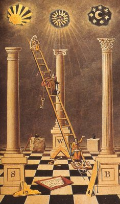

  
[Intangible Textual Heritage](../../index)  [Masonry](../index) 

------------------------------------------------------------------------

[Buy this Book at
Amazon.com](https://www.amazon.com/exec/obidos/ASIN/0517331942/internetsacredte)

------------------------------------------------------------------------

[Buy this Book on
Kindle](https://www.amazon.com/exec/obidos/ASIN/B002J9HH2O/internetsacredte)

------------------------------------------------------------------------

<table width="75%">
<colgroup>
<col style="width: 50%" />
<col style="width: 50%" />
</colgroup>
<tbody>
<tr class="odd">
<td width="50%" data-valign="TOP"> 
First Degree Board, by J. Bowring [1891] (Public Domain Image)</td>
<td width="50%" data-valign="CENTER"><h1 id="the-meaning-of-masonry" data-align="CENTER">The Meaning of Masonry</h1>
<h2 id="by-w.l.-wilmshurst" data-align="CENTER">by W.L. Wilmshurst</h2>
<h4 id="section" data-align="CENTER">[1922]</h4></td>
</tr>
</tbody>
</table>

------------------------------------------------------------------------

[Contents](#contents)    [Start Reading](mom00)    [Page
Index](pageidx)    [Text \[Zipped\]](mom.txt.gz)

------------------------------------------------------------------------

|                                                                                                                           |
|---------------------------------------------------------------------------------------------------------------------------|
|  |

This is a set of essays which discuss the esoteric side of Masonry. The
author, Walter Leslie Wilmshurst, (b. 1867, d. 1939) attempts to
demonstrate that Masonry has a deeper meaning, specifically the striving
for human perfection, and is firmly in the mainstream of traditional
mystery teachings.

------------------------------------------------------------------------

 [Title Page](mom00)  
[Contents](mom01)  
[Introduction](mom02)  
[Chapter I. The Deeper Symbolism of Freemasonry](mom03)  
[Chapter II. Masonry as a Philosophy](mom04)  
[Chapter III. Further Notes on Craft Symbolism](mom05)  
[Chapter IV. The Holy Royal Arch of Jerusalem](mom06)  
[Chapter V. Freemasonry in Relation to the Ancient Mysteries](mom07)  
