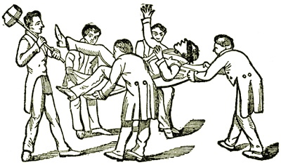

  
[Intangible Textual Heritage](../../index)  [Freemasonry](../index) 

------------------------------------------------------------------------

[Buy this Book at
Amazon.com](https://www.amazon.com/exec/obidos/ASIN/B002E9II90/internetsacredte)

------------------------------------------------------------------------

<table width="75%">
<colgroup>
<col style="width: 50%" />
<col style="width: 50%" />
</colgroup>
<tbody>
<tr class="odd">
<td width="50%" data-valign="TOP"></td>
<td width="50%" data-valign="CENTER"><h1 id="illustrations-of-masonry" data-align="CENTER">Illustrations of Masonry</h1>
<h2 id="by-william-morgan" data-align="CENTER">by William Morgan</h2>
<h4 id="section" data-align="CENTER">[1827]</h4></td>
</tr>
</tbody>
</table>

------------------------------------------------------------------------

[Contents](#contents)    [Start Reading](morg00)    [Page
Index](pageidx)    [Text \[Zipped\]](morg.txt.gz)

------------------------------------------------------------------------

|                                                                                                                           |
|---------------------------------------------------------------------------------------------------------------------------|
|  |

This book has a controversial backstory which is part of the mythology
of anti-Freemasonry. 'Captain' William Morgan, the author, was a
disappointed Freemason in Batavia, New York. Rejected by the local
lodge, he announced that he was going to publish a work exposing Masonic
rituals and secrets. Shortly before publication in 1826, he disappeared,
and three Masons were later convicted of kidnapping him. Although claims
were made that Morgan had been murdered, some say that he was forced to
leave the US. Either way, it was good publicity for this book, which was
published in 1827, but bad for the Masons. The incident led to
widespread protests against Freemasons in the US, and eventually an
anti-Masonic Party, which at its height in 1832 got seven electoral
votes for William Wirt for President.

So why read this book? Stripped of the fevered historical background,
and ignoring the publisher's antimasonic introduction, this becomes
simply one of the first published accounts of US Freemasonry in the
early 19th century. It seems accurate, based on other published
Monitors, such as [Ducan's](../dun/index). At this perspective,
Illustrations is no more offensive than Robert's Rules of Order,
although it makes more interesting reading.

Production Notes: I have, as is the usual practice, silently cleaned up
egregious punctuation errors in the text, particularly quotation marks.
There were no obvious chapter breaks, so I have inserted file breaks at
logical boundaries in the text. As usual, any text in small green type
was added to the text by the transcriber.--J. B. Hare.

------------------------------------------------------------------------

 [Title Page](morg00)  
[Verso](morg01)  
[Introduction](morg02)  

### Illustrations of Masonry

[Opening the Lodge](morg03)  
[First Degree Initiation](morg04)  
[Closing the Lodge](morg05)  
[First Section of the Lecture on the First Degree](morg06)  
[Second Section of the Lecture on the First Degree](morg07)  
[Third Section of the Lecture on the First Degree](morg08)  
[Second or Fellow Craft Degree Initiation](morg09)  
[First Section of the Fellow Craft Mason Lecture](morg10)  
[Second Section of the Fellow Craft Mason Lecture](morg11)  
[Third, or Master Mason's Degree](morg12)  
[First Section of the Master Mason Lecture.](morg13)  
[Second Section of the Master Mason Lecture.](morg14)  
[Second Section of the Master Mason Lecture](morg15)  

### Freemasonry at a Glance

[Entered Apprentice Degree](morg16)  
[Fellow Craft Degree](morg17)  
[Master Mason's Degree](morg18)  
