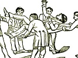

  
[Intangible Textual Heritage](../../index)  [Freemasonry](../index) 
[Index](index)  [Previous](morg00)  [Next](morg02) 

------------------------------------------------------------------------

[Buy this Book at
Amazon.com](https://www.amazon.com/exec/obidos/ASIN/B002E9II90/internetsacredte)

------------------------------------------------------------------------

  
*Illustrations of Masonry*, by William Morgan, \[1827\], at Intangible
Textual Heritage

------------------------------------------------------------------------

p. ii

*Northern District of New York to wit:*

|                     |
|---------------------|
|  |

Be it Remembered, That on the fourteenth
day of August, in the fifty-first year of the Independence of the United
States of America, A. D. 1826, William Morgan, of the said  district,
hath deposited in this office the title of a book, the right whereof he
claims as author, in the words following, to wit:—

"Illustrations of Masonry, by one of the fraternity who has devoted
thirty years to the subject. 'God said, Let there be light, and there
was light.'"

In conformity to the act of Congress of the United States, entitled "An
act for the encouragement of learning, by securing the copies of maps,
charts and books, to the authors and proprietors of such copies, during
the time therein mentioned," and also to the act entitled "An act
supplementary to the act entitled 'An act for the encouragement of
learning, by securing the copies of maps, charts and books, to the
authors and proprietors of such copies, during the time therein
mentioned,' and extending the benefits thereof to the arts of designing,
engraving, and etching historical and other prints."

R. R. LANSING,         

*Clerk of the Northern District of N. Y.*

------------------------------------------------------------------------

[Next: Introduction](morg02)
