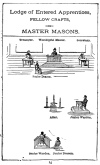
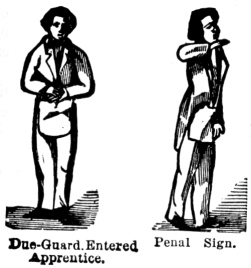

  
[Intangible Textual Heritage](../../index)  [Freemasonry](../index) 
[Index](index)  [Previous](morg02)  [Next](morg04) 

------------------------------------------------------------------------

[Buy this Book at
Amazon.com](https://www.amazon.com/exec/obidos/ASIN/B002E9II90/internetsacredte)

------------------------------------------------------------------------

  
*Illustrations of Masonry*, by William Morgan, \[1827\], at Intangible
Textual Heritage

------------------------------------------------------------------------

p. 10 p. 11

### Opening the Lodge

##### ILLUSTRATIONS

###### —OF—

# MASONRY, ETC.

**A Description of the Ceremonies used in opening a  
Lodge of Entered Apprentice Masons; which is the  
same in all upper degrees, with the exception  
of the difference in the signs, due-guards,  
grips, pass-grips, words and their several  
names; all of which will be  
given and explained in their  
proper places as the  
work progresses.**

One rap calls the lodge to order—one calls up the Junior and Senior
Deacons—two raps call up all the subordinate officers, and three, all
the members of the lodge.

The Master having called the lodge to order, and the officers all
seated, the Master says to the Junior Warden, 'Brother Junior, are they
all Entered Apprentice Masons in the south?'

Ans. 'They are, Worshipful.'

Master to the Senior Warden, 'Brother Senior, are they all Entered
Apprentice Masons in the west?'

Ans. 'They are, Worshipful.'

The Master then says, 'They are, in the east,' at the same time he gives
a rap with the common gavel or mallet, which calls up both Deacons.

Master to Junior Deacon, 'Brother Junior, the first care of a Mason?'

Ans. 'To see the lodge tyled, Worshipful.'

Master to Junior Deacon, 'Attend to that part of your duty, and inform
the Tyler that we are about to open a lodge of Entered Apprentice
Masons, and direct him to tyle accordingly.' The Junior Deacon then
steps to the door and gives three raps, which are answered by three raps
from without; the Junior Deacon then gives one, which is also answered
by the Tyler with one; the door is then partly opened and the Junior
Deacon delivers his message, and resumes his situation

p. 12

and says, 'The door is tyled, Worshipful.' (at the same time giving the
due-guard, which is never omitted when the Master is addressed.)

The Master to Junior Deacon, 'Brother, by whom?'

Ans. 'By a Master Mason without the door, armed with the proper
implement of his office.'

Master to Junior Deacon, 'His duty there?'

Ans. 'To keep off all cowans and eaves-droppers, see that none pass or
repass without permission from the Master.' (Some say without permission
from the chair.)

Master to Junior Deacon, 'Brother Junior, your place in the lodge?'

Ans. 'At the right hand of the Senior Warden in the west.'

Master to Junior Deacon, 'Your business there, Brother Junior?'

Ans. 'To wait on the Worshipful Master and Wardens, act as their proxy
in the active duties of the lodge, and take charge of the door.'

Master to Junior Deacon, 'The Senior Deacon's place in the lodge?'

Ans. 'At the right hand of the Worshipful Master in the east.' \[The
Master, while asking the last questions gives two raps, which call up
all the subordinate officers.\]

Master to Senior Deacon, 'Your duty there, Brother Senior?'

Ans. 'To wait on the Worshipful Master and Wardens, act as their proxy
in the active duties of the lodge, attend to the preparation and
introduction of candidates, and welcome and clothe all visiting
Brethren. \[*i.e.*, furnish them with an apron.\]

Master to Senior Deacon, 'The Secretary's place in the lodge, Brother
Senior?'

Ans. 'At the left hand of the Worshipful Master in the east.'

Master to the Secretary, 'Your duty there, Brother Secretary?'

Ans. 'The better to observe the Worshipful Master's will and pleasure,
record the proceedings of the lodge; transmit a copy of the same to the
Grand Lodge, if required; receive all moneys and money bills from the
hands of the Brethren, pay them over to the Treasurer, and take his
receipt for the same.'

p. 13

The Master to the Secretary, 'The Treasurer's place in the lodge?'

Ans. 'At the right hand of the Worshipful Master.'

Master to Treasurer, 'Your duty there, Brother Treasurer?'

Ans. 'Duly to observe the Worshipful Master's will and pleasure; receive
all moneys and money bills from the hands of the Secretary; keep a just
and true account of the same; pay them out by order of the Worshipful
Master and consent of the Brethren.'

The Master to the Treasurer, "The Junior Warden's place in the lodge,
Brother Treasurer?'

Ans. 'In the south, Worshipful.'

Master to Junior Warden, 'Your business there, Brother Junior?'

Ans. 'As the sun in the south at high meridian is the beauty and glory
of the day, so stands the Junior Warden in the south, the better to
observe the time, call the crafts from labor to refreshment, superintend
them during the hours thereof, see that none convert the hours of
refreshment into that of intemperance or excess; and call them out again
in due season, that the Worshipful Master may have honor, and they
profit and pleasure thereby.'

Master to the Junior Warden, 'The Senior Warden's place in the lodge?'

Ans. 'In the west, Worshipful.'

Master to Senior Warden, 'Your duty there, Brother Senior?'

Ans. 'As the sun sets in the west to close the day, so stands the Senior
Warden in the west to assist the Worshipful Master in opening his lodge,
take care of the jewels and implements, see that none be lost, pay the
craft their wages, if any be due, and see that none go away
dissatisfied.'

Master to the Senior Warden, 'The Master's place in the lodge?'

Ans. 'In the east, Worshipful.'

Master to the Senior Warden, 'His duty there?'

Ans. 'As the sun rises in the east to open and adorn the

p. 14

  [  
Click to enlarge](img/01400.jpg)

p. 15

day, so presides the Worshipful Master in the east to open and adorn his
lodge, set his crafts to work with good and wholesome laws, or cause the
same to be done.' The Master now gives three raps, when all the brethren
rise, and the Master taking off his hat, proceeds as follows: In like
manner so do I, strictly forbidding all profane language, private
committees, or any other disorderly conduct whereby the peace and
harmony of this lodge may be interrupted while engaged in its lawful
pursuits, under no less penalty than the by-laws, or such penalty as the
majority of the Brethren present may see fit to inflict. Brethren,
attend to giving the signs.' \[Here lodges differ very much. In some
they declare the lodge opened as follows, before they give the signs:\]

|                    |
|--------------------|
|  |

The Master (all the Brethren imitating him) extends his left arm from
his body so as to form an angle of about forty-five degrees, and holds
his right hand transversely across his left, the palms thereof about one
inch apart. This is called the Due Guard, and alludes to the position a
Candidate's hands are placed in when he takes the obligation of an
Entered Apprentice Mason. The Master then draws his right hand across
his throat, the hand open, with the thumb next to his throat, and drops
it down by his side. This is called the penal sign of an Entered
Apprentice Mason, (many call it sign) and alludes to the penalty of the
obligation. (See obligation.) The Master Then declares the lodge opened
in the following manner: 'I vow declare this lodge of Entered Apprentice
Masons duly opened for dispatch of business.' The Senior Warden declares
it to the Junior Warden, and he to the Brethren. 'Come, Brethren, let us
pray.'—One of the following prayers is used:

Most holy and glorious God! the great architect of the Universe; the
giver of all good gifts and graces: Thou hast promised that 'Where two
or three are gathered together in thy name, thou wilt be in the midst of
them and bless them.' In thy name we assemble, most humbly beseeching
thee to bless us in all our undertakings; that we may know and

p. 16

serve thee aright, and that all our actions may tend to thy glory and
our advancement in knowledge and virtue. And we beseech thee, O Lord
God, to bless our present assembling; and to illuminate our minds
through the influence of the Son of Righteousness, that we may walk in
the light of thy countenance; and when the trials of our probationary
state are over, be admitted into the temple, not made with hands,
eternal in the heavens. Amen. So mote it be.

*Another prayer, as often used at opening as closing:*

Behold, how good and pleasant it is for brethren to dwell together in
unity; it is like the precious ointment upon the head, that ran down
upon the beard, even Aaron's beard, that went down to the skirts of his
garment; as the dew of Hermon, and as the dew that descended upon the
mountains of Zion, for there the Lord commanded the blessing, even life
forever more. Amen. So mote it be.

The lodge being now open and ready to proceed to business, the Master
directs the Secretary to read the minutes of the last meeting, which
naturally brings to view the business of the present.

------------------------------------------------------------------------

[Next: First Degree Initiation](morg04)
