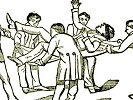

  
[Intangible Textual Heritage](../../index)  [Freemasonry](../index) 
[Index](index)  [Previous](morg15)  [Next](morg17) 

------------------------------------------------------------------------

[Buy this Book at
Amazon.com](https://www.amazon.com/exec/obidos/ASIN/B002E9II90/internetsacredte)

------------------------------------------------------------------------

  
*Illustrations of Masonry*, by William Morgan, \[1827\], at Intangible
Textual Heritage

------------------------------------------------------------------------

p. 104

### FREEMASONRY AT A GLANCE.

#### ENTERED APPRENTICE DEGREE.

|                    |
|--------------------|
|  |

The Holy Bible on the altar is usually opened at the 123d Psalm and the
square and compass placed thereon, the latter open and both points
placed below the square.

|                    |
|--------------------|
|  |

Preparation of Candidate Entered Apprentice
Degree.—He is ushered into the "*preparation* room," where he
meets the Junior Deacon and Stewards who divest him of all his clothing
except his shirt. He is then handed an old pair of drawers which he puts
on; the left leg is rolled up above the knee; the left sleeve of the
shirt is rolled up above the elbow, a hoodwink is fastened over both
eyes, a rope, called a cable-tow, is put once around his neck, and a
slipper (with the heel slip-shod) is put upon the *right* foot.

|                    |
|--------------------|
|  |

Due Guard of An Entered Apprentice—Hold
out the left hand a little in front of the body and in a line with the
lower button of the vest, the hand being open and palm turned upward.
Now place the right hand horizontally across the left and about two or
three inches above it.

Penal Sign of an Entered Apprentice.—Made
from the due-guard by dropping the left hand carelessly; at the same
time raise the right arm and draw the hand, still open, across the
throat, thumb

p. 105

next the throat, and drop the hand perpendicularly by the side. These
movements ought to be made in an off hand manner, without stiffness.

Sign without Due-Guards— (The usual way
outside the lodge.) Simply draw the open hand carelessly across the
threat and let it fall down by the side.

  [  
Click to enlarge](img/10500.jpg)  
Candidate taking Entered Apprentice Obligation.  

Worshipful Master to Candidate:—"You will advance to the altar, kneel
upon your naked left knee, your right forming a square, your left hand
supporting the holy Bible, square and compass, your right resting
thereon, in which due form you will say, I, with your name in full, and
repeat after me."

|                    |
|--------------------|
|  |

Grip of an Entered Apprentice.—Take hold
of each other's hands as in ordinary hand-shaking and press the top of
your thumb hard against the first knuckle-joint of the first finger near
the hand. If the person whom you are shaking hands with is a Mason, he
will generally return a like pressure on your hand.

p. 106

Entered Apprentice Word—Boaz. It is the
name of this grip.

Entered Apprentice Step.—Step off one
step with the left foot and bring the heel of your right foot to the
hollow of your left.

------------------------------------------------------------------------

[Next: Fellow Craft Degree](morg17)
