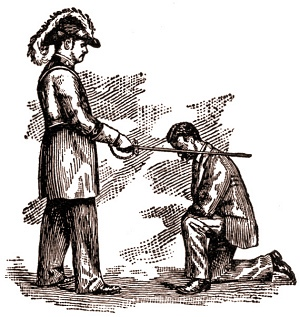

  
[Intangible Textual Heritage](../../index)  [Freemasonry](../index) 

------------------------------------------------------------------------

[Buy this Book at
Amazon.com](https://www.amazon.com/exec/obidos/ASIN/0766158284/internetsacredte)

------------------------------------------------------------------------

<table width="75%">
<colgroup>
<col style="width: 50%" />
<col style="width: 50%" />
</colgroup>
<tbody>
<tr class="odd">
<td width="50%" data-valign="TOP"></td>
<td width="50%" data-valign="CENTER"><h1 id="shibboleth-a-templar-monitor" data-align="CENTER">Shibboleth: A Templar Monitor</h1>
<h2 id="by-george-cooper-connor" data-align="CENTER">by George Cooper Connor</h2>
<h4 id="section" data-align="CENTER">[1894]</h4></td>
</tr>
</tbody>
</table>

------------------------------------------------------------------------

[Contents](#contents)    [Start Reading](shib00)    [Page
Index](pageidx)    [Text \[Zipped\]](shib.txt.gz)

------------------------------------------------------------------------

|                                                                                                                           |
|---------------------------------------------------------------------------------------------------------------------------|
|  |

This is a nineteenth century 'Monitor' of the American Knights Templar.
This is a Masonic organization which has its own distinctive rituals and
regalia. While they are not connected directly to the [Medieval
Templars](../../sro/index), they carry on the knightly ideals by
charitable works, and sponsoring Masonic youth groups.

Shibboleth is similar in format and organization to other 19th century
Masonic literature such as [Duncan's Masonic Ritual and
Monitor](../dun/index), including the funky woodcuts and 19th century
atmosphere. Mixed in with this is historical material on the Templars,
stories from the Bible, songs, poetry, sermons, a lot of blank forms for
all occasions, and bits of advice. For instance, 'Hints on Templar
Banquets' notes: 'Never permit smoking when ladies are present...'

------------------------------------------------------------------------

 [Title Page](shib00)  
[Dedication](shib01)  
[Preface to Fifth Edition](shib02)  
[Note by the Publishers](shib03)  
[Monitorial Instructions](shib04)  
[Order of the Red Cross](shib05)  
[To Open a Council of the Red Cross](shib06)  
[The Records of our Fathers](shib07)  
[The Journey](shib08)  
[The Immemorial Discussion](shib09)  
[Three Ancient Cities of Persia](shib10)  
[Concluding Remarks](shib11)  
[History of the Order of the Temple](shib12)  
[History of the Order in the United States](shib13)  
[Original Templar Grand Masters](shib14)  
[Banners, Crosses and Paraphernalia](shib15)  
[Officers of a Commandery](shib16)  
[To Open a Commandery](shib17)  
[The Work](shib18)  
[Second House of the Templars](shib19)  
[Third House of the Templars](shib20)  
[Close of Seven Years of Preparation](shib21)  
[The Banners](shib22)  
[Historical Lecture](shib23)  
[The Charge](shib24)  
[To Close the Commandery](shib25)  
[A Ritualistic Commentary](shib26)  
[The So-Called Vision of Constantine](shib27)  
[An Historical Fact](shib28)  
[Dress of the Ancient Templars](shib29)  
[The Ancient Motto](shib30)  
[“It Is Finished”](shib31)  

### Appendix

[Dedication and Consecration of Asylums](shib32)  
[Constituting New Commanderies](shib33)  
[Installation of Officers of a Commandery](shib34)  
[Grand Commanderies](shib35)  
[Installation of Grand Encampment](shib36)  
[Templar Uniform](shib37)  
[Burial Service](shib38)  
[The Order of Malta](shib39)  

### Second Appendix

[Calendars](shib40)  
[Knight Templar Grand Jurisdictions of the United States](shib41)  
[The Name of God in Twenty-Two Languages](shib42)  
[Popular Abbreviations](shib43)  
[Some Words Not Fully Understood](shib44)  
[Fraternity Music](shib45)  
[Templar Forms](shib46)  

### Third Appendix

[Reception of Grand Visitors](shib47)  
[Hints to Eminent Commanders](shib48)  
[Rules of Order](shib49)  
[A Form of Divine Worship on Ascension Day, and Other
Occasions](shib50)  
[Ritual of a Commandery of Sorrow](shib51)  
[The Christmas Observance](shib52)  
[Form of Recorder's Minutes](shib53)  
[Asylum, and Prelate's Hall](shib54)  
[Hints on Templar Banquets](shib55)  
[Index](shib56)  
