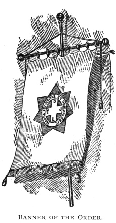
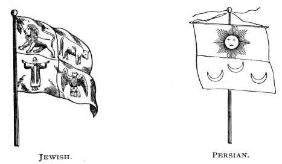
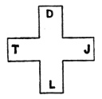

  
[Intangible Textual Heritage](../../index)  [Freemasonry](../index) 
[Index](index)  [Previous](shib03)  [Next](shib05) 

------------------------------------------------------------------------

[Buy this Book at
Amazon.com](https://www.amazon.com/exec/obidos/ASIN/0766158284/internetsacredte)

------------------------------------------------------------------------

  
*Shibboleth: A Templar Monitor*, by George Cooper Connor, \[1894\], at
Intangible Textual Heritage

------------------------------------------------------------------------

p. 7

##### THE ILLUSTRIOUS

# ORDER OF THE RED CROSS.

###### Monitorial Instructions, Notes, Comments, and Suggestions.

#### A FEW HINTS TO COMMANDERS.

It is the earnest desire of the author of
this Monitor to discover that all the Commanderies invest the beautiful,
instructive and entertaining Order of the Red Cross with the interest
its importance demands. The Ritual provides ample opportunity for the
display of true dramatic taste, both in robing and in reading. It also
presents the great central thought of the Order,—Truth,—as it has never been presented previous
to the adoption at Denver.

The feeling had become almost universal that the Order of the Red Cross
was of slight importance, and was at best little more than a social
observance. Hence the ceremonials were hurried over, the candidate was
practically told that it was mere matter of form, and he went away
profoundly impressed that the Commandery was indeed a jovial
institution. Never was a graver mistake, and the impression so made was
more injurious than beneficial. The Ritual now adopted can not fail to
correct that erroneous view of the value of the Order.

The Order of the Red Cross should, if possible, be conferred upon
classes, and be made the occasion of social intercourse among the
members; the healing of wounds, the forming of new bonds of fraternity.
The lessons of the ceremonies tend to these noble ends, and by
conferring them with the dignity and pathos they merit those ends will
be assuredly attained. See with what fervor of gratitude the newly
created Companions will hereafter refer to the name they assumed, and
the character they represented. There can be no nobler, and if the work
is done with the devotion to dramatic effects which the Ritual demands,
that name and character will never be forgotten.

p. 8

\[paragraph continues\] Hence the
propriety of the Refection at the close of the work of the Council.

Commanders will advance the interests of the bodies they govern by
securing full paraphernalia and equipments. The robes need not be
expensive, but should be appropriate. It is of the greatest importance
that the Grand Council, Companion Conductor, Warder and Guards be in
Jewish robes and turbans. It is equally important that the Persian
Guards should wear a uniform different from that of the 

|                                       |
|---------------------------------------|
|  |

Order of the Red Cross, an Order not then founded, technically speaking.

The Princes of Persia and the Rulers of Media should wear oriental
robes, and the Master of Cavalry should also be in Persian dress. The
Sovereign Master, Prince Chancellor and Prince Master of the Palace wear
the regulation robes.

The seating of the Princes and Rulers, fully robed, should be in such
form as to produce the best effects upon the Jewish Prince. No fixed
floor plan can be laid down, because of the variations in the different
Audience Chambers. Here Commanders will use their discretion.

In reading the lines of the Addresses be natural above all things.
Affect no so-called dramatic or oratorical tones. Invest each scene with
earnestness and pathos, as demanded. Allow no frivolous allusions, or
undignified liberties to be taken with Z. Play the King according to your best conception of
royalty. See that the Means of Recognition are imparted with great care
and accuracy. Let the dignified Order of the Red Cross be indeed a
preparation for the solemn Order of the Temple.

#### THE BANNER OF THE ORDER.

It is of green color. In its center is a star of seven points, painted
on gold, within which is painted the blood-red Cross of the

p. 9

\[paragraph continues\] Order, surrounded
by the Motto: "Magna est Veritas, et Prævalebit." The letters on the
arms of the Cross are black.

 

#### THE RED CROSS OF THE ORDER.

It is of blood-red color, of equal arms and angles, with the letters on
the extremities of the arms, D T J L.

|                                             |
|---------------------------------------------|
|  |

The four arms, thus indicating Deity, Truth, Justice and Liberty,
commemorate our faith in God, and in the grand characteristics of the
Order.

This Cross is the Jewel of the Order, and may be properly worn by the
members thereof, suspended by a green and red ribbon.

 

------------------------------------------------------------------------

[Next: Order of the Red Cross](shib05)
