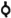

  
[Intangible Textual Heritage](../../index)  [Freemasonry](../index) 
[Index](index)  [Previous](shib04)  [Next](shib06) 

------------------------------------------------------------------------

[Buy this Book at
Amazon.com](https://www.amazon.com/exec/obidos/ASIN/0766158284/internetsacredte)

------------------------------------------------------------------------

  
*Shibboleth: A Templar Monitor*, by George Cooper Connor, \[1894\], at
Intangible Textual Heritage

------------------------------------------------------------------------

p. 10

### ORDER OF THE RED CROSS.

THE learned Sir Alfred Creigh, whose name is a household word among
American Knights Templar, used the following language in a report to the
Grand Commandery of Pennsylvania, September, 1867:

"The Ritual of the Red Cross was manufactured by Webb and his associates
from kindred degrees not of this Order. It requires no argument to
demonstrate that this degree has no connection whatever with the orders
of Christian knighthood, nor never should have been incorporated into an
order whose sublime teachings are of Jesus as the Redeemer of the
world—in his mediatorial character, as the way, the truth and the life."

The equally scholarly and thoughtful Sir George S. Blackie made a report
to the Grand Commandery of Tennessee, May 9, 1871, in which he used the
following strong language:

"The inconsistency is glaring—the ceremonies are foreign to Christian
knighthood. How utterly out of place does the Christian candidate appear
when, as a preliminary to the glorious truths of the New Testament, he
is introduced to a Jewish Sanhedrin, captured by pagan soldiers, and
after having been entertained with an apocryphal legend at the banquet
of a pagan monarch, he is sent out into the world without having heard
of the name of Christ."

The *unanimous* adoption of the revised Ritual of the Illustrious Order
of the Red Cross by the Grand Encampment, in Denver, on August 10, 1892,
explains and settles the misconceptions of these dear Fratres forever,
and yet a few words may not be out of place at this time.

The Illustrious Order of the Red Cross is not a pagan rite, nor is it a
mere social observance. It is an Order founded upon Truth, recognizing the God of Truth as the only one true and living
God. As such it is a proper preparation for the solemnities of the Order
of the Temple.

Darius believed in the same one that Israel did when he registered a vow
with that God to rebuild His Temple in the destroyed

p. 11

city of Jerusalem. No doubt he registered that vow under the promptings
of his Jewish friend, Prince Zerubbabel, who was the recognized Chosen
of God. Darius kept that vow, demonstrating his love of Truth and his reverence for Judah's Jehovah.

The most exalted Truth was present
implicitly, in Judaism, and the Law of Judaism was the schoolmaster that
brought us to Christianity. The most exalted Truth is now explicit in Christianity. In
Judaism it was the seed, then the blade, and then Christianity ripened
it into the ear. So is the Truth of all
truths implicitly in the Order of the Red Cross, and the candidate finds
that same truth, but explicitly, in the Order of the Temple.

As Judaism was a preparation for Christianity, so let, the Illustrious
Order of the Red Cross be a preparation for the Christian Order of the
Temple.

#### HISTORICAL SKETCH.

The Scriptures inform us that for their own sins, and those of their
forefathers, the Jewish people were led into captivity by Nebuzaradan,
chief Captain of Nebuchadnezzar, King of Babylon. As slaves they tilled
the valleys of the Euphrates, and of the Tigris, until Cyrus destroyed
the Chaldean dynasty.

During that captivity Zerubbabel, Crown Prince of the House of Judah,
and Darius, son of Hystaspes, formed an alliance of friendship which was
probably terminated with death only.

One of the first acts of the conqueror Cyrus was the liberation of the
Jewish captives; he then permitted them to return to Judea, that they
might rebuild the city of Jerusalem and its Temple, which Nebuchadnezzar
had destroyed.

The foundation stone of the Second Temple was laid 535 years before
Christ; Zerubbabel, the Royal Prince, Joshua, the High Priest, and
Haggai, the Prophet, laying the same.

Cyrus died, and his son, Cambyses, succeeded him on the Medo-Persian
throne. On complaint of the Cutheans, and other contiguous tribes,
Cambyses commanded the work upon the city and Temple to cease. During
the nine years that followed, scarcely anything was done on the walls of
Jerusalem, or its Temple.

Cambyses died and the Magians seized the throne, from which their
usurper was driven with great slaughter, in a little over a year. Then
the Seven Great Families of Persia laid hold of the government, and
Darius ascended the throne. He appointed Zerubbabel,

p. 12

his friend, to be the Governor of the Jews that had returned to
Jerusalem under the decree of the great Cyrus, and afterwards made him
stand in the royal bed-chamber, as the Guard of his body. There were
three of these Guards, and they were chosen because of the monarch's
implicit confidence in their loyalty.

Fifteen years after the Jews had laid the foundation of the Second
Temple they were forced to call a Grand Council to consult about the
state of the country. Cambyses was dead, and the Magian usurper,
Smerdis, had been driven from the throne, to give place to Darius, son
of Hystaspes, whose favoring of the Jews was believed to be almost as
marked as was that of the great Cyrus.

Darius spread a feast at his capital, and invited thereto the Princes of
Persia and the Rulers of the Medes. That feast having been thoroughly
enjoyed, "they every one departed to go to bed at their own houses, and
Darius, the King, went to bed."

The King slept lightly, and awakening he fell into conversation with his
three Guards. He suggested, as a part of the festivities of the morrow,
that they three engage in a public discussion of some interesting
question, as had been the custom on similar occasions from time
immemorial, and that he would reward with a princely gift the successful
contestant. The King then proposed the following question:

"Whether Wine was not the strongest? Whether Kings were not such?
Whether Women were not such, or whether Truth was not strongest of all?"

Esdras makes the Guards suggest both the questions and the prize, but we
follow the story as related by Josephus.

Again the King slept, and the Guards prepared for the contest of the
morning. When the King arose he sent for the Princes and Rulers to meet
him in the Audience Chamber, and witness the contest between his Guards.

This contest began, in time, by one of the Guards declaiming in favor of
the strength of Wine, followed by another in favor of the power of the
King. Then the Jew, Zerubbabel, contended for the supremacy of Woman,
concluding with a noble deliverance in favor of Truth.

The brilliant assembly burst forth into applause when Zerubbabel
concluded, and the King awarded him the prize in these words: "Ask for
somewhat over and above what I have promised, for I would give it unto
you because of your wisdom."

p. 13

Then "Zerubbabel put him in mind of the vow he had made in case he
should ever have the kingdom. Now this vow was to build Jerusalem, and
to rebuild therein the Temple of God, as also to restore the vessels
which Nebuchadnezzar had pillaged and carried to Babylon."

And behold the King was pleased to arise and to kiss his eloquent Guard,
and to grant his request. Zerubbabel returned to his people in Jerusalem
with great joy, and the rebuilding of the city and Temple was
immediately resumed. Darius not only kept his vow, but he made large
contributions to the rebuilding out of the royal treasury.

The details adapted to more beautifully round out the drama, and to more
pointedly teach the lesson of the almighty force and the importance of
Truth are esoteric.

### OFFICERS AND SPECIAL MEMBERS

#### OF A COUNCIL OF THE ILLUSTRIOUS ORDER OF THE RED CROSS:

|                             |                                                 |              |
|-----------------------------|-------------------------------------------------|--------------|
| Sovereign Master            | SM                                              |              |
| Prince Chancellor           | PC                                              |              |
| Prince Master of the Palace | PMP                                             |              |
| Excellent High Priest       | HP                                              |              |
| Master of Cavalry           | MC                                              | 1            |
| Master of Infantry          | MI                                              | 2            |
| Master of Finance           | MF                                              | 3            |
| Master of Dispatches        | MD                                              | 4            |
| Standard Bearer             | StB                                             | 5            |
| Sword Bearer                | SwB                                             | 6            |
| Warder                      | W                                               | 7            |
| Sentinel                    | Sen.                                            |              |
| Guards                      | Gd                                              | **<u>o</u>** |
| Princes and Rulers          |   |              |

The Sovereign Master, Prince Chancellor and Prince Master of the Palace
will wear the regulation oriental robes. The Master of Cavalry should be
in Persian Uniform, and not in the Uniform of the Red Cross. The members
designated as the Princes and Rulers should be in oriental dress. The
Uniform of the Red Cross is as follows:

p. 14

Green Sash, Belt and Sword. A Red Cross may be on the Sash. A Cap, with
the Red Cross of the Order in front.

A Companion of the Red Cross should always appear in the Audience
Chamber clad in dark garments.

\_\_\_\_\_\_\_\_\_\_\_\_\_\_

The "Fatigue Uniform" of a Knight Templar should not appear in the
ceremonies of the Order of the Red Cross. The Templar Baldric turned
inside out will serve as a Sash. If the Passion Cross on the Templar Cap
is movable it can be replaced by the Red Cross of the Order, or a cover,
on which is the Red Cross of the Order, may be put on the Templar Cap.
The Templar Sword will be sufficient.

In the Grand Council the High Priest wears the regulation Robes of the
Royal Arch Chapter, but these should not be worn by him in the Audience
Chamber.

The Grand Council should be clothed in Jewish Robes and Turbans, as
should also be the Companion Conductor and Warder, while in attendance
upon the Grand Council. The Jewish Guards should also be in Jewish Robes
and Turbans.

When a Commandery is unable to furnish these Jewish Robes, the members
of the Grand Council, Companion Conductor, Guards and Warder should
appear in plain civilian dress, and *not* in Red Cross Uniform, while in
attendance upon the Grand Council.

It is of importance that full equipments should be provided for the
ceremonies of the Red Cross. These equipments should be prepared with
good taste, and should always be kept in good order and ready for
immediate use.

The Fetters, Garb of Slavery, Robe and Coronet should be easily put on
and taken off.

The "Altar of Masonry" may be small, so as to be easily moved from place
to place, and may be placed in the northwest corner of the Audience
Chamber, ready for use when called for.

The "Bridge" and the "Banners" in the discretion of the Commanderies.

------------------------------------------------------------------------

[Next: To Open a Council of the Red Cross](shib06)
