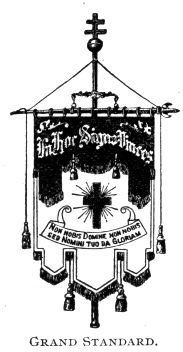
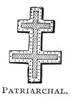
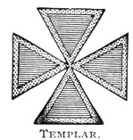

  
[Intangible Textual Heritage](../../index)  [Freemasonry](../index) 
[Index](index)  [Previous](shib14)  [Next](shib16) 

------------------------------------------------------------------------

[Buy this Book at
Amazon.com](https://www.amazon.com/exec/obidos/ASIN/0766158284/internetsacredte)

------------------------------------------------------------------------

  
*Shibboleth: A Templar Monitor*, by George Cooper Connor, \[1894\], at
Intangible Textual Heritage

------------------------------------------------------------------------

##### BANNERS OF THE ORDER OF THE TEMPLE.

The following are the official descriptions of these Banners:

|                                  |
|----------------------------------|
|  |

"The Grand Standard is of white woolen or
silk stuff, six feet in height and five feet in width, made tripartite
at the bottom, fastened at the top to the cross-bar by nine rings; in
the center of the field a blood-red Passion Cross, over which is the
motto, "*In hoc Signo Vinces*," and under, "*Non Nobis Domine! non
Nobis, sed Nomini tuo da Gloriam!*" The Cross to be four feet high, and
the upright

p. 41

and bar to be seven inches wide. On the top of the staff a gilded globe
or ball, four inches in diameter, surmounted by the Patriarchal Cross,
twelve inches in height. The Cross to be crimson, edged with gold."

|                                                           |
|-----------------------------------------------------------|
|  |

"The Beauceant is of woolen or silk
stuff, same form and dimensions as the Grand Standard, and suspended in
the same manner. The upper half of this standard is black, the lower
half white."

The Passion Cross is added in the drawing because the ancient Templars
frequently so displayed it. And in that form they came to paint the
Beauceant upon their kite-shaped Shields, as an armorial bearing.

|                                                           |
|-----------------------------------------------------------|
|  |

Anciently the Beauceant was sometimes divided *per pale*, that is,
perpendicularly, but generally it was divided *per fesse*, horizontally.
The two forms here given were familiar to our ancient brethren.

The Beauceant was the battle flag of the Templars, and the *Vexillum
Belli* of the Order was a white banner, on which was displayed, in full
size, the "Red Cross of the Order." This standard was unfurled at the
headquarters of the Grand Master during time of war, but the Beauceant
was always carried into the battle. This standard was known as the "Red
Cross War Banner of the Order," and the Beauceant as the "Battle Flag of
the Order."

p. 42

##### CROSSES OF THE ORDER OF THE TEMPLE,

UNDER THE JURISDICTION OF THE GRAND
ENCAMPMENT.

 

Cross of Salem.—This is worn by the Grand
Master as the proper emblem of his office. It is borne before the Pope
in procession, and is therefore called the Pontifical Cross. When in
purple enamel, and edged with gold, it is the insignia of the Grand
Master and of Past Grand Masters.

 

Patriarchal Cross.—This Cross when in
purple enamel, and edged with gold, is the insignia of all officers of
the Grand Encampment below the Grand Master.

 

Templar Cross.—This Cross is formed of
four equilateral triangles joined at the apices, and is called the Cross
patée. It is the insignia of the officers of a Grand Commandery.

It is insisted upon by learned antiquarians that this is the Red Cross
of the Order which the ancient Templars wore. That Cross is described as
of "equal limbs, somewhat wider and somewhat concave at the ends,
heraldically called patée." The "Ancient Red," here given, illustrates
that Cross, and the author of this Monitor is inclined to accept it in
preference to the form adopted by the Grand Encampment of the United
States. This Cross was given the Templars by Pope Eugenius, and some
think the Cross he gave them had its lower limb longer than the others,
as in the Passion Cross.

 

Passion Cross.—When in red enamel, and
edged with gold, the Passion Cross is the insignia of a Commander of a
Commandery. This Cross appears on the Grand Standard of the Order in the
United States.

 

Cross of Malta.—This Cross has not been
adopted as insignia by the Grand Encampment. It is of white enamel, and
edged with gold, and formed into eight points, as above, to represent
the eight *langes* into which the Hospitalers (Knights of Malta) were
divided.

p. 43

##### THE PARAPHERNALIA

OF A COMMANDERY OF KNIGHTS TEMPLAR.

1\. A Triangle.—This is a triangular
Table, of the height of thirty-two inches, and with sides not less than
six feet in length. It may be covered with black velvet, and be draped
with silver-fringed valance.

2\. The Chamber.—This room to be entirely
in black, even. to the floor.

3\. The Sepulchre.—The Chamber may be
utilized as the Sepulchre by suspending a curtain, with a proper
painting thereon, from the ceiling, so as to conceal, at the proper
time, the equipments of the Chamber proper.

4\. Ascension.—Lanterns are becoming
popular, but a movable Scene is much to be preferred.

5\. Altar, for Prelate's use in Prelate's Hall.

6\. Lectern, for Prelate's use in Asylum.

7\. Robe, Mitre, Cross, and Crozier, for Prelate.

8\. Pilgrim's Garb, Sandals, Staff, and Scrip.

9\. Sword and Buckler.

10\. Robes and Hats, for Hermits.

11\. Three Tents, changeable to Huts.

12\. White Robe for Penitential Year.

13\. Taper for the P. P.

14\. Equipments for Triangle and the Chamber.

These are necessary to the proper rendition of the ceremonies of the
Order of the Temple. It is not sufficient excuse for the absence of any
of them that the funds of the Commandery do not permit their purchase. A
Commandery unable to provide itself with a comfortable Asylum, and the
proper equipments, should not try to exist. Templarism is a luxury, and
should be looked upon as an expensive one by those seeking to establish
and maintain a Commandery.

------------------------------------------------------------------------

[Next: Officers of a Commandery](shib16)
