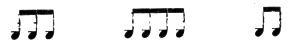

  
[Intangible Textual Heritage](../../index)  [Freemasonry](../index) 
[Index](index)  [Previous](shib24)  [Next](shib26) 

------------------------------------------------------------------------

[Buy this Book at
Amazon.com](https://www.amazon.com/exec/obidos/ASIN/0766158284/internetsacredte)

------------------------------------------------------------------------

  
*Shibboleth: A Templar Monitor*, by George Cooper Connor, \[1894\], at
Intangible Textual Heritage

------------------------------------------------------------------------

p. 71

### TO CLOSE THE COMMANDERY.

\_\_\_\_\_\_\_\_\_\_\_\_\_\_\_\_\_\_\_\_\_\_\_\_\_\_

The Commander directs that the same
precautionary steps be taken previous to the ceremony of Closing.

 

 

##### PRAYER.

The Prelate will lead in the Lord's Prayer, after which he will
pronounce this, or some other Benediction:

"The grace of our Lord Jesus Christ be with you. Amen."

------------------------------------------------------------------------

[Next: A Ritualistic Commentary](shib26)
