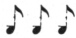

  
[Intangible Textual Heritage](../../index)  [Freemasonry](../index) 
[Index](index)  [Previous](shib32)  [Next](shib34) 

------------------------------------------------------------------------

[Buy this Book at
Amazon.com](https://www.amazon.com/exec/obidos/ASIN/0766158284/internetsacredte)

------------------------------------------------------------------------

  
*Shibboleth: A Templar Monitor*, by George Cooper Connor, \[1894\], at
Intangible Textual Heritage

------------------------------------------------------------------------

p. 83

### CONSTITUTING NEW COMMANDERIES.

The Knights about to be constituted into
a Commandery will assemble in the Asylum on the appointed day, and open
a Commandery of Knights Templar. The Triangle should be fully equipped,
but the Tapers to be unlighted. The Jewels are placed upon a small Table
or Altar, in the West, and covered with a white cloth.

The Commandery opened, the Grand Officers will be received according to
the Tactics of the Jurisdiction. When the Grand Officers are in their
stations, then—

G. Mar.—Right Eminent Grand Commander, a
constitutional number of Knights of the Valiant and Magnanimous Order of
the Temple, duly instructed in the sublime mysteries of our Order,
having received from the proper authority a Warrant or Charter,
authorizing them to hold a regular Commandery of Knights Templar, are
now assembled for the purpose of being legally constituted, and having
their Officers installed, in due and ancient form.

GC.—Let the Constituting ceremonies begin. The Choir will render
appropriate Music.

*The Choir will sing appropriate Music, as
chosen*.

GC.—Excellent Grand Prelate, read unto us a Lesson.

*Grand Prelate reads Psalm lxiii: 1-8*.

GC.—Excellent Grand Prelate, lead us in Prayer.

GCG.—Commandery, Attention! Uncover!

PRAYER.

Almighty God, our Heavenly Father, with
whom is life, and from whom cometh every good and perfect gift, unto

p. 84

\[paragraph continues\] Thee do we bow our
hearts in reverence and in trust, gratefully acknowledging Thy mercies
and the manifold manifestations of Thy providence and Thy love. And now,
as we engage in the solemn services of this occasion, we beseech Thy
guidance and direction, that all things may be done to Thy glory and to
the advancement of the interests we have in charge. Let Thy grace be
upon these Thy servants about to be constituted into an organization
founded upon the Christian religion and the practice of the Christian
virtues. Give unto them a large appreciation of the mission to which
they are called, and an earnest purpose to perform the duties which will
henceforth devolve upon them. Enlighten their minds, purify their
hearts, and help them to attain that true consecration of soul, which
will enable them to bear much fruit to the honor and glory of Thy holy
Name.

All this we ask, most Merciful Father, through him who is the
Resurrection and the Life, our Lord and Saviour, Jesus Christ. Amen.

Lord's Prayer follows
(in which all unite).

GCG.—Sir Knights, Re-cover!

GC.—Sir Knights, Be seated!

MUSIC.

GC.—Sir Knight Recorder, read aloud the Charter issued to this
Commandery.

*Recorder reads the Charter aloud*.

GC.— , Sir Knights, do you
still approve the Officers named in this Charter, and desire their
installation?

*If the Knights shall answer—"We do,"—then—*

p. 85

GCG.—Sir Knights, *Draw* Swords!
*Present* Swords!

GC.—By virtue of the high power and authority in me vested, I do now
form you, Sir Knights, into a just and regular Commandery of Knights
Templar. Henceforth you are authorized and empowered to form and open a
Council of Knights of the Red Cross, a Commandery of Knights Templar and
Knights of Malta, of the Order of St. John of Jerusalem, and to perform
all such things as may appertain to the same; conforming in all your
doings to the Laws and Constitution of the Grand Commandery under whose
authority you act, and to the Constitution and Edicts of the Grand
Encampment of the United States. And may the God of our fathers be with
you, guide and direct you in all your undertakings.

*The Jewels are now uncovered by the Grand Wardens;
solemn Music*.

GC.—Excellent Grand Prelate, you will now pronounce the words of Consecration.

GP.—To our Most Eminent and Worthy Patron, St. John the Almoner, I do
now solemnly dedicate this — Commandery, by the name and title of
Commandery; and may the God of all grace abundantly bless it and all its
members in their laudable undertakings; and may each one of its members
so redeem his time, that he may receive the joyful invitation, "Enter
thou into the joy of thy Lord."

GP.—Glory to God in the highest, and on earth peace, good will toward
men.

The Knights.—AS it was in the beginning,
is now, and ever shall be, world without end. Amen.

p. 86

GCG.—Sir Knights, Carry Swords!

*The Grand Wardens now light the Tapers on the
Triangle*.

MUSIC.

The "Doxology" (in which all will unite).

GP.—The Lord bless thee, and keep thee: the Lord make his face shine
upon thee, and be gracious unto thee: the Lord lift up his countenance
upon thee, and give thee peace.

The Knights.—Amen! Amen!
Amen!

GC.—Sir Knight Grand Marshal, make Proclamation in the East.

G. Mar.—Hear ye! Valiant Knights of the
Temple!

I am ordered to proclaim that this new Commandery of Knights Templar and
the Appendant Orders, by the name of — Commandery, has been legally
constituted according to the forms and ceremonies of the Order of
Knights Templar; and it is now authorized to meet and work as a regular
Commandery under the jurisdiction of the Grand Commandery of —.

GCG.—Sir Knights, *Return* Swords!

GC.—Sir Knights, Be seated!

------------------------------------------------------------------------

[Next: Installation of Officers of a Commandery](shib34)
