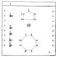
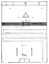

  
[Intangible Textual Heritage](../../index)  [Freemasonry](../index) 
[Index](index)  [Previous](shib38)  [Next](shib40) 

------------------------------------------------------------------------

[Buy this Book at
Amazon.com](https://www.amazon.com/exec/obidos/ASIN/0766158284/internetsacredte)

------------------------------------------------------------------------

  
*Shibboleth: A Templar Monitor*, by George Cooper Connor, \[1894\], at
Intangible Textual Heritage

------------------------------------------------------------------------

p. 131

# THE ORDER OF MALTA,

###### OR

## KNIGHT HOSPITALER,

##### OF THE ORDER OF

#### Saint John of Jerusalem, Palestine, Rhodes and Malta.

\_\_\_\_\_\_\_\_\_\_\_\_\_\_\_\_\_\_\_\_\_\_

##### According to the Ritual Adopted by Grand Encampment in 1883.

\_\_\_\_\_\_\_\_\_\_\_\_\_\_\_\_\_\_\_\_\_\_

### TO OPEN A PRIORY.

All being suitably equipped, and the
Priory suitably arrayed, the necessary precautionary steps will be
taken. This is the array:

  [  
Click to enlarge](img/13100.jpg)

p. 132

##### KNIGHT OF SAINT PAUL.

 

##### PAUL AT MELITA (MALTA).

And when they were escaped, then they knew that the island was called
Melita. And the barbarous people shewed us no little kindness: for they
kindled a fire, and received us every one, because of the present rain,
and because of the cold. And when Paul had gathered a bundle of sticks,
and laid *them* on the fire, there came a viper out of the heat, and
fastened on his hand. And when the barbarians saw the *venomous* beast
hang on his hand, they said among themselves, No doubt this man is a
murderer, whom, though he hath escaped the sea, yet vengeance suffereth
not to live. And he shook off the beast into the fire, and felt no harm.
Howbeit they looked when he should have swollen, or fallen down dead
suddenly: but after they had looked a great while, and saw no harm come
to him, they changed their minds, and said that he was a god. Acts
xxviii: 1-6.

 

##### PAUL'S EXHORTATION.

And now I exhort you to be of good cheer: for there shall be no loss of
*any man's* life among you, but of the ship. For there stood by me this
night the angel of God, whose I am, and whom I serve, saying, Fear not,
Paul; thou must be brought before Cæsar: and, lo, God hath given thee
all them that sail with thee. Wherefore, sirs, be of good cheer: for I
believe God, that it shall be even as it was told me. Acts xxvii: 22-25.

 

##### F N. P.

 

p. 133

##### KNIGHT HOSPITALER.

 

B. L. D. R. A.

 

##### VOW.

 

Admitted.                Raised.

 

##### THE BEATITUDES.

Blessed *are* the poor in spirit: for their’s is the kingdom of heaven.
Blessed *are* they that mourn: for they shall be comforted. Blessed
*are* the meek: for they shall inherit the earth. Blessed *are* they
which do hunger and thirst after righteousness: for they shall be
filled. Blessed *are* the merciful: for they shall obtain mercy. Blessed
*are* the pure in heart: for they shall see God. Blessed *are* the
peacemakers: for they shall be called the children of God. Blessed *are*
they which *are* persecuted for righteousness’ sake: for their’s is the
kingdom of heaven. Blessed are ye, when *men* shall revile you, and
persecute *you*, and shall say all manner of evil against you falsely,
for my sake. Matt. v: 3-11.

 

##### DOUBTING THOMAS.

But Thomas, one of the twelve, called Didymus, was not with them when
Jesus came. The other disciples therefore said unto him, We have seen
the Lord. But he said unto them, Except I shall see in his hands the
print of the nails, and put my finger into the print of the nails, and
thrust my hand into his side, I will not believe. And after eight days
again his disciples were within, and Thomas with them: then

p. 134

came Jesus, the doors being shut, and stood in the midst, and said,
Peace *be* unto you. Then saith he to Thomas, Reach hither thy finger,
and behold my hands; and reach hither thy hand, and thrust *it* into my
side; and be not faithless, but believing. And Thomas answered and said
unto him, My Lord and my God. John xx: 24-28.

 

##### THE INSCRIPTION.

And Pilate wrote a title, and put *it* on the cross. And the writing
was, Jesus of Nazareth the King of the
Jews. John xix: 19.

Here endeth the third lesson.

 

##### RECOGNITION.

 

Note.—As a new Order of Malta will (D. V.) be submitted to the
Grand Encampment, at its Triennial, Boston, 1893, the above will be
sufficient for the Commanderies at present.

p. 135

##### FLOOR PLAN

###### OF THE PROPOSED REVISED RITUAL OF THE ORDER OF MALTA.

  [  
Click to enlarge](img/13500.jpg)

Stations same as in K. T. at Opening. The dotted lines show course of
second entrance.

This plan contemplates the use of a single Hall, which is most
desirable. The Bulwarks are Cyprus, Rhodes, and Malta. Meditations at
these are on the Birth, Life, Death, Resurrection and Ascension of our
Saviour.

------------------------------------------------------------------------

[Next: Calendars](shib40)
