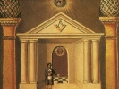

  
[Intangible Textual Heritage](../../index)  [Freemasonry](../index) 
[Index](index)  [Previous](syma22)  [Next](syma24) 

------------------------------------------------------------------------

[Buy this Book on
Kindle](https://www.amazon.com/exec/obidos/ASIN/B002J9HE6I/internetsacredte)

------------------------------------------------------------------------

  
*Symbolical Masonry*, by H.L. Haywood, \[1923\], at Intangible Textual
Heritage

------------------------------------------------------------------------

p. 137

### CHAPTER XIX

### THE RITE OF SALUTATION

The Rite of Salutation, during which the candidate pays his respects to
the various stations, is in one sense only the lodge's recognition of
the membership of the candidate, he having now been received by the
Master as a brother and fellow workman, and encouraged to make himself
at home in his new fellowship; in another sense, and one of much greater
importance, I believe, the salutation is the candidate's recognition of
the constituted authority of the Craft as vested in the Master and
Wardens. Of this there is need to speak at some length as it is a lesson
to be learned by the citizen of a state as well as by a member of the
Fraternity, since it is nothing other than the old and badly needed
teaching of true Liberty, and of the relationship between Liberty and
Law, a teaching to which Masonry has always borne testimony by its
actions as well as its words.

"No part of its history has been more noble," writes Dr. J. F. Newton
("The Builders," p. 273), "no principle of its teaching has been more
precious than its age-long demand for the right and duty of every soul
to seek that light by which no man was ever injured, and that truth
which makes men free. Down through the centuries—often in times when the
highest crime was not murder, but thinking, and the human conscience was
a captive dragged at the wheel of the ecclesiastical chariot—always and
everywhere Masonry has stood for the

p. 138

right of the soul to know the truth and to look up unhindered from the
lap of earth into the face of God. Not freedom from faith, but freedom
of faith, has been its watchword, on the ground that as despotism is the
mother of anarchy, so bigoted dogmatism is the prolific source of
scepticism—knowing also that our race has made its most rapid advance in
those fields where it has been free the longest."

True to this spirit, always, Masonry has everywhere fought as a champion
of human freedom, in civil life, in art, and in religion. It worked as a
leaven in France long before the Revolution set that country aflame; it
was one of the secret forces that made for Italian nationality; it was a
power behind the scenes in the American colonies’ struggle for
independence. Truly, as Albert Pike has said, it "is devoted to the
cause of Toleration and Liberality against Fanaticism and Persecution,
political and religious, and to that of Education. Instruction and
Enlightenment against Error, Barbarism and Ignorance."

#### II

But this Freedom, be it noted—it is my point here—is freedom *in*, not
freedom *from*, the law. This is nature's way, and law is never anything
else, if it be truly law and not conventionality, than the open path
along which Life walks to ample power. He that keeps the laws of hygiene
enjoys the vigorous liberty of health; he that keeps step with the
seasons reaps the first fruits of the fields; he that thinks in
accordance with fact and evidence is given the sceptre of truth. It is
our loyalty that sets us free; it is our keeping the rules of the game
that yields us the joy and spontaneity of the game.

All just civil law partakes of this character, for its

p. 139

purpose is to relieve a man from the bondage of caprice, the dominance
of the brutal, and the superciliousness of the tyrant, making it safe
for children to play along the streets and for women to walk in the
dark. It is the friend and protectress of the human. It guards our
property and our limbs, it arbitrates our quarrels, it secures to us the
fruit of our toil, and night and day stands watch above our lives.
Always the best country is that where the head is held high, the heart
is free, and men walk in that liberty which is "inbound in law."

If there is one danger lurking in our midst to-day it is the spread of
that subtle civil scepticism that flouts authority and makes light of
order. The rich would prostitute the statutes of the land to the support
of ill-gotten gains; those that have nothing would shape them into means
of wresting what they want from those that have; and the anarchists, of
whom there are many in fact if not in name, whisper that law itself is
bondage and every officer a tyrant. Masonry's word to this condition is
that the evil of law is to be remedied only by making laws wiser and
more just and that the one cure for bad authority is good authority.
Accordingly, the candidate is no sooner released from his cable tow than
he is told to salute the Wardens; this act may be a contradiction in
appearance but is not in fact.

------------------------------------------------------------------------

[Next: Chapter XX. The Apron](syma24)
