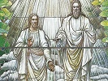

  
[Intangible Textual Heritage](../../index)  [Mormonism](../index) 
[Index](index)  [Previous](hou09)  [Next](hou11) 

------------------------------------------------------------------------

[Buy this Book at
Amazon.com](https://www.amazon.com/exec/obidos/ASIN/B002ECE8AA/internetsacredte)

------------------------------------------------------------------------

  
*History of Utah, 1540-1886*, by Hubert Howe Bancroft, \[1889\], at
Intangible Textual Heritage

------------------------------------------------------------------------

p. 193

### CHAPTER VII. BRIGHAM YOUNG SUCCEEDS JOSEPH. 1844-1845.

The Question of
Succession—Biography of Brigham Young—His Early
Life—Conversion—Missionary Work—Made President of the Twelve—His
Devotion to the Prophet—Sidney Rigdon and Brigham Young Rival Aspirants
for the Presidency—Rigdon's Claims—Public Meetings—Brigham Elected
President of the Church—His Character—Temple- Building—Fresh
Disasters—the Affair at Morley—the Men of Quincy and the Men of
Carthage—the Mormons Consent to Abandon Their City.

    Upon the death of Joseph Smith, one
of the questions claiming immediate attention was, Who shall be his
successor? It was the first time the question had arisen in a manner to
demand immediate solution, and the matter of succession was not so well
determined then as now, it being at present well established that upon
the death of the president of the church the apostle eldest in
ordination and service takes his place.

    Personal qualifications would have much to do with it; rules could
be established later. The first consideration now was to keep the church
from falling in pieces. None realized the situation better than Brigham
Young, who soon made up his mind that he himself was the man for the
emergency. Then to make it appear plain to the brethren that God would
have him take Joseph's place, his mind thus works: "The first thing that
I thought of," he says, "was whether Joseph had taken the keys of the
kingdom with him

p. 194

from the earth. Brother Orson Pratt sat on my left; we were both leaning
back on our chairs. Bringing my hand down on my knee, I said, 'The keys
of the kingdom are right here with the church.'" But who held the keys
of the kingdom? This was the all-absorbing question that was being
discussed at Nauvoo when Brigham and the other members of the quorum
arrived at that city on the 6th of August, 1844.

    Brigham Young was born at Whitingham, Windham county, Vermont, on
the 1st of June, 1801. His father, John, a Massachusetts farmer, served
as a private soldier in the revolutionary war, and his grandfather as
surgeon in the French and Indian war. [1](#fn_211) In 1804 his family, which included nine
children, [2](#fn_212) of whom he was then the
youngest, removed to Sherburn, Chenango county, New York, where for a
time hardship and poverty were their lot. Concerning Brigham's youth
there is little worthy of record. Lack of means compelled him, almost
without education, to earn his own livelihood, as did his brothers,
finding employment as best they could. Thus, at the age of twenty-three,
when he married he had learned how to work as farmer, carpenter, joiner,
painter, and glazier, in the last of which occupations he was an expert
craftsman.

    In 1829 he removed to Mendon, Monroe county, where his father then
resided; and here, for the first time, he saw the book of Mormon at the
house of his brother Phineas, who had been a pastor in the reformed
methodist church, but was now a convert to Mormonism. [3](#fn_213)

p. 195

    About two years later he himself was converted [4](#fn_214) by the preaching of Elder Samuel H.
Smith, brother of the prophet; on the 14th of April, 1832, he was
baptized, and on the same night ordained an elder, his father [5](#fn_215) and all his brothers afterward becoming
proselytes. During the same month he set forth to meet the prophet at
Kirtland, where he found him and several of his brethren chopping wood.
"Here," says Brigham, "my joy was full at the privilege of shaking the
hand of the prophet of God…He was happy to see us and bid us welcome. In
the evening a few of the brethren came in, and we conversed together
upon the things of the kingdom. He called upon me to pray. In my prayer
I spoke in tongues. As soon as we rose from our knees, the brethren
flocked around him, and asked his opinion…He told them it was the pure
Adamic language;…it is of God, and the time will come when Brother
Brigham Young will preside over this church." In 1835 he was chosen, as
will be remembered, one of the quorum of the twelve, and the following
spring set forth on a missionary tour to the eastern states. Returning
early in the winter, he saved the life of the prophet, and otherwise
rendered good service during the great apostasy of 1836, when the church
passed through its darkest hour. [6](#fn_216)

    Brigham was ever a devoted follower of the prophet, and at the risk
of his own life, shielded him against the persecutions of apostates. At
the close of 1837 he was driven by their machinations from
Kirtland, [7](#fn_217)

p. 196

and took refuge at Dublin, Indiana, where he was soon afterward joined
by Joseph Smith and Sidney Rigdon. Thence, in company with the former,
he went to Missouri, arriving at Far West a short time before the
massacre at Haun's Mill. Once more Brigham was compelled to flee for his
life, and now betook himself to Quincy, where he raised means to aid the
destitute brethren in leaving Missouri, [8](#fn_218) and directed the first settlement of the
saints in Illinois, the prophet Joseph, Parley P. Pratt, and others
being then in prison.

    By revelation of July 8, 1838, [9](#fn_219)
it was ordered that eleven of the quorum should "depart to go over the
great waters, and there promulgate my gospel, the fulness thereof, and
bear record of my name. Let them take leave of my saints in the city Far
West, on the 26th day of April next; on the building spot of my house,
saith the Lord." As the twelve had been banished from Missouri and could
not return with safety, many of the church dignitaries urged that the
latter part of this revelation should not be fulfilled. "But," says
Brigham, "I felt differently, and so did those of the quorum who were
with me." The affairs of the church were now in the hands of the twelve,
and their president was not the man to shrink from danger. "The Lord had
spoken, and it was their duty to obey."

    The quorum started forth, and reaching Far West toward the end of
April, hid themselves in a grove. Between midnight of the 25th and dawn
of the 26th

p. 197

they held a conference, relaid the foundation of the house of the
Lord, [10](#fn_220) and ordained Wilford
Woodruff and George A. Smith as apostles in place of those who had
fallen from grace. "Thus," says Brigham, "was this revelation fulfilled,
concerning which our enemies said, if all the other revelations of
Joseph Smith came to pass, that one should not be fulfilled."

    Upon the excommunication of Thomas B. Marsh, in 1839, the office of
president of the twelve devolved by right on Brigham by reason of his
seniority of membership. On the 14th of April, 1840, he was publicly
accepted by the council as their head, and at the reorganization of the
church councils at Nauvoo he was appointed by revelation on the 19th of
January, 1843, president of the twelve travelling council.

    After the founding of Nauvoo, the president, together with three
others of the quorum, [11](#fn_221) sailed for
Liverpool, where they arrived on the 6th of April, 1840, the tenth
anniversary of the organization of the church. Here he was engaged for
about a year in missionary work, of which more hereafter. Taking ship
for New York on the 20th of April, 1841, he reached Nauvoo on the 1st of
July, and was warmly welcomed by the prophet, who a few days
afterward [12](#fn_222) received the following
revelation: "Dear and well-beloved brother Brigham Young, verily thus
saith the Lord unto you, my servant Brigham, it is no more required at
your hand to leave your family as in times past, for your offering is
acceptable to me; I have seen your labor and toil in journeyings for my
name. I therefore command you to send my word abroad, and take special
care of your family from this time henceforth and forever. Amen."

    Already the mantle of the prophet was falling upon the president of
the twelve; already the former had

p. 198

foretold his own death; but notwithstanding the revelation, Brigham was
sent as a missionary to the eastern states, and at Peterborough, New
Hampshire, received news of the tragedy at Carthage jail.

    When Governor Ford and his militia were preparing to march on Nauvoo
for the purpose of forestalling civil war, the only course open to the
prophet and his followers was a removal from Illinois. In 1842 an
expedition had been planned to explore the country toward or beyond the
Rocky Mountains; but when Joseph Smith put himself forward as a
candidate for the presidency of the United States, all other matters
were for the time forgotten. Brigham claimed that had he been present
the assassination would never have occurred; he would not have permitted
the prophet's departure for Carthage: rather would he have sent him to
the mountains under a guard of elders. But Brigham had no reason to
complain of the dispensation of providence which was now to bring his
clear, strong judgment and resolute will to the front.

 

    Prominent among the aspirants for the presidency of the church was
Sidney Rigdon, one of the first and ablest to espouse the cause, and not
altogether without grounds for his pretensions. He had performed much
labor, had encountered many trials, and had received scanty honors,
being at present nothing more than preacher, and professor of history,
belles-lettres, and oratory. By revelation of January 19, 1841, he had
been offered the position of counsellor to the prophet, [13](#fn_223)

p. 199

if he would consent to humble himself. But Sidney would not humble
himself. Soon after Joseph's death, at which he was not present, he had
a revelation of his own, bidding him conduct the saints to
pittsburgh. [14](#fn_224) Visiting that city,
he found the time not yet ripe for this measure; and meanwhile returning
to Nauvoo, the 3d of August, he offered himself on the following day as
a candidate for the presidency, aided by Elder Marks.

    Sidney now put forth all his strength to gain influence and secure
retainers. He must have Joseph's mantle; he must have the succession, or
henceforth he would be nothing. It was a momentous question, not to be
disposed of in a day. To substantiate his claim, Sidney could now have
visions with the best of them; on various occasions he told how the Lord
had through him counselled the people to appoint him as their guardian.
He requested that a meeting should be held on the following sabbath, the
8th of August, for the further consideration of the matter. But prior to
this meeting Parley Pratt and two others of the twelve bade the
candidate go with them to the house of John Taylor, who yet lay
prostrate with his wounds. Taylor expostulated with him, but to no
purpose. Sidney continued to press his claims, even assuming the sacred
office, prophesying and ordaining. On the sabbath named, according to
appointment, Sidney and his supporters met in the grove near the temple;
but were confronted by the apostles, with Brigham at their head.
Standing before them, Sidney addressed the

p. 200

brethren for nearly two hours. Yet he seemed to make no impression. "The
Lord has not chosen him," said one to another. The assembly then
adjourned to two o'clock, when the saints in and about Nauvoo gathered
in great numbers. After singing and prayer, through the vast assemblage
was heard a voice, strikingly clear, distinct, and penetrating. [15](#fn_225) It was the voice of Brigham, who said:
"Attention, all! For the first time in my life I am called to act as
chief of the twelve; for the first time in your lives you are called to
walk by faith, your prophet being no longer present in the flesh. I
desire that every one present shall exercise the fullest liberty. I now
ask you, and each of you, if you want to choose a guardian, a prophet,
evangelist, or something else as your head to lead you. All who wish to
draw away from the church, let them do it, but they will not prosper. If
any want Sidney Rigdon to lead them, let them have him; but I say unto
you that the keys of the kingdom are with the twelve." [16](#fn_226)

    It was then put to vote, Brigham meanwhile saying, "All those who
are for Joseph and Hyrum, the book of Mormon, book of Doctrine and
Covenants, the temple, and Joseph's measures, they being one party, will
be called upon to manifest their principles boldly, the opposite party
to enjoy the same liberty." [17](#fn_227) The
result was ten votes for Sidney, the quorum with Brigham at their head
getting all the rest. Elder Philips then motioned that all "who have
voted for Sidney Rigdon be suspended until they can have a trial before
the high council." [18](#fn_228)

    The truth is, Sidney was no match for Brigham. It was a battle of
the lion and the lamb; only Brigham

p. 201

did not know before that he was a lion, while Sidney received the truth
with reluctance that he was indeed a lamb. Something more than oratory
was necessary to win in this instance; and of that something, with great
joy in his heart, Brigham found himself in possession. It was the
combination of qualities which we find present primarily in all great
men, in all leaders of men—intellectual force, mental superiority,
united with personal magnetism, and physique enough to give weight to
will and opinion; for Brigham Young was assuredly a great man, if by
greatness we mean one who is superior to others in strength and skill,
moral, intellectual, or physical. The secret of this man's power—a power
that within a few years made itself felt throughout the world—was this:
he was a sincere man, or if an impostor, he was one who first imposed
upon himself. He was not a hypocrite; knave, in the ordinary sense of
the term, he was not; though he has been a thousand times called both.
If he was a bad man, he was still a great man, and the evil that he did
was done with honest purpose. He possessed great administrative ability;
he was far-seeing, with a keen insight into human nature, and a thorough
knowledge of the good and evil qualities of men, of their virtues and
frailties. His superiority was native to him, and he was daily and
hourly growing more powerful, developing a strength which surprised
himself, and gaining constantly more and more confidence in himself,
gaining constantly more and more the respect, fear, and obedience of
those about him, until he was able to consign Sidney to the buffetings
of Satan for a thousand years, while Brigham remained president and
supreme ruler of the church. [19](#fn_229)

p. 202

    Thus Brigham Young succeeded Joseph Smith. The work of the latter
was done. It was a singular work, to which he was singularly adapted;
the work yet to be done is no less remarkable, and a no less remarkable
agent is raised up at the right moment. Matters assume now a more
material turn, and a more material nature is required to master them—if
coarser-grained, more practical, rougher, more dogmatical, dealing less
in revelations from heaven and more in self-protection and
self-advancement here on earth, so much the better for the saints.
"Strike, but hear me!" Joseph with Themistocles used to cry; "I will
strike, and you shall hear me," Brigham would say.

    No wonder the American Israel received Brigham as the gift of God,
the Lion of the Lord, [20](#fn_230) though the
explanation of the new ruler himself would have been nearer that of the
modern evolutionist, who would account for Brigham's success as the
survival of the fittest. It was fortunate for the saints at this
juncture that their leader should be less prophet than priest and king,
less idealist than business manager, political economist, and
philosopher. Brigham holds communion with spiritual powers but
distantly, perhaps distrustfully; at all events, he commands the spirits
rather than let them command him; and the older he grows the less he has
to do with them; and the less he has to do with heavenly affairs, the
more his mind dwells on earthly matters. His prophecies are eminently
practical; his people must have piety that will pay. And later, and all
through his life, his position is a strange one. If the people about
Nauvoo are troublesome, God orders him west; and then he tells

p. 203

him if roads are opened and canals constructed it will please him. From
these practical visions come actions, and on a Sunday the great
high-priest rises in the tabernacle and says: "God has spoken. He has
said unto his prophet, 'Get thee up, Brigham, and build me a city in the
fertile valley to the south, where there is water, where there are fish,
where the sun is strong enough to ripen the cotton plants, and give
raiment as well as food to my saints on earth. Brethren willing to aid
God's work should come to me before the bishop's meeting.'" "As the
prophet takes his seat again," says an eye-witness, "and puts on his
broad-brimmed hat, a hum of applause runs around the bowery, and teams
and barrows are freely promised."

    To whatsoever Brigham applied himself he directed his whole
strength, provided his whole strength was necessary to the
accomplishment of his purpose. There were others in the field against
him, aspirants for the late prophet's place, besides Sidney; but
directing his efforts only against the most powerful of them, the
president of the twelve summoned the quorum and the people, as we have
seen, crushed Rigdon and his adherents by one of the master-strokes
which he was now learning, declared the revelations of Rigdon to be of
the devil, cut him off, cursed him, and was himself elected almost
without a dissenting voice, giving all ostensibly the fullest liberty to
act, yet permitting none of them to do so, and even causing ten to be
tried for dissenting. Henceforth none dared to gainsay his authority; he
became not only the leader of the Mormons, but their dictator; holding
authority for a time as president of the twelve apostles, and finally in
the capacity of the first presidency, being made president of the whole
church in December 1847.

    Brigham Young was now in his forty-third year, in the prime of a
hale and vigorous manhood, with exuberant vitality, with marvelous
energy, and with unswerving faith in his cause and in himself. In
stature

p. 204

he was a little above medium height; in frame well-knit and compact,
though in later years rotund and portly; in carriage somewhat stately;
presence imposing, even at that time, and later much more so; face clean
shaven now, but afterward lengthened by full beard except about the
mouth; features all good, regular, well formed, sharp, and smiling, and
wearing an expression of self-sufficiency, bordering on the
supercilious, which later in life changed to a look of subdued sagacity
which he could not conceal; deep-set, gray eyes, cold, stern, and of
uncertain expression, lips thin and compressed, and a forehead broad and
massive—his appearance was that of a self-reliant and strong-willed man,
of one born to be master of himself and many others. In manner and
address he was easy and void of affectation, deliberate in speech,
conveying his original and suggestive ideas in apt though homely
phrase. [21](#fn_231) When in council he was
cool and imperturbable, slow to decide, and in no haste to act; but when
the time for action came he worked with an energy that was satisfied
only with success.

    Like his predecessor, he was under all circumstances naturally a
brave man, possessing great physical strength, and with nerves unshaken
by much excess or sickness. That he was given to strong drink has often
been asserted by his enemies, but never by his friends, and rarely by
impartial observers. He was always in full possession of himself, being
far too wise a man to destroy himself through any indiscretion.

    He was undoubtedly the man for the occasion, however, for no other
could, at this juncture, save the Mormons from dissolution as a sect and
as a people. If the saints had selected as their leader a man less
resolute, less confident, less devoted to his cause and to his people, a
man like Sidney Rigdon,

p. 205

for example, Mormonism would have split into half a dozen petty
factions, the strongest of which would hardly be worthy of notice.

    Discussing the great Mormon leaders, Hyde, who though an apostate
was one of the most impartial of writers, says: "Brigham Young is far
superior to Smith in everything that constitutes a great leader. Smith
was not a man of genius; his forte was tact. He only embraced
opportunities that presented themselves. He used circumstances, but did
not create them. The compiling genius of Mormonism was Sidney Rigdon.
Smith had boisterous impetuosity, but no foresight. Polygamy was not the
result of his policy, but of his passions. Sidney gave point, direction,
and apparent consistency to the Mormon system of theology. He invented
its forms and many of its arguments. He and Parley Pratt were its
leading orators and polemics. Had it not been for the accession of these
two men, Smith would have been lost, and his schemes frustrated and
abandoned. That Brigham was superior not only to Smith but also to
Rigdon is evident."

    Burton says: "His manner is at once affable and impressive, simple
and courteous,…shows no sign of dogmatism,…impresses a stranger with a
certain sense of power; his followers are, of course, wholly fascinated
by his superior strength of brain." Temper even and placid, manner cold,
but he is neither morose nor methodistic. Often reproves in violent
language; powers of observation acute; has an excellent memory, and is a
keen judge of character. "If he dislikes a stranger at the first
interview, he never sees him again. Of his temperance and sobriety there
is but one opinion. His life is ascetic; his favorite food is baked
potatoes with a little buttermilk, and his drink water." [22](#fn_232)

p. 206

    Further: though he made his people obey him, he shared their
privations. Soon we shall find him rousing his followers from the
lethargy of despair, when their very hearts had died within them, and
when all cheeks blanched but his; speaking words of cheer to the men,
and with his own sick child in his arms, sharing his scant rations with
women and children who held out their hands for bread.

 

    For a brief space after the election of Brigham the saints had rest.
The city of Nauvoo continued to thrive; [23](#fn_233) a portion of the temple was finished
and dedicated, [24](#fn_234) the building of
the Nauvoo house and council-house was progressing rapidly.

    Their buildings were erected with great sacrifice of time, and
amidst difficulties and discouragement in consequence of poverty. Money
was exceedingly scarce. [25](#fn_235) The
revelation requiring tithing, made in 1838, was first practically
applied in Nauvoo; the tenth day was regularly given to work on the
temple; the penny subscriptions of the sisters are mentioned, which was
a weekly contribution, and was intended for the purchase of glass and
nails. Every effort was made to encourage manufacture, and to utilize
their water-power. At a meeting of the trades delegates

p. 207

there was intelligent discussion as to the place becoming a great
manufacturing centre. [26](#fn_236)

    In January 1845 it was proposed that a building for the high-priests
should be erected, to cost $15,000, and the work was cheerfully
undertaken. There were frequent entertainments given in the way of
dances and public dinners in the Nauvoo mansion and in the bowery six
miles out of the city. [27](#fn_237) At their
conference in April, thousands gathered. The temple was pushed forward,
as the people were counselled to receive their endowments there as early
as possible. On the 24th of May the walls were finished, and the event
was duly celebrated. [28](#fn_238) On the 5th
of October their first meeting in the temple was held. [29](#fn_239) From mites and tithings it was
estimated that a million dollars had been raised. Brigham, Parley, and
others of the quorum administered in the temples to hundreds of people,
the services often continuing all day and night. [30](#fn_240) At the end of December one thousand of
the people had received the ordinances. And all this was done midst
renewed persecutions, and while the people were making preparations to
evacuate the city.

    The masons withdrew the dispensation previously granted to Nauvoo,
and to this day they refuse to admit Mormons into their order.

p. 208

    Fresh disaster now approached Nauvoo. The whigs and the democrats of
Illinois had both sought to secure the Mormon vote, until finally they
began to declare that Mormonism signified a government not in accord
with that of the United States. The city charter had been repealed in
January 1845, and Daniel Spencer, who had been elected to fill the
remainder of the term of the murdered mayor, was deposed, as were all
the other city officers; a new charter was before the legislature, but
never granted. These and like measures, followed as they were by the
discharge of Joseph Smith's assassins, imparted to the gentiles renewed
courage. The crimes of the whole country were laid at the door of the
saints. Nauvoo was denounced as a den of counterfeiters, cattle-thieves,
and assassins, [31](#fn_241) the leaders of the
gang being men who in the name of religion outraged all sense of
decency. The smuts retaliated in kind; and shortly it came about that in
sections settled by Mormons gentiles feared to travel, and in sections
settled by gentiles Mormons feared to travel. In view of this state of
affairs, which was more like old-time feudalism than latter-day
republicanism, Governor Ford made an inspection of the city, and
declared that fewer thefts were committed in Nauvoo in proportion to
population than in any other town in the state. The cause of this,
however, may have lain in the fact that the population of Nauvoo was
chiefly Mormon, and whatever might be their depredations upon the
gentiles, the saints were not accustomed to steal from each other.

    At a place called the Morley settlement, in Hancock county, in
September 1845, the people held a meeting to devise means for the
prevention of thievery. Though few definite charges were advanced, there
was much said derogatory to Mormon honesty. Presently the discharge of a
gun was heard, once or twice, perhaps more. It was said the shots were
fired

p. 209

by Mormons, and that they took aim at the house in which the meeting was
held. Soon the cry went abroad that the Mormons were in arms, and there
were quickly volunteers at hand to help the men of Morley. A meeting was
held, and it was resolved to expel the saints. At the time appointed,
armed bands appeared and burned some twenty Mormon dwellings, driving
the inmates into the bushes. [32](#fn_242) The
people of Illinois were evidently now determined to adopt the previous
policy of the men of Missouri. This was not all. Word had come that
forces from Nauvoo were moving to the aid of the Mormons at Morley,
whereupon the gentiles throughout all that region banded, threatening to
burn and drive out the saints until not one should remain. As a
beginning, Buel's flouring mill and carding machine, near Lima, the
property of a Mormon, was reduced to ashes. [33](#fn_243)

    And now the men of Quincy, their old friends and benefactors, turned
against them; and though not manifesting the deadly hate displayed in
some quarters, were nevertheless resolved that the Mormons should depart
from the stake. On the 22d the citizens met and agreed that further
efforts to live in peace with the Mormons were useless. [34](#fn_244)

    Indeed, the saints themselves had reached the

p. 210

same conclusion. It was no new idea to them, seeking a home elsewhere.
It was a rough element, that by which they were surrounded, an element
which brought upon them more of evil than of good. Comparatively few
additions were made to their number from the bold border men of Missouri
and Illinois, most of their proselytes coming from other parts of the
United States and from Europe. The whole great west was open to them;
even during the days of Joseph there had been talk of some happy
Arcadian retreat far away from every adverse influence; [35](#fn_245) and in the fertile brain of Brigham the
idea assumed proportions yet broader and of more intensified form,
significant of western empire and isolation somewhere in California or
the Pacific isles, with himself as leader, and followers drawn from
every quarter of the globe.

    A general council was held on the 9th of September, at which it was
resolved that a company of fifteen hundred men be selected to go to Salt
Lake Valley, and a committee of five was appointed to gather information
relative to the subject. [36](#fn_246) There
were frequent meetings of the authorities and consultations in regard to
emigrating to California. [37](#fn_247)

    The saints would go, they said, but they must have a reasonable time
in which to dispose of their property

p. 211

and leave the country. [38](#fn_248) The
meeting at Quincy, notice of which with a copy of the resolutions was
sent to Nauvoo, named six months as the time within which the Mormons
must depart. In answer, the council of the church replied, on the 24th
of September, that they could not set forth so early in the spring, when
there would be neither food for man or beast, nor even running water,
but that it was their full intention to depart as soon as possible, and
that they would go far enough, God helping them, forever thereafter to
be free from their enemies. Meanwhile all they asked was that they
should not be further molested by armed bands or suits at law, but
rather assisted in selling their property and collecting their
effects. [39](#fn_249)

    To this the men of Quincy gave assent; at the same time pledging
themselves to prompt action in case of failure oil the part of the
saints to keep their promise, and taking measures to secure a military
organization of the people of Adams county. [40](#fn_250)

    It was not to be expected that Carthage would remain idle while
other towns were acting. A convention of delegates from nine surrounding
counties was held there about the end of September, and four
commissioners, among whom were Hardin, commander of the state militia,
and Douglas, senator, [41](#fn_251) were sent
to Nauvoo to demand the departure of the Mormons. The deputation was met
by the council of the twelve with the president at their head, and
answer was promptly made that the removal would

p. 212

take place as speedily as possible. "What guarantee will you give us?"
asked Hardin. "You have our all as guarantee," answered Brigham. "Young
is right," said Douglas. But this reply would not satisfy all the
commissioners, and the twelve were requested to submit their intentions
in writing, in order that they might be laid before the governor and
people of the state. This was done. [42](#fn_252)

    The commissioners then returned home; but not even yet were the men
of Carthage content. To the resolutions passed at Quincy were added
others of similar nature, and the whole adopted. A plan of organization
was agreed upon, and arrangements were made for calling meetings and
securing volunteers, who were to select their own officers and report to
the Quincy military committee. The judge of Hancock county was requested
by this convention not to hold

p. 213

court during that autumn, for fear of collision between saints and
gentiles, and the governor was recommended to station in that vicinity a
small military force to keep peace during the winter.

    During the height of the troubles at Nauvoo, Orson Pratt was in New
York, where on the 8th of November, 1845, he addressed a farewell
message to the brethren in the east, calling upon such of them as had
means to sell their property, buy teams, and join the overland
emigration, and those who had none to take passage in the ship
*Brooklyn*, chartered for the purpose by Elder Samuel Brannan, and which
was to sail round Cape Horn, via the Hawaiian Islands, for California.
Shortly after, the *Brooklyn* sailed with 238 emigrants, the price of
passage being $50 for adults, with $25 additional for subsistence. The
details of this expedition, with names of the emigrants, their doings in
California, and the departure for the Great Salt Lake of a large portion
of them, is given in volume V. chapter XX. of my *History of
California*. Upon his return to Nauvoo, Pratt brought $400 worth of
Allen's six-shooting pistols.

------------------------------------------------------------------------

### Footnotes

[194:1](hou10.htm#fr_211) *Waite's The Mormon
Prophet and his Harem*. Linforth, *Route from Liverpool*, 112, note,
states that his grandfather was an officer in the revolutionary war;
this is not confirmed by Mrs Waite, who quotes from Brigham's
autobiography. Again, Nabby Howe was the maiden name of Brigham's
mother, as given in his autobiography; while Linforth reads Nancy Howe;
and Remy, *Jour. to G. S. L. City*, i. 413, Naleby Howe.

[194:2](hou10.htm#fr_212) Born as follow:
Nancy, Aug. 6, 1786, Fanny, Nov. 8, 1787, Rhoda, Sept. 10, 1789, John,
May 22, 1791, Nabby, Apr. 23, 1793, Susannah, June 7, 1795, Joseph, Apr.
7, 1797, Phineas, Feb. 16, 1799, and Brigham, June 1, 1801. Two others
were born later: Louisa, Sept. 25, 1804, and Lorenzo Dow, Oct. 19, 1807.

[194:3](hou10.htm#fr_213) In *Ibid*., it is
mentioned that before the organization of the latter-day p. 195 church, Phineas had wrought a miracle,
'whereby a young girl on the point of death had been restored to life.'
Remy does not give his authority.

[195:4](hou10.htm#fr_214) At a branch of the
church at Columbia, Penn. *Tullidge's Life of Young*, 78.

[195:5](hou10.htm#fr_215) John Young was made
first patriarch of the church. He died at Quincy, Ill., Oct. 12, 1839.
*Waite's The Mormon Prophet*, 2.

[195:6](hou10.htm#fr_216) *Tullidge's Life of
Brigham Young*, 83. In a speech delivered after he became president,
Brigham says: 'Ascertaining that a plot was laid to waylay Joseph for
the purpose of taking his life, on his return from Monroe, Michigan, to
Kirtland, I procured a horse and buggy, and took brother William Smith
along to meet Joseph, whom we met returning in the stage-coach. Joseph
requested William to take his seat in the stage, and he rode with me in
the buggy. We arrived at Kirtland in safety.'

[195:7](hou10.htm#fr_217) 'On the morning of
Dec. 22d I left Kirtland in consequence of the fury p. 196 of the mob, and the spirit that prevailed in
the apostates, who threatened to destroy me because I would proclaim
publicly and privately that I knew, by the power of the holy ghost, that
Joseph Smith was a prophet of the most high God, and had not
transgressed and fallen, as apostates declared.' *Id*., 84.

[196:8](hou10.htm#fr_218) I held a meeting with
the brethren of the twelve and the members of the church in Quincy, on
the 17th of March, when a letter was read to the people from the
committee, on behalf of the saints at Far West, who were left destitute
of the means to move. Though the brethren were poor and stripped of
almost everything, yet they manifested a spirit of willingness to do
their utmost, offering to sell their hate, coats, and shoes to
accomplish the object. At the close of the meeting $50 was collected in
money and several teams were subscribed to go and bring the brethren.'
*Id*., 89-90.

[196:9](hou10.htm#fr_219) This is the date
given in *Doctrine and Covenants*, 381 (ed. S. L. City, 1876). See also
*Linforth's Route from Liverpool*, 112, note. Tullidge gives July 8,
1836. *Life of Brigham Young*, 90.

[197:10](hou10.htm#fr_220) 'Elder Cutler, the
master workman of the house, recommenced laying the foundation by
rolling up a large stone near the south-east corner. *Id*., 92.

[197:11](hou10.htm#fr_221) Heber C. Kimball,
George A. Smith, and Parley P. Pratt. Reuben Hedlock also accompanied
them.

[197:12](hou10.htm#fr_222) On July 9th.
*Doctrine and Covenants*, 409.

[198:13](hou10.htm#fr_223) *Doctrine and
Covenants*, 406. In this same revelation the officers of the priesthood
were likewise named: Hyrum Smith, patriarch; Joseph Smith, presiding
elder over the whole church, also translator, revelator, seer, and
prophet, with Sidney Rigdon and William Law as councillors, the three to
constitute a quorum and first presidency. Brigham Young, president over
the twelve travelling council, who were Heber C. Kimball, Parley P.
Pratt, Orson Pratt, Orson Hyde, William Smith, John Taylor, John E.
Page, Wilford Woodruff, Willard Richards, George A. Smith, and some one
to be appointed in place of David Patten; a high council, Samuel Bent,
H. G. Sherwood, George W. Harris, Charles C. Rich, Thomas Grover, Newel
Knight, David Dort, Dunbar Wilson, Aaron Johnson, David Fulmer, Alpheus
Cutler, William p. 199 Huntington; president
over a quorum of high priests, Don Carlos Smith, with Amasa Lyman and
Noah Packard for counsellors; a priesthood to preside over the quorum of
elders, John A. Hicks, Samuel Williams, and Jesse Baker; to preside over
the quorum of seventies, Joseph Young, Josiah Butterfield, Daniel Miles,
Henry Herriman, Zera Pulsipher, Levi Hancock, James Foster—this for
elders constantly travelling, while the quorum of elders was to preside
over the churches from time to time; to preside over the bishopric,
Vinson Knight, Samuel H. Smith, and Shadrach Roundy, and others.

[199:14](hou10.htm#fr_224) See his memorial to
the Pennsylvania legislature, in *Times and Seasons*, v. 418-23. Remy
says that he was also instructed to pay a visit; to Queen Victoria, and
overthrow her if she refused to accept the gospel. *Jour. to G. S. L.
City*, i. 411; a statement for which I find no authority.

[200:15](hou10.htm#fr_225) 'He \[Brigham\]
said, as he stood on the stand, he would rather sit in sackcloth and
ashes for a month than appear before the people, but he pitied their
loneliness, and was constrained to step forward, and we know he was,
because he had the voice and manner of Joseph, as hundreds can testify.'
*Reminiscences of Mrs F. D. Richards*, MS., p. 14.

[200:16](hou10.htm#fr_226) *Woodruff's
Journal*, MS., Aug. 8, 1844.

[200:17](hou10.htm#fr_227) *Hist. Brigham
Young*, 1844, MS., 25.

[200:18](hou10.htm#fr_228) Wifford Woodruff
states that Rigdon did not receive a single vote. *Reminiscences*, MS.,
2.

[201:19](hou10.htm#fr_229) Sidney had a trial,
and was convicted and condemned. Sidney Rigdon was a native of Saint
Clair, Penn., where he was born in 1793. Until his 26th year he worked
on his father's farm, but in 1819 received a license to preach, from the
society known as the regular baptists, being appointed in 1822 to the
charge of the first baptist church in Pittsburgh, where he became very
popular. In 1824 he resigned his position, from conscientious motives,
and joined the Campbellites, supporting himself by working as a
journeyman tanner. Two years later he accepted a call as a Campbellite
preacher at Bainbridge, O., p. 202 and
afterward built up churches at Mantua and Mentor in that state. In 1830
he joined the Mormon church, being converted by the preaching of Parley.
Further particulars will be found in *Times and Seasons*, iv. 177-8,
193-4, 209-10; *Cobb's Mormon Problem*, MS., 12; *Tucker's Mormonism*,
123-7; *Pittsburgh Gaz.*, in *S. F. Bulletin*, Aug. 4, 1876. Returning
to Pittsburgh after his excommunication, Sidney led a life of utter
obscurity, and finally died at Friendship, Allegheny County, N. Y., July
14, 1876. *Lippincott's Mag*., Aug. 1880.

[202:20](hou10.htm#fr_230) See note
[41](hou09.htm#fn_209), [p. 192](hou09.htm#page_192), this vol.

[204:21](hou10.htm#fr_231) Bowles, *Across the
Continent*, 86, says that even at 64 he spoke ungrammatically. This
criticism is a fair commentary on the difference between a Bowles and a
Brigham.

[205:22](hou10.htm#fr_232) *City of the
Saints*, 292—3,; *Mormonism*, 170. Hyde is by no means one of Brigham's
flatterers, but appears to speak from conviction. On the same page he
remarks: 'Brigham may be a great man, greatly deceived, but he p. 206 is not a hypocrite;' and on the next page:
'Brigham, however deceived, is still a bad man, and a dangerous man; and
as much more dangerous, being sincere in thinking he is doing God's
work, as a madman is than an impostor.' In *Id*., 136-40, we have a
short and succinct narrative of Brigham's career up to the assassination
of Joseph Smith, probably the best that has yet been written in such
brief space.

[206:23](hou10.htm#fr_233) 'Almost every
stranger that enters our city is excited with astonishment that so much
has been done in so short a time.' Likewise there was always work enough
for them among the gentiles, who 'did not know how to make a short
johnny-cake until our girls taught them.' Speech of Elder Kimball, April
8, 1845, in *Id*., vi. 973. Says John Taylor: 'When we first settled in
Nauvoo,…farming lands out of the city were worth from $1.25 to $5 per
acre; when we left they were worth from $5 to $50 per acre. We turned
the desert into a city, and the wilderness into a fruitful field or
fields and gardens.' *Millennial Star*, viii. 115. Bennett mentions a
community farm near Nauvoo, which was cultivated in common by the poorer
classes. *History of the Saints*, 191.

[206:24](hou10.htm#fr_234) It was dedicated May
1, 1846, by Wilford Woodruff and Orson Hyde. Two days later they held
their last meeting there. *Woodruff's Rem*., MS., 3.

[206:25](hou10.htm#fr_235) 'When corn was
brought to my door at ten cents a bushel, and sadly needed, the money
could not be raised.' *Utah Notes*, MS., p. 6.

[207:26](hou10.htm#fr_236) There was $500 or
$600 already collected from the penny subscriptions, which was drawn by
order of Brigham to meet a debt on land which must be immediately paid.
*Hist. B. Young* MS., Dec. 5, 1844. John Taylor says it was intended to
establish manufactures at Nauvoo on a large scale, for which the
services of English emigrants were to be secured. At the head of the
rapids, near Nauvoo, stood an island, to which it was proposed to build
a dam, leaving spaces for water-wheels, and thus securing power for
mills. *Rem*., MS., 19-20.

[207:27](hou10.htm#fr_237) In *Hist. B. Young*,
MS., July 9, 1845, is a description of a public dinner for the benefit
of the church, where Young, Kimball, Taylor, and others officiated at
the table.

[207:28](hou10.htm#fr_238) At six o'clock in
the morning the people assembled. The 'Capstone March,' composed for the
occasion, was played by Pitt's band; Brigham laid on the last stone and
pronounced the benediction, and the whole congregation shouted, Hosanna!
hosanna to God and the lamb! amen, amen, and amen!' *Hist, B. Young*,
MS., 83.

[207:29](hou10.htm#fr_239) The first stone was
laid April 6, 1841.

[207:30](hou10.htm#fr_240) 'I commenced
administering the ordinances of endowment at five o'clock and continued
until half-past three in the morning.' *Id*., MS., Dec. 10, 1845.

[208:31](hou10.htm#fr_241) For specimens of the
accusations brought against them, see *Hall's Mormonism Exposed*, 24-34.

[209:32](hou10.htm#fr_242) Says the *Quincy
Whig*: 'If the Mormons have been guilty of crime, why, punish them; but
do not visit their sins on defenceless women and children. This is as
bad as the savages.' Sheriff Backenstos thus testifies: 'It is proper to
state that the Mormon community have acted with more than ordinary
forbearance, remaining perfectly quiet, and offering no resistance when
their dwellings, other buildings, stacks of grain, etc., were set on
fire in their presence, and they have forborne until forbearance is no
longer a virtue.' *Fullmer's Expulsion*, 19.

[209:33](hou10.htm#fr_243) 'Mobs commenced
driving out the Mormons in the lower part of Hancock co., and burning
their houses and property…The burning was continued from settlement to
settlement for ten or eleven days without any resistance whatever. The
people at Nauvoo sent out wagons and teams to bring those people in whom
the mob had driven out of their homes.' *Wells’ Narrative*, MS., 35-6.
'The mob said they would drive all into Nauvoo, and all Nauvoo into the
Mississippi.' *Richards, Rem*., MS., 16.

[209:34](hou10.htm#fr_244) 'It is a settled
thing that the public sentiment of the state is against the Mormons, and
it will be in vain for them to contend against it; and to prevent
bloodshed and the sacrifice of so many lives on both sides it is their
duty to obey the public will, and leave the state as speedily as
possible. That they will do this, we have a confident hope, and that,
too, before the last extreme is resorted to, that of force.' *Fullmer's
Expulsion*, 20.

[210:35](hou10.htm#fr_245) On the 20th of Feb.,
1844, according to the *Millennial Star*, xxii. 819, Joseph counselled
the twelve to send out a delegation and 'investigate the locations of
California and Oregon, and hunt out a good location where we can remove
to after the temple is completed, where we can build a city in a day and
have a government of our own.' In Taylor's *Reminiscences*, MS., 19, is
the following: 'A favorite song in Nauvoo, and of my own composition,
was entitled "The Upper California, O that's the land for me!" what is
now Utah being known by that name. Joseph Smith was the first who talked
of the latter-day saints coming to this region. As early as August 1842
he prophesied that the saints would be driven to the Rocky Mountains,
and there become a mighty people.'

[210:36](hou10.htm#fr_246) See *Hist. B.
Young*, 1845, MS., 19.

[210:37](hou10.htm#fr_247) F. D. Richards read
*Fremont's Journal* to the twelve, and later Hastings’ account of
California was read. *Hist. B. Young*, MS., 308-16. A letter was also
read to the authorities from Brother Sam Brannan, stating that the
secretary of war and others of the cabinet were planning to prevent
their moving west—alleging that it was against the law for an armed body
to go from the U.S. to any other government; that it would not do to let
them go to California or Oregon, but that they must be obliterated.
*Hist. B. Young*, MS., 305.

[211:38](hou10.htm#fr_248) One thousand
families, including 5,000 or 6,000 souls, would remove in the spring.
*Hist. B. Young*, MS., 1845, 234. Hundreds of farms and some 2,000
houses were offered for sale in Nauvoo city and county. 'There was grain
enough growing within 10 miles of Nauvoo, raised by the Mormons, to feed
the whole population for two years, if they were to do nothing but
gather it in and feast upon it.' *Id*., MS., 35.

[211:39](hou10.htm#fr_249) A lengthy
communication to this effect was drawn up and signed by Brigham Young,
president, and Willard Richards, clerk. Printed in full in *Fullmer's
Expulsion*, 20-1.

[211:40](hou10.htm#fr_250) Answer in full in
*Id*., 22.

[211:41](hou10.htm#fr_251) The other two were
W. B. Warren and J. A. McDougal. *Tullidge's Life of Young*, 8.

[212:42](hou10.htm#fr_252) In answer to the
letter of the commissioners, the saints on the same day said, after
referring to their communication of the 24th to the Quincy committee:
'In addition to this, we would say that we had commenced making
arrangements to remove from the country previous to the recent
disturbances; that we have four companies of 100 families each, and six
more companies now organizing, of the same number each, preparatory to a
removal. That 1,000 families, including the twelve, the high council,
the trustees, and general authorities of the church, are fully
determined to remove in the spring, independent of the contingencies of
selling our property; and this company will comprise from 5,000 to 6,000
souls. That the church, as a body, desire to remove with us, and will if
sales can be effected so as to raise the necessary means. That the
organization of the church we represent is such that there never can
exist but one head or presidency at any one time. And all good members
wish to be with the organization; and all are determined to remove to
some distant point, where we shall neither infringe nor be infringed
upon, so soon as time and means will permit. That we have some hundreds
of farms and some 2,000 houses for sale in this city and county, and we
request all good citizens to assist in the disposal of our property.
That we do not expect to find purchasers for our temple and other public
buildings; but we are willing to rent them to a respectable community
who may inhabit the city. That we wish it distinctly understood that
although we may not find purchasers for our property, we will not
sacrifice it, nor give it away, or suffer it illegally to be wrested
from us. That we do not intend to sow any wheat this fall, and should we
all sell, we shall not put in any more crops of any description. That as
soon as practicable we will appoint committees from the city, La Harpe,
Macedonia, Bear Creek, and all necessary places in the country, to give
information to purchasers. That if these testimonies are not sufficient
to satisfy any people that we are in earnest, we will soon give them a
sign that cannot be mistaken—we will leave them.' In *Hist. B. Young*,
MS., Nov. 1845, it is stated that there were families organized 3,285:
wagons on hand 1,508; wagons commenced 1,892.

------------------------------------------------------------------------

[Next: Chapter VIII. Expulsion From Nauvoo. 1845-1846.](hou11)
