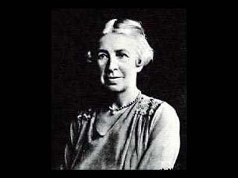

  
[Intangible Textual Heritage](../../index)  [Mysticism](../index) 

------------------------------------------------------------------------

[Buy this Book on
Kindle](https://www.amazon.com/exec/obidos/ASIN/B0030IM7KU/internetsacredte)

------------------------------------------------------------------------

<table width="75%">
<colgroup>
<col style="width: 50%" />
<col style="width: 50%" />
</colgroup>
<tbody>
<tr class="odd">
<td width="50%" data-valign="TOP"></td>
<td width="50%" data-valign="CENTER"><h1 id="mysticism" data-align="CENTER">Mysticism</h1>
<h2 id="by-evelyn-underhill" data-align="CENTER">by Evelyn Underhill</h2>
<h4 id="section" data-align="CENTER">[1911]</h4></td>
</tr>
</tbody>
</table>

------------------------------------------------------------------------

[Contents](#contents)    [Start Reading](myst00)    [Page
Index](pageidx)    [Text \[Zipped\]](myst.txt.gz)

------------------------------------------------------------------------

|                                                                                                                           |
|---------------------------------------------------------------------------------------------------------------------------|
|  |

Evelyn Underhill (b. 6 Dec. 1875, d. 15 Jun 1941) was an English
Anglo-Catholic writer who wrote extensively on Christian mysticism. A
pacifist, novelist, and philosopher, she was widely read during the
first half of the 20th century. This work, Mysticism, is not a textbook
of the subject. She disagrees with William James' [The Varieties of
Religious Experience](../../etc/vre/index) with his four-part division
of the mystic state (ineffability, noetic quality, transcience, and
passivity). She sees Bucke's [Cosmic Consciousness](../../eso/cc/index)
as only the gateway to Unitative Living, about halfway there by her view
(p. 193).

Underhill maps out her own view of the mystic's journey into five parts:
"Awakening of Self," "Purgation of Self," "Illumination," "the Dark
Night of the Soul," and "the Unitative life." Underhill is focussed on
mysticism in Christianity but she also mentions Sufism, Hinduism,
Buddhism, and other belief systems. This has long been considered a
crucial work on the subject of Mysticism, and continues to guide seekers
a century later.--J.B. Hare

------------------------------------------------------------------------

 [Title Page](myst00)  
[Preface to the Twelfth Edition](myst01)  
[Preface to the First Edition](myst02)  

### Part One: The Mystic Fact

[Part One: The Mystic Fact](myst03)  
[I. The Point of Departure](myst04)  
[II. Mysticism and Vitalism](myst05)  
[III. Mysticism and Psychology](myst06)  
[IV. The Characteristics of Mysticism](myst07)  
[V. Mysticism and Theology](myst08)  
[VI. Mysticism and Symbolism](myst09)  
[VII. Mysticism and Magic](myst10)  

### Part Two: The Mystic Way

[Part Two: The Mystic Way](myst11)  
[I. Introductory](myst12)  
[II. The Awakening of the Self](myst13)  
[III. The Purification of the Self](myst14)  
[IV. The Illumination of the Self](myst15)  
[V. Voices and Visions](myst16)  
[VI. Introversion. Part I: Recollection and Qui](myst17)  
[VII. Introversion. Part II: Contemplation](myst18)  
[VIII. Ecstasy and Rapture](myst19)  
[IX. The Dark Night of the Soul](myst20)  
[X. The Unitive Life](myst21)  

 

[Conclusion](myst22)  
[Appendix: Historical Sketch of Mysticism](myst23)  
[Bibliography](myst24)  
[Bibliographical Note](myst25)  
[Index](myst26)  

### Indexes

[Index of Scripture References](myst27)  
[Latin Words and Phrases](myst28)  
[French Words and Phrases](myst29)  
[Index of Pages of the Print Edition](myst30)  
