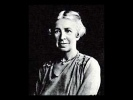

  
[Intangible Textual Heritage](../../index)  [Mysticism](../index) 
[Index](index)  [Previous](myst10)  [Next](myst12) 

------------------------------------------------------------------------

[Buy this Book on
Kindle](https://www.amazon.com/exec/obidos/ASIN/B0030IM7KU/internetsacredte)

------------------------------------------------------------------------

  
*Mysticism*, by Evelyn Underhill, \[1911\], at Intangible Textual
Heritage

------------------------------------------------------------------------

## PART TWO: THE MYSTIC WAY

p. 166 

>  “As the Pilgrim passes while the Country
> permanent remains  
> So Men pass on; but the States remain permanent forever.”  

Blake, “Jerusalem.”

p. 167 

------------------------------------------------------------------------

[Next: I. Introductory](myst12)

