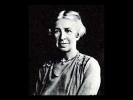

  
[Intangible Textual Heritage](../../index)  [Mysticism](../index) 
[Index](index)  [Previous](myst23)  [Next](myst25) 

------------------------------------------------------------------------

[Buy this Book on
Kindle](https://www.amazon.com/exec/obidos/ASIN/B0030IM7KU/internetsacredte)

------------------------------------------------------------------------

  
*Mysticism*, by Evelyn Underhill, \[1911\], at Intangible Textual
Heritage

------------------------------------------------------------------------

### Bibliography

I. THE WORKS AND LIVES OF THE MYSTICS.

II. GENERAL WORKS ON MYSTICISM.

III. PHILOSOPHY, PSYCHOLOGY, THEOLOGY.

IV. ALCHEMY AND MAGIC.

#### PART I

####  THE WORKS AND LIVES OF THE MYSTICS

1. Texts. 2. Translations. 3. Biographies and
Monographs.

 **Note** . For early lives and legends of
all canonized and beatified Christian mystics, see Acta Sanctorum
Bollandiana, Jan.-Oct. vi. Brussels 1643-1794; Oct. vii.-Nov., Brussels
and Paris, 1845-1910. (In progress.)  
See also Dictionnaire de Théologie Catholique for biographies, with
bibliographical notes.

##### ANONYMOUS WORKS.

###### Texts.

The Cloud of Unknowing. Edited, from B. M.
Harl., 674, by E. Underhill. London, 1912.

The Cloud of Unknowing, Epistle of Privy
Counsel and Denis Hid Divinity. Edited by Dom Justin McCann, O.S.B.
(Orchard Books.) London, 1924.  
(Compare Part II., E. Gardner: The Cell of Self Knowledge.)

The Mirror of Simple Souls. Edited \[with
some omissions\] by Clare Kirschberger. (Orchard Books.) London, 1928.

##### AL GHAZZALI.

###### Trans.

The Confessions of Al Ghazzali. Translated
by Claud Field. (Wisdom of the East Series.) London, 1909.

The Alchemy of Happiness. Translated by
Claud Field. (Wisdom of the East Series.) London, 1910.

(See also in Part II., Schmölders.)

##### AL HALLAJ.

###### Mon.

 *Massignon, L* . La Passion de Al-Halladj.
2 tomes. Paris, 1922. (See also Part II., Maréchal.)

##### ANGELA OF FOLIGNO, BLESSED.

###### Texts.

Le livre de la Bienheureuse Angèle de
Foligno. Annoté par Paul Doncoeur. t. I. Texte latin. Paris, 1925. t.
II. Documents originaux. Paris, 1926.

Le livre de l’experiènce des vrais fidèles
de Ste Angèle de Foligno. Trad. par M. J. Ferré. Edition critique: texte
latin et traduction française. Paris, 1927.

(These two, from the earliest MSS.,
supersede all previous editions.)

Beatae Angela de Fulginio Visionum ët
Instructionum Liber (Bibliotheca mystica et ascetica, t. V.) Cologne,
1849. p. 476 

###### Trans.

The Book of Divine Consolations of the
Blessed Angela of Foligno. Translated by M. Steegmann. With an
Introduction by Algar Thorold. (New Mediaeval Library.) London, 1908.

Il Libro delle Mirabili Visioni Consolazioni
e Istruzioni della B. Angela di Foligno. Translated by Luigi Fallacara.
Florence, 1926.

###### Mons.

 *Ferré, M. J.* Oeuvres authentiques
d’Angèle de Foligno. (Revue d’histoire francescaine, July, 1927.)

—Principales dates de la Vie d’Angèle de
Foligno, (ibid., Jan., 1925).

—Les oeuvres d’Angèle de Foligno, (ibid.,
Oct. 1425).

##### ANSELM, SAINT.

###### Text.

St. Anselm Opera. (Migne, Patrologia Latina.
t. 158-59.) Paris, 1844.

###### Trans.

Meditations et Prières de S. Anselme.
Traduction par A Wilmart Maredsous, 1923.

###### Mon.

 *Rule, M.* Life and Times of St. Anselm.
London, 1883.

##### AUGUSTINE OF HIPPO, SAINT.

###### Texts.

Opera Omnia. (Migne, Patrologia Latina. t.
37-47.) Paris, 1844,

Confessionum, libri tredecim. Ex recog. P.
Knöll. Lipsiae, 1898.

Confessions. Edited by J. Gibb and W.
Montgomery. (Cambridge Patristic Texts.) 1908. \[Latin text and English
notes.\]

###### Trans.

Works. Edited by Marcus Dods. 15 vols.
Edinburgh, 1876.

Works. Trans. and annotated by J. E.
Pilkington and others. 8 vols. (Library of Nicene and Post-Nicene
Fathers.) London, 1888-92.

The Confessions. Translated by Dr. E. B.
Pusey. London,1907.

The Confessions (first nine books). Trans.
by C. Bigg. London, 1898.

###### Mons.

 *Bertrand, L.* St. Augustin. Paris, 1913.

English trans., London, 1914.

 *Harnack, A* . Augustins Confessionen.
Giessen, 1895.

##### BERNARD OF CLAIRVAUX, SAINT.

###### Text.

Opera Omnia. Notis et observationibus. J.
Mabillon. (Migne, Patrologia Latina, 182-185.) Paris, 1854.

###### Trans.

Life and Works of St. Bernard. Edited by Dom
J. Mabillon O.S.B. Translated and edited by S. L. Eales, M.A. 4 vols.
London, 1889-96. (Vols. I. and II., Letters; III., Letters and Sermons;
IV., Sermons on the Song of Songs.)

Cantica Canticorum: Sermons on the Song of
Songs. Translated by S. J. Eales, M.A. London, 1895.

Sermons on the [Canticles.
2](../../bib/kjv/sol002.htm#000) vols.
Dublin, 1920.

St. Bernard on the Love of God. Translated
by Edmund Gardner. London, 1916.

St. Bernard on Consideration. Translated by
G. Lewis. Oxford, 1908.

Suggestions on the Method of Meditation,
extracted from St. Bernard’s Scala Claustralium by W. B. Trevelyan.
London, 1904.

###### Mons.

 *Morrison, J. Cotter.* Life and Times of
St. Bernard, Abbot of Clairvaux. Second edition. London, 1868.

 *Ratisbonne, M.,* Histoire de Bernard et
son siècle. II ème édition. 2 vols. Paris, 1903.

 *Schuck, J.* Das religiose Erlebnis beim H.
Bernhard von Clairvaux. Wurzbourg, 1922.

 *Vacandard, E.* Vie de S. Bernard. Paris,
1895.

 *Williams, Watkin.* Studies in St. Bernard
of Clairvaux. London, 1927. p. 477 

##### BLAKE, WILLIAM.

###### Texts.

The writings of William Blake. Edited by
Geoffrey Keynes. 3 vols. London, 1925.

Poetry and Prose of William Blake. Edited by
Geoffrey Keynes, complete in one volume. London, 1927.

Prophetic Writings. Edited with
Introduction, etc., by D. J. Sloss and A. Wallis. 2 vols. Oxford, 1926.

Works: Poetic, Symbolic, and Critical.
Edited by E. J. Ellis and W. B. Yeats. 3 vols. London, 1893.

Poetical Works: new and verbatim text by J.
Sampson. Oxford, 1905.

Blake’s “Jerusalem.” Edited by E. R. D.
Maclagen and A. G. B. Russell. London 1904.

Blake’s “Milton.” Edited by E. R. D.
Maclagen and A. G. B. Russell. London 1907.

The Letters of William Blake, and Life by F.
Tatham. Edited by A. G. B. Russell. London, 1906.

###### Mons.

 *Berger, P.* William Blake: Mysticisme et
Poesie. Paris, 1907.

 *Damon, S. F.* W . Blake, his philosophy
and symbols. London, 1924.

 *De Selincourt, Basil.* William Blake.
London, 1909.

 *Gardner, C.* William Blake the Man.
London, 1919.

 *Gilchrist, Alexander.* Life of William
Blake. London, 1880.

 *Plowman, M* . Introduction to the Study of
Blake. London, 1927.

 *Saurat, D.* Blake and Modern Thought.
London. 1929.

 *Swinburne, A. C.* William Blake. London,
1868.

 *Symons, Arthur.* William Blake. London,
1907.

 *Wicksteed, J.* Blake’s Vision of the Book
of Job. London, 1910.

 *Wilson, Mona.* Life of William Blake.
London, 1927.

 *Wright. Thomas.* Life of William Blake. 2
vols. London, 1929.

##### BLOSIUS (Louis de Blois).

###### Text.

Opera. Antwerp, 1632.

###### Trans.

Oeuvres Spirituelles, trad. par les
Benedictins de S. Paul de Wisques. (In progress.) Paris, 1911, etc.

The Book of Spiritual Instruction. London,
1925.

A Mirror for Monks. London, 1926.

The Sanctuary of the Faithful Soul. 2 vols.
London, 1920-7.

The Paradise of the Faithful Soul. 2 vols.
London, 1928-30.

##### BOEHME, JACOB.

###### Texts.

J. Boehme, Sein Leben und seine
theosophischen Werke in geordneten Auszuge mit Einleitungen und
Erläuterungen. Allen Christglaubigen dargeboten durch J. Claassen. 3
Bands Stuttgart, 1885.

Theosophia revelata. Das ist: Alle göttliche
Schriften. . . . J. Böhmens. 7 vols. Amsterdam, 1730-31.

###### Trans.

The Works of Jacob Boehme. In 4 vols., with
Life of the Author. English translation. London, 1764-81. (The only
collected English edition, but incomplete. All Boehme’s works were
translated by Sparrow and others in the seventeenth century and have
since been re-issued. See below. For full bibliography, see ‘William Law
and the English Mystics,’ by C. Spurgeon, in ‘Cambridge History of
English Literature.’)

The Threefold Life of Man. With an
Introduction by the Rev. G. W. Allen. London, 1909.

The Three Principles of the Divine Essence.
With an Introduction by Dr. Paul Deussen. London, 1910. p. 478 

The Forty Questions of the Soul and the
Clavis. London, 1911.

Six Theosophic Points. Translated by J. R.
Earle. London, 1919.

Mysterium Magnum. Edited by C. J. Barker.
London, 1924.

De Electione Gratiae and Quaestiones
Theosophicae. Translated by J. R. Earle. London, 1930.

Treatises of Jacob Boehme. London, 1769.

Dialogues on the Supersensual Life. Edited,
with an Introduction, by Bernard Holland. London, 1901.

The Signatures of All Things. (Everyman’s
Library.) London, 1912.

The Way to Christ. London, 1912.

The Epistles of Jacob Boehme, reprinted from
the 1689 edition. 1886.

Confessions. Edited by W. S. Palmer. London,
1920.

###### Mons.

Memoirs of the life, death, burial, and
wonderful writings of J. Behmen. Now first done at large into English
from the original German. With preface by J. Okeley. Northampton, 1780.

 *Boutroux, E.* Le Philosophe Allemand,
Jacob Boehme. Paris, 1888.

 *Hartmann, F.* The Life and Doctrines of
Jacob Boehme. London, 1891.

 *Martensen, H. L.* Jakob Böhme.
Theosophische Studien. Grafenhainichen, 1882.

Translation. Jacob Behmen: His life and
teaching. London, 1885.

 *Taylor, Edward.* J. Behmen’s theosophick
philosophy unfolded. 1691.

 *Whyte, Rev. Alexander.* Jacob Böhme: an
Appreciation. Edinburgh, 1894.

##### BONAVENTURA, SAINT.

###### Text.

Opera Omnia. Editae a P. P. Collegii S.
Bonaventurae. 10 t. Ad Claras Aquas 1882. 1902.

###### Trans.

Théologie Séraphique, extraite et traduite
par C. et A. Alix. 2 vols. Paris, 1853

Les six Ailes du Seraphin. Paris, 1860.
(There are no English translations. The ‘Soliloquies ‘ and ‘Meditations’
attributed to St. Bonaventura are not authentic. For his life of St.
Francis, *vide infra,* Francis of Assisi, St.)

###### Mons.

 *Bollea, B. L. C.* II mysticismo di S.
Bonaventura studiato nelle sue antecedenza e nelle sue esplicazione.
Torino, 1901.

 *Gilson, E.* La Philosophie de S.
Bonaventure. Paris, 1924.

 *Lutz, E.* Die Psychologie Bonaventuras
nach den quellen dargestellt. (Beitrage zur Geschichte der Philosophie
des Mittelalters.) Munster, 1909.

##### BOURIGNAN, ANTOINETTE.

###### Text.

Oeuvres. 19 tomes. Amsterdam, 1686.

###### Mons.

 *Anon* . An Apology for Mrs. Antonia
Bourignan. London, 1699.

 *Cockburn, J.* Bourignianism Detected: or,
the Delusions and Errors of Antonia Bourignan and her growing Sect.
London, 1689.

 *MacEwen,* A. R. Antoinette Bourignan,
Quietist. London, 1910.

 *Von der Linde, A.* Antoinette Bourignan,
das Licht der Welt. Leyden, 1895.

##### BRIDGET OF SWEDEN, SAINT.

###### Text.

Revelationes. Rome, 1628.

Vita S. Brigettae. Edited by M. Annerstedt.
Upsala, 1876.

###### Mons.

 *Flavigny, Comtesse de.* Ste. Brigitte de
Suede. Paris, 1910.

 *Hormann, P. Simon.* Birgittenischer
Calender, 1676, Reprint, Munich, 1880.

 *Williamson, B.* The Bridgettine Order.
London, 1922. p. 479 

##### CASSIAN.

###### Text.

Dialogues. (Migne, Patrologia Latina. t.
49, 50.) Paris, 1845.

###### Trans.

Cassian: (Library of Nicene and Post-Nicene
Fathers. Ser. II.). London, 1894.

##### CATHERINE DEI RICCI, SAINT.

###### Text.

Lettere. Edited by Gherardi. Florence,
1890.

###### Mons.

Vita, par S. Razzi. Lucca, 1594.

Vie, par H. Bayonne. Paris, 1873.

##### CATHERINE OF GENOA, SAINT.

###### Texts.

Vita Mirabile e dottrina celeste di Santa
Caterina da Genova, insieme col Trattato del Purgatorio e col Dialogo
della Santa. 1743.

Dialogo di S. Caterina da Genova. Milano,
1882.

(The authenticity of this dialogue is
denied by Von Hügel.)

###### Trans.

The Treatise on Purgatory. With a Preface
by Cardinal Manning. London, 1858.

La Vie et les Oeuvres de Ste. Catherine de
Gênes, traduits par le Vicomte de Bussierre. Paris, 1860.

###### Mon.

 *Vallebona, S.* La Perla dei Fieschi.
Genova, 1887.

(See also Pt. II., Von Hügel, for the best
modern account of this mystic.)

##### CATHERINE OF SIENA, SAINT.

###### Texts.

S. Catherinae Senensis Vitae. Auctore Fr.
Raimundo Capuano. Acta S.S. Aprilis. T. III. Paris and Rome, 1860.

Opere della Seraphica Santa Caterina da
Siena. Edited by Gigli. 5 vols. Siena, 1727.

Le lettere di S. Caterina da Siena. Edited
by P. Misciatelli. 6 vols. Siena, 1922.

###### Trans.

The Divine Dialogue of St. Catherine of
Siena. Translated by Algar Thorold. Second ed. London, 1926.

St. Catherine of Siena as seen in her
Letters. Edited by Vida Scudder. London. 1905.

###### Mons.

 *Curtayne A.* St. Catherine of Siena.
London, 1929.

 *Drane, A T.* The History of St. Catherine
of Siena and her Companions. 2 vols. London, 1887.

 *Fawtier, R.* Ste. Catherine de Sienne;
essai de critique des sources, T. I. Paris, 1921.

 *Gardner, Edmund* . St. Catherine of
Siena. London, 1907. (The best modern biography.)

 *Joergensen, J.* Ste. Catherine de Sienne.
Paris, 1920.

 *Mignaty, M. A.* Catherine de Sienne.
Paris, 1886.

##### CHANTAL: JEANNE FRANÇOISE DE, SAINT.

###### Text.

Vie et Oeuvres. 8 vols. Paris, 1874-79.

###### Trans.

Her Spirit as shown in her Letters. London,
1922, selected Letters. London, 1917.

###### Mons.

 *Bougaud, E.* Histoire de Ste. Chantal. 2
t. Paris, 1899.

 *Bremond, H.* Ste. Chantal. 3 ème édition.
Paris, 1912.

 *Sanders, E. K.,* St. Chantal. London,
1918.

##### CLEMENT OF ALEXANDRIA.

###### Text.

Opera Omnia. Recog. R. Klotz. 4 vols.
Lipsiae, 1831-34.

###### Trans.

Writings, translated by W. Wilson. 2 vols.
Edinburgh. 1867-69. p. 480 

###### Mons.

 *De Faye.* Clément d’Alexandrie. Paris,
1898.

 *Tollinton, R. B.* Clement of Alexandria.
2 vols. London, 1914.

 *Wagner.* Der Christ und die Welt nach
Clemens von Alexandrien. Göttingen, 1903.

##### DANTE.

###### Texts.

Tutte le Opere. Rived nel testo da Dr. E.
Moore. Oxford, 1894.

La Divina Commedia. II testo Wittiano
rived. da Toynbee. London, 1900.

###### Text & Trans.

The Hell of Dante. Edited, with Translation
and Notes, by A. J. Butler. London, 1892.

The Purgatory. London, 1880.

The Paradise. London, 1885.

The Inferno, Purgatorio, and Paradiso.
Text, with Translation by Carlyle. Okey, and Wicksteed. (Temple
Classics.) 3 vols. London, 1900.

Readings on the Inferno, Purgatorio, and
Paradiso; chiefly based on the Commentary of Benvenuto da Imola by W. W.
Vernon. 6 vols. London, 1894-1900.

###### Minor Works.

The Convivio of Dante. Translated by P. H.
Wicksteed. (Temple Classics.) London. 1903.

Dante’s Convivio. Translated by W. W.
Jackson. Oxford, 1909.

Dante’s Eleven Letters. Translated, with
Notes, &c., by C. S. Latham. Boston, 1902.

A Translation of Dante’s Latin Works.
(Temple Classics.) London, 1896.

The New Life. Translated by D. G. Rossetti.
(The Siddal Edition.) London, 1899.

###### Mons.

 *Baratono, A.* Dante e la Visione di Dio.
1909.

 *Barelli, V.* L’Allegoria della Divina
Commedia di Dante Alighieri. Firenze, 1864.

 *Bonanni, T.* II Cantico al Sole di S.
Francesco d’Assisi commentato nella Divina Commedia. Aquila. 1890.

 *Capetti V.* L’Anima e l’arte di Dante.
1907.

 *Carroll Rev. J. S.* Exiles of Eternity:
an Exposition of Dante’s Inferno. London, 1903.

—Prisoners of Hope: an Exposition of
Dante’s Purgatorio. London, 1906.

 *Ciuffo, G* . La visione ultima della Vita
Nuova. 1899.

 *Croce, B.* La Poesia di Dante. Rome,
1921.

Translation. The Poetry of Dante. London,
1922.

 *Dunbar, H.* F. Symbolism in Mediaeval
Thought and its Consummation in the Divine Comedy. Oxford, 1929.

 *Fardel, M. D.* La Personne de Dante dans
la Divine Comédie: étude psychologique. Paris, 1894.

 *Gardner, Edmund.* Dante’s Ten Heavens.
London, 1898.

—Dante and the Mystics. London, 1913.

—A Dante Primer. Third edition. London,
1923.

 *Guiliozzi, C.* Dante e il Simbolismo.
1900.

 *Hettinger, Franz.* Dante’s Divina
Commedia, its Scope and Value. Translated and edited by Rev. H. S.
Bowden. London, 1887.

 *Perez, Paolo.* ISette Cerchi del
Purgatorio di Dante, Saggio di Studi. Milano, 1896. p. 481 

 *Wicksteed, Rev. P.* H. Dante: Six
Sermons. Second edition. London, 1890.

—Dante and Aquinas. London, 1913.

—From Vita Nuova to Paradiso. London, 1922.
(I select from the mass of Dante literature a few books useful to the
student of mysticism. For full bibliographies, see the works of Vernon
and Gardner, above cited.)

##### DENIS THE CARTHUSIAN.

###### Texts.

Doctoris Ecstatici D. Dionysii Cartusiani
opera omnia in unum corpus digesta. Cura et labore monachorum S. Ordinis
Cartusiensis. 45 vols. (In progress.) Monstrolii, 1896, etc.

D. Dionysii Carthusiani de perfecto mundi
contemptu. Colonie, 1533.

###### Mons.

 *Krogh-Tonning, K.* Der Letzte
Scholastiker. 1904.

 *Loër.* Dionysii Carthusiani doctorus
extatici vita. Cologne, 1532.

 *Mougel, D. A.* Denys le Chartreux.
Montreuil-sur-Mer, 1896.

##### DIONYSIUS THE AREOPAGITE.

###### Texts.

Opera Omnia. (Migne, Patrologia Graeca. t.
3-4.) Paris, 1855

Greek text of the Ecclesiastical Hierarchy,
with Preface by Rev. John Parker. London, 1899.

###### Trans.

Dionise Hid Divinity. (An old English
translation of the Theologia Mystica, attributed to the author of The
Cloud of Unknowing, q.v.)

Opera S. Dionysii Areopagitae, &c., a
Balthazar Corderius Latine interpretata. Folio. 1634.

Oeuvres de Saint Denys l’Aréopagite.
Traduits du grec et precédées d’une Introduction par l’Abbé Darboy.
Paris, 1815.

The Works of Dionysius the Areopagite.
Translated by the Rev. J. Parker. 2 vols. Oxford, 1897.

The Divine Names and Mystical Theology.
Translated by C. E. Rolt. London, 1920.

###### Mon.

 *Ball, Hugo.* Byzantin, Christentum III.
Heiligen leben. Munich, 1923.

 *Colet, J.* Two Treatises on the
Hierarchies of Dionysius. London, 1869.

 *Erigena.* Expositiones super Hierarchies
Caelestes S. Dionysii. Roma, 1871.

 *Koch, Dr. Hugo.* Pseudo-Dionysius
Areopagita. Maintz, 1900.

 *Müller, H. F.* Dionysius, Proclus,
Plotinus. Munster, 1918.

##### DOUCELINE, SAINT.

###### Text.

La Vie de Ste. Douceline, fondatrice des
béguines de Marseilles. Annoté par J. H. Albanés. (Provençal text,
French translation.) Marseille, 1879.

###### Mon.

 *Macdonell, Anne.* Saint Douceline.
London, 1905.

##### ECKHARTSHAUSEN, C. VON.

###### Texts.

Kostis Reise von Morgen gegen Mittag.
Leipzig, 1795.

Gott ist die reinste Liebe. Neu
ungearbeitet und vermehrt son F. X. Steck. Reutlingen, 1899.

Der Wolke vor dem Heiligthume. 1802.

###### Trans.

God is Love most pure, my Prayer and my
Contemplation. Freely translated from the original by J. Grant. London,
1817.

The Cloud upon the Sanctuary. Translated,
with Notes, by Isabel de Steiger. London, 1896. p.
482 

##### ECKHART, MEISTER.

###### Texts.

Deutsche Mystiche des 14ten Jahrhunderts.
Band 2. Meister Eckhart. F. Pfeiffer. Göttingen, 1906.

Meister Eckhart’s Schriften und Predigten
aus dem Mittelhochdeutschen übersetzt und herausgegeben von Büttner.
Leipzig, 1903.

Meister Eckhart’s lateinische Schriften.
Edited by Denifle. (Archiv. fur Litt. u. Kirchengeschichte d.
Mittelalters, 1886.)

Meister Eckhart’s Mystische Schriften, an
unsere Sprache übertragen von Gustav Landauer. (Verschollene Meister der
Literatur.) Berlin, 1903.

###### Trans.

Eckhart’s Sermons, etc. Translated by C. de
B. Evans. London, 1924.

###### Mons.

 *Denifle, H. S.* Akten z. Process, Meister
Eckhart’s. (Archiv. fur Litt. u. Kirchengeschichte d. Mittelalters,
1886).

 *Jundt, A.* Essai sur le Mysticisme
speculatif de Maitre Eckhart. Strasbourg, 1871.

 *Lasson, A.* Meister Eckhart der Mystiker.
Berlin, 1868.

 *Martensen, H.* Meister Eckhart, Eine
theologische Studie. Hamburg, 1842.

 *Michelsen. Carl.* Meister Eckhart, Ein
Versuch. 1888.

##### ELIZABETH OF SCHÖNAU, SAINT.

Die Visionen. Edited by F. W. Roth. Brünn.
1884.

##### ERIGENA, JOHN SCOTUS.

###### Texts.

Opera. (Migne, Patrologia Latina. t. 122.)
Paris. 1850.

De Divisione Naturae. Monasterii Guestphal,
1838.

###### Mon.

 *Gardner, Alice.* Studies in John the
Scot. London, 1900.

##### FOX, GEORGE.

###### Texts.

Journal of George Fox. Edited from the MSS.
by N. Penney. Cambridge, 1911.

Short Journal and Itinerary Journals.
Edited by N. Penney. Cambridge, 1925.

###### Mon.

 *Braithwaite, W.* The Beginnings of
Quakerism. London, 1912.

 *Hodgkin, T.* George Fox. London, 1896.

 *Watson, J. S.* Life of Fox. London, 1860.

##### FRANCIS OF ASSISI, ST.

###### Texts.

Opuscula S. Patris Francisci Assisiensis.
Quarrachi, 1904.

Seraphici Doctoris S. Bonaventura Legendae
duae de Vita S. Francisci Seraphici. Editae a P.P. Collegii S.
Bonaventurae. Quarrachi, 1898.

S. Francisci Assisiensis. Vita et Miracula.
Auctore Fr. Thoma de Celano. Edited by Fr. E. Alençon, O.F.M. Roma,
1906.

La Leggenda di S. Francisco scritta da tre
suoi compagni. (Latin and Italian.) Roma, 1899.

Speculum Perfectionis seu S. Francisci
Assisiensis legenda antiquissima, auctore Fr. Leo. Ed. P. Sabatier.
Paris, 1898.

I Fioretti di S. Francesco e il Cantico del
Sole. Milano, 1907.

Bartolommeo da Pisa. De Conformitate B.
Francisci ad Vitam Domini Jesu. (Analecta Franc. iv. et v. Quarrachi,
1906-12.)

###### Trans.

The Writings of St. Francis of Assisi.
Newly translated, with an Introduction and Notes, by Fr. Paschal
Robinson, O.F.M. London, 1906.

The Words of St. Francis from His Works and
the Early Legends. Selected and translated by Anne Macdonell. London,
1904. p. 483 

The Writings of St. Francis of Assisi. New
translation into English from the original texts, by Constance Countess
de la Warr London, 1907.

The Life of St. Francis, by St.
Bonaventura. English translation. (Temple Classics.) London, 1904.

The Lives of St. Francis of Assisi, by
Brother Thomas of Celano. Translated by A. G. Ferrers Howell. London,
1908.

Legend of St. Francis by the Three
Companions. English translation by E. G. Salter. (Temple Classics.)
London 1902.

The Mirror of Perfection. English
translation by Robert Steele. (Temple Classics.) London, 1903.

The Little Flowers of St. Francis of
Assisi. Translated by T. W. Arnold. (Temple Classics.) Sixth edition.
London, 1903.

###### Mons.

 *Cotette, T. S.* François d’Assise. Étude
Médicale. Paris 1895.

 *Cuthbert, Fr.* Life of St. Francis of
Assisi. London, 1914.

 *Fortini, A.* Nova vita di S. Francesco
d’Assisi. Milan, 1926.

 *Joergensen, J.* Vie de S. François
d’Assise. Paris, 1911.

Translation, by T. O’Connor Sloane. London,
1922.

 *Parenti, Giovanni.* Sacrum Commercium:
the Converse of Francis and his Sons with Holy Poverty. (Latin text and
English translation by Canon Rawnsley. Introduction by P. Sabatier.)
Temple Classics. London, 1904.

 *Robinson, Fr. Pascal, O.F.M.* A Short
Introduction to Franciscan Literature. New York, 1907, (A valuable and
scholarly little book.)

 *Sabatier, P.* Vie de S. François
d’Assise. 22me edition. Paris, 1899.

Translation. Life of St. Francis of Assisi.
Translated by L. S. Houghton. London, 1901.

##### FRANÇOIS DE SALES, SAINT.

###### Texts.

Oeuvres Complètes. 22 vols. Annecy,
1893-1925.

Introduction à la Vie Dévote. (Réimpression
textuelle de latroisième édition.) 2 tomes. Mountiers, 1895.

Traicté de l’Amour de Dieu. Paris, 1647.

###### Trans.

Introduction to the Devout Life. Trans. by
Rev. A. Ross. London, 1925.

On the Love of God. Edited by W. J. Knox
Little. London, 1901.

Spiritual Letters. Trans. by Sidney Lear.
London, 1892.

###### Mons.

 *Hamon.* Vie de S. François de Sales. 2
vols. Paris, 1854.

Eng. trans. by H. Burton. 2 vols. London,
1929.

 *Sanders, E. K.* St . François de Sales.
London, 1928.

 *Thamery, E.* Le mysticisme de S. François
de Sales. Arras, 1906.

 *Vincent, F. S.* François de Sales,
Directeur d’Ames. Paris, 1923.

##### FRIENDS OF GOD.

(See Part I. Merswin, Suso, Tauler; and
Part II., Dalgairns, Delacroix, Denifle, Jones Jundt, Preger; also
Pfeiffer, Deutsche Mystiche der 14ten Jahrhunderts. Bänd I. Göttingen,
1907.)

##### GERARD GROOT.

###### Texts.

Gerardi Magni epist. XIV edit. J. G. Acquoy
Amsterdam, 1857.

Moll, W. and Scheffer, H. Studien en
Bijdragen t. I., II., III Amsterdam, 1870-76 (for texts of Gerard
Groot’s works).

Thomas à Kempis, Opera Omnia. Paris, 1549.
(Containing early lives of G. Groot and other founders of the New
Devotion.) p. 484 

###### Mons.

 *Bonet-Maury.* G. Groot un precurseur de
la Reforme. Paris, 1878.

 *Grube, C.* L. Gerhard Groot u s.
Stiftungen. Cologne, 1883.

Des Augustines propstes J. Busch Chron.
Windesheimense Bearbeitet. (Geschichtsquellen des Prov. Sachsen, Bd. 19,
1880.)

##### GERSON.

###### Text.

Opera Omnia. 3 vols. Antwerp, 1706.

##### Mons.

 *Masson, A. L.* Jean Gerson, sa vie, son
temps. Lyons, 1894.

 *Schwab J. B.* Johannes Gerson. Wurtzburg,
1858.

##### GERTRUDE, SAINT.

###### Text.

Sanctae Gertrudis magnae Virginis ordinis
S. Benedicti, Legatus Divinae Pietatis. Accedunt ejusdem exercitia
spiritualia. (Contained in Revelationes Gertrudianae ac Mechtildianiae.
Vol. I. Paris, 1875.)

###### Trans.

The Exercises of St. Gertrude. London,
1863.

Le Heraut de l’amour divin, trad. par les
P. P. Benedictins Nouv. ed. Paris, 1921.

Prayers of St. Gertrude and St. Mechthild.
London, 1917.

###### Mons.

 *Ledos, G.* Ste. Gertrude. Paris, 1901.

The Life and Revelations of St. Gertrude,
by a Religious of the Order of Poor Clares. London, 1865.

##### GUYON, MADAME.

Oeuvres Complètes. 40 vols. Paris, 1789-91.

Vie, par Elle-même. 3 tomes. Paris, 1791.

Lettres. 4 vols. Paris, 1718.

Receuil de divers traitez de Théologie
Mystique. Paris, 1699.

Les Opuscules Spirituelles. 2 vols. Paris,
1790.

(Contains the Moyen Court, Torrents, and
minor tracts and letters.)

###### Trans.

Autobiography of Mme. Guyon. Translated in
full by T. T. Allen. 2 vols. London, 1897.

A Short Method of Prayer and Spiritual
Torrents. Translated by A. W. Marston. London, 1875.

A Short and Easy Method of Prayer. (Heart
and Life Booklets.) London, 1900.

###### Mons.

 *Masson, Maurice.* Fénelon et Mme. Guyon.
Paris, 1907.

 *Upham, T. C.* Life, Religious Opinions,
and Experience of Mme. Guyon. New edition. With an Introduction by W. R.
Inge, London, 1905.

(See also Part II., Delacroix and Leuba.)

##### HAFIZ.

###### Trans.

The Divan. Translated into prose, with a
Life, note on Sufiism, &c., by H. W. Clarke. 2 vols. London, 1891.

Ghazels from the Divan of Hafiz, done into
English by J. H. McCarthy. London, 1893.

##### HILDEGARDE, SAINT.

###### Text.

Analecta S. Hildegardis opera, Spicilegio
Solesmensi parata. (Pitra, Analecta Sacra, Vol. VIII.) Paris, 1882.

###### Trans.

Révélations. 2 vols. Paris, 1912.

###### Mons.

 *Bronarski.* Lieder der h. Hildegard.
Leipzig, 1922.

 *Cochem, M. von.* Hildegardis die Heilige.
Passau, 1844.

 *Godefridus.* Vie de Ste. Hildegarde.
1907.

 *May, J.* Die h. Hildegard. Munich, 1911.

 *Renard J.* Histoire de Ste. Hildegarde.
Paris, 1865.

 *Singer, C.* Scientific views of St.
Hildegarde. London, 1917. p. 485 

##### HILTON, WALTER.

###### Texts.

The Scale of Perfection. Edited from MS.
sources, with an Introduction, by E. Underhill. London, 1923.

The Scale of Perfection, Modernized from
the first printed edition, with an Introduction from the French of Dom
M. Noetinger (Orchard Books.) London, 1927.

Minor Works. Edited by D. Jones. (Orchard
Books.) London, 1929.

(Only the first piece, Mixed Life, can be
ascribed to Hilton with certainty. His other authentic work, The Song of
Angels, is printed by Gardner, The Cell of Self-Knowledge. See Part II.)

##### HUGH OF ST. VICTOR.

###### Text.

Opera Omnia. (Migne, Patrologia Latina. t.
175-177.) Paris, 1854.

###### Mons.

 *Hauréau, J.* *B.* Les oeuvres de Hugues
de S. Victor: essai critique Paris, 1886.

 *Mignon, A.* Les origines de la
Scholastique et Hugues de S. Victor, 2 vols. Paris, 1895.

##### IGNATIUS LOYOLA, SAINT.

###### Texts.

Exercitia spiritualia ex autographe
Hispanico, notis. J. Roothaan. Namur, 1841.

Ejercicios espirituales. Rome, 1615.

Cartas de S. Ignacio de Loyola, ed. A.
Cabre, etc. 6 vols. Madrid, 1874-90.

###### Trans.

The Spiritual Exercises, Spanish and
English, with Commentary by J. Rickaby, S. J. London, 1915.

The Testament of St. Ignatius Loyola.
Translated by E. M. Rix with a Preface by G. Tyrrell. London, 1900.

Letters and Instructions of St. Ignatius
Loyola. Translated by D. F. O’Leary. London, 1914.

###### Mons.

 *Brou.* La Spiritualité de St. Ignace.
Paris, 1914.

 *Greff, N.* Der heilige Ignatius und seine
Zeit. Kalden Kirchen, 1903.

 *Joly, H* . St. Ignace de Loyola (Les
Saints). Paris, 1899.

Translation, St. Ignatius of Loyola,
translated by M. Partridge. London, 1898.

 *Malzac, M.* Ignace de Loyola: essaie de
psychologie religieuse. 1898.

 *Peers, E. Allison.* St. Ignatius: in
Studies of the Spanish Mystics, Vol. I. London, 1927. (With full
bibliography.)

 *Ribaniera.* Vita Ignatii Loyolae. Naples,
1572.

 *Rose, S.* Ignatius Loyola and the Early
Jesuits. London, 1871 .

 *Thompson, Francis.* St. Ignatius Loyola.
London, 1909.

 *Venturi, P. T* . Storia della Compagnia
di Gesù in Italia. 2 vols. Roma, 1910-22.

##### JACOPONE DA TODI.

###### Texts.

Laude di Fr. Jacopone da Todi. Firenze,
1490.

Laude di frate Jacopone da Todi. A cura di
G. Ferri. Bari, 1915.

###### Mons.

 *Ancona, A. d’.* Jacopone da Todi il
Giullare di Dio. Roma, 1914.

 *Brugnoli, B.* Le Satire di Jacopone da
Todi. Firenze, 1914.

 *Pacheu, J.* Jacopone da Todi, Paris,
1914.

 *Underhill, E.* Jacopone da Todi: with a
selection from the Spiritual Songs trans. by Mrs. T. Beck. London, 1919
. p. 486 

##### JALÁLU ’DDIN RUMI.

###### Text.

Selected Poems from the Divan i Shamsi
Tabriz. Translated by R. A. Nicholson. Persian and English. Cambridge,
1898.

###### Trans .

Masnavi i Ma’ navi: the Spiritual Couplets
of Jalálu ‘ddin. Translated by E. H. Whinfield. London, 1887.

The Mesnevi. Bk. I . , with Life, &c.
Translated by J. W. Redhouse. London, 1881.

Jalálu ‘ddin. Selections by F. Hadland
Davis. (Widsom of the East Series.) London, 1907.

##### JÁMÍ

###### Trans .

Joseph and Zuleika. Translated by A.
Rogers. London, 1892.

Yusuf and Zulaikha. Translated by R. T. H.
Griffith. London, 1882.

Lawa’ih: a treatise on Sùfiism. Fascimile
of MS. with translation by Whinfield and Mirza Muhammed Kazvini
(Oriental Translation Fund, new series), 1906.

Jámí. Selections, by F. Hadland Davis.
(Wisdom of the East Series.) London, 1908.

##### JOACHIM OF FLORA.

###### Texts.

Liber Concordia novi ac veteris Testamenti.
Venice, 1519.

Expositio in Apocalipsum Psalterium decem
chordarum. Venice, 1527.

###### Trans .

L’evangile Éternel traduction avec
biographie par. E. Aegerter.

###### Mons.

 *Fournier, P.* Études sur J. de Flore et
ses Doctrines. Paris, 1909.

 *Grundmann, H.* Studien uber Joachim von
Floris. Berlin, 1927.

##### JOAN OF ARC, SAINT.

###### Texts.

Procès de condamnation de Jeanne d’Arc.
Text, trad. et notes. 2 tomes. Paris, 1920.

###### Mons.

 *Auriac, J. E. d’.* La Veritable Jeanne
d’Arc. Paris, 1920

 *Ayroles.* La Vraie Jeanne d’Arc. 5 tomes.
Paris, 1890-1902.

 *Barrès,* M. Autour de Jeanne d’Arc.
Paris, 1916.

 *Denis,* L. La verité sur Jeanne d’Arc.
Paris, 1910.

 *France, Anatole.* Vie de Jeanne D’Arc.
Paris, 1908.

 *Lang, A.* The Maid of France. London,
1908.

 *Petit dc Julleville.* Jeanne D’Arc. (Les
Saints.) Paris, 1909.

##### JOHN OF THE CROSS, SAINT.

###### Texts.

Obras del místico Doctor S. Juan de la
Cruz. Edición Crítica. 3 vols. Toledo, 1912-14.

Aphorismes: texte et trans. Intro. par J.
Baruzi. Bordeaux, 1924

###### Trans.

The Ascent of Mount Carmel. Trans. by David
Lewis. New edition. London, 1906.

The Dark Night ofthe Soul. Trans. by D.
Lewis. London, 1916.

The Flame of Living Love. Trans. by D.
Lewis. London, 1912.

A Spiritual Canticle of the Soul. Trans. by
D. Lewis. London, 1911.

Oeuvres: traduction nouvelle sur le texte
de l’édition critique espagnole par H. Hoornaert. 4 tomes. Paris, 1925.

###### Mons.

 *Baruzi, Jean.* S. Jean de la Croix et le
problème de l’Expérience Mystique. Paris., 1924. (Important.)

 *Besse, L* . de. Eclaircissements sur les
Oeuvres mystiques de S. Jean de la Croix. Paris, 1983.

 *Calaber, Abbé* . La Terminologie de S.
Jean de la Croix, etc. Paris, 1904. p. 487

 *Dominiguez Berrueta,* M. El Misticismo de
S. Juan de la Cruz. 1894.

 *Dosithée de Saint Alexis.* Vie de St.
Jean de la Croix. Paris, 1727.

 *Lewis, D.* The Life of St. John of the
Cross: compiled from all his Spanish biographers and other sources.
London, 1897.

 *Peers, E. Allison.* St. John of the Cross
(in Studies of the Spanish Mystics. Vol. I) with bibliography.

 *Poulain, A.* La Mystique de S. Jean de la
Croix. Paris, 1892.

##### JULIAN OF NORWICH.

###### Texts.

The Shewings: from the Amherst MS.
transcribed by the Rev. Dundas Harford. 3rd ed. London, 1925. (The
earliest text.)

Revelations of Divine Love, recorded by
Julian, Anchoress at Norwich. A.D. 1373. Edited by Grace Warrack. 5th
ed. London, 1923.

Sixteen Revelations of Divine Love showed
to Mother Juliana of Norwich. With a Preface by G. Tyrrell. London,
1902.

###### Mon.

 *Thouless, R. H.* The Lady Julian: a
psychological study. London, 1924.

##### KEMPE, MARGERY.

(See in Bibliography, Part II., Gardner:
The Cell ofSelf-Knowledge.)

##### LAW, WILLIAM.

Works. 9 vols. London, 1762. (Privately
reprinted, London, 1893.)

An Appeal to all who doubt. London, 1742.

The Spirit of Prayer. London, 1750.

The Spirit of Love. London, 1759.

The Liberal and Mystical Writings of W.
Law. Edited by W. Scott Palmer. London, 1908.

###### Mons.

 *Gem, S. H.* William Law on Christian
Practice and Mysticism. Oxford, 1905.

 *Hobhouse, S.* W . Law and 18th Century
Quakerism. London, 1928.

 *Overton Canon* J. H. Law, Nonjuror and
Mystic. London, 1881.

 *Walton C.* Notes and Materials for a
Biography of William Law. London, 1854.

 *Whyte, A* . Character and Characteristics
of W. Law. Edinburgh, 1893.

##### LAWRENCE, BROTHER.

###### Text.

Laurent de la Resurrection (Nicholas
Herman). Abrégé de la vie de Frère Laurent, ses maximes spirituelles, et
quelques lettres qu’il a escrites a des personnes de pièté. (Receuil de
divers traitez de théologie mystique.) Paris, 1699.

###### Trans.

The Practice of the Presence of God. With
additional letters. London, 1906.

The Practice of the Presence of God. Trans.
D. Attwater. (Orchard Books ) London, 1926.

The Spiritual Maxims of Brother Lawrence,
together with his character. London, 1907.

##### LEAD, JANE.

###### Texts.

The Tree of Faith. London, 1696.

The Ark of Faith: or a Supplement to the
Tree of Faith. London, 1696.

The Revelation of Revelations. London,
1683.

A Message to the Philadelphian Society.
London, 1696.

The Ascent to the Mount of Vision.
(Reprint.) Littleborough, 1906.

The Enochian walks with God. (Reprint.)
Glasgow, 1891.

The Signs of the Times. (Reprint.) Glasgow.
1891. p. 488 

##### LUCIE-CHRISTINE.

###### Text.

Journal Spirituel. Paris, 1912.

###### Trans.

Spiritual Journal. London, 1915.

##### LULL, RAMON.

###### Text.

Obras. 13 vols. (In progress.) Palma di
Mallorca, 1906 *seq* .

###### Trans.

The Book of the Lover and Beloved. London,
1923.

The Art of Contemplation. London, 1925.

The Tree of Love. London, 1926.

Blanquerna. London, 1926.

###### Mons.

 *André, M.* Le B. Raymond Lull. Paris,
1900.

 *Anon.* A Life of Ramon Lull, written by
an unknown hand about 1311, Trans. by E. Allison Peers. London, 1927.

 *Blanch, Mn. Antoni.* Vida de Beat. Ramon
Lull. Barcelona, 1907.

 *Galmes, Mn. Salvador.* Vida Compendrosa
del Bt. Ramon Lull. Palma, 1915.

 *Peers, E. Allison.* Ramon Lull. London,
1929. (With full bibliography.)

 *Probst,* M. L’Art de Contemplation et la
Mystique de Raymond Lull. Munster, 1912.

##### LYDWINE OF SCHIEDAM, SAINT.

###### Text.

Acta S. S. Aprilis t. II. Paris and Rome,
1860. (The original Lives, by her contemporaries Gerlac and Brugman.)

###### Trans.

La Vie de la Très saincte et vrayment
admirable Vierge Lydwine, tirée du Latin de J. Brugman et mise en abrégé
par M. Michel d’Esne, évesque de Tournay. Douai, 1608.

###### Mon.

 *Huysmans, J. K* . Sainte Lydwine de
Schiedam. 3 me éd. Paris, 1901.

##### MARIA MADDELENA DEI PAZZI, SAINT.

###### Text.

Opere. Florence, 1893.

###### Trans.

Oeuvres, ed. par D. Anselme Bruniaux, 2
vols. Paris, 1873.

##### MARIE DE L’INCARNATION.

###### Texts.

La Vie de la Venerable Mère Marie de
l’Incarnation tirée de ses lettres, etc. Paris 1684.

Lettres de la Ven Mere Marie de
l’Incarnation. Paris, 1681. Nouv. ed. Paris, 1876.

Méditations et retraites de la Ven Mere
Marie de l’Incarnation. Paris, 1681.

###### Mons.

See Part II. Bremond and Menzies.

##### MECHTHILD OF HACKBORN, SAINT.

###### Texts.

Liber Specialis Gratiae. (Contained in
Revelationes Gertrudianae ac Mechtildianiae, t. 2. Paris, 1875.)

Revelationes Selectae S. Mechthildis.
Edited by Dr. A. Heuser. (Bibliotheca Mystica et Ascetica.) Cologne,
1854.

Das Buch des geistlichen Gnaden (Reliquien
aus dem Mittelalter. Bänd 3). 1860.

###### Mons.

Select Revelations of S. Mechtild, Virgin,
Translated from the Latin by a secular priest. London, 1872.

Revelations. Paris, 1919.

##### MECHTHILD OF MAGDEBURG.

###### Texts.

Offenbarungen der Schwester Mechthild von
Magdeburg, oder Das Fliessende Licht der Gottheit aus der einzigen
Handschrift des p. 489  Stiftes Einsiedeln, herausgegeben von P.
Gall Morel. Regensburg, 1869.

Lux Divinitatis. (Contained in Revelationes
Gertrudianae ac Mechtildianiae, t. 2. Paris, 1875.)

Das flieszende Licht der Gottheit von
Mechthild von Magdeburg. Ins Neudeutsche übertragen und erlaütert von
Mela Escherich. Berlin, 1909.

###### Mons.

 *Ancelet-Eustache, J.* Mechtilde de
Magdebourg. Paris, 1926.

 *Lüers, Dr. G* . Die Sprache der deutschen
Mystik des Mittelalters in Werke d. Mechthild von Magdeburg. Munich,
1924.

##### MERSWIN, RULMAN.

###### Texts.

Das Buch von den Neun Felsen. Leipzig,
1859.

Das grosse deutsche Memorial. (MS. in
Universitats u. Laudes Bibliothek, Strasbourg.) A collection of 16
treatises by R. Merswin or his school.

###### Mons.

 *Jundt, A.* Rulman Merswin et l’Ami de
Dieu de l’Oberland. Paris, 1890.

 *Rieder, Carl.* Der Gottesfreund von
Oberland. Innsbruck, 1905.

 *Schmidt,* Nikolaus von Basel. Wien, 1866.
(Some of Merswin’s treatises are printed in this book.)

##### MOLINOS, MIGUEL DE.

###### Text.

Manuductio Spiritualis. Leipzig, 1687.

###### Trans.

The Spiritual Guide which disentangles the
Soul. Edited, with Introduction, by Lyttelton. (Library of Devotion.)
London, 1908.

###### Mon.

 *Dudon, P.* Le quiétiste espagnol M.
Molinos. Paris, 1921.

##### MORE, GERTRUDE.

###### Texts.

The Spiritual Exercises of the Most
Virtuous and Religious Dame Gertrude More. Paris, 1658.

The Inner Life and Writings of Dame
Gertrude More. Edited by Dom Benedict Weld Blundell, O.S.B. Vol. I., The
Inner Life; Vol. II., The Writings. London, 1910.

The Holy Practices of a Divine Lover.
Edited, with Introduction, by Dom H. Lane Fox. London and Edinburgh,
1909.

##### NICOLAS OF CUSA.

###### Text.

Opera. Basle, 1565.

###### Trans.

The Vision of God, trans. by E. Gurney
Salter. London, 1928.

###### Mon.

 *Vansteenberghe, E.* Le Cardinal Nicolas
de Cuse, Paris, 1920.

##### ORIGEN

###### Text.

Origenes Werke. 8 vols. Leipzig, 1899-1925.

###### Trans.

Library Writings; trans. F. Crombie. 2
vols., (Anti-Nicene Library.) Edinburgh. 1869-72.

###### Mons.

 *Fairweather, W.* Origen and Greek
theology. London, 1901.

 *Faye, E. de.* Origène, sa Vie, etc. 2
vols., 1923-27.

Translation. Origen and his Work. London,
1926.

##### OSANNA ANDREASI, BLESSED.

###### Mon.

 *Gardner, E.* AMystic of the Renaissance:
Osanna Andreasi of Mantua. Privately printed. London, 1910.

##### PASCAL.

###### Text.

Les Pensées Fragments et Lettres de Blaise
Pascal. Edited by Faugère. 2 me ed. Paris, 1897.

Pensées, et Vie par Madame Périer. Paris,
1861.

(Pascal’s other works, being unrelated to
his mystic life, are not given.) p. 490 

###### Trans.

The Thoughts of Pascal. Edited by C. S.
Jerram. (The Library of Devotion.) London, n.d.

###### Mons.

 *Boutroux, Emile.* Pascal. Paris, 1900.

 *Bremond, H.* En Prière avec Pascal.
Paris, 1923.

Jovy, E. Études Pascaliennes. Paris, 1927.

 *St. Cyr, Viscount.* Pascal. London, 1910.

##### PENINGTON, ISAAC.

###### Text.

Works. London, 1681.

##### PETER OF ALCANTARA, SAINT.

###### Text.

Tratado de la oración y meditación. Ed. Fr.
A. de Ocerin Jauregui. Madrid, 1916.

###### Trans.

A Golden Treatise of Mental Prayer. Ed. by
G. S. Hollings. London, 1905.

A Treatise on Prayer and Meditation. Trans.
by Dominic Devas, O.F.M. (Orchard Books.) London, 1926.

###### Mon.

 *O’Connor, A.* Life of St. Peter of
Alcantara. Bedworth, 1915.

##### PETERSEN, GERLAC.

###### Text.

Gerlaci Petri, ignitum cum Deo soliloquium.
Cologne, 1849. (A reprint of the edition of 1616.)

###### Trans.

The Fiery Soliloquy with God of Master
Gerlac Petersen. London, 1921.

##### PHILO.

###### Text.

Opera. Recog. L. Cohn et P. Wendland. 5
vols. Berlin, 1896-1906.

###### Trans.

Works, tr. Yonge. 4 vols. London, 1854.

Philo on the Contemplative Life. Edited by
F. C. Conybeare. Oxford, 1895.

###### Mons.

 *Drummond, J.* Philo: the Jewish
Alexandrian philosopher. London, 1888.

 *Kennedy, H. A.* Philo’s Contribution to
Religion. London, 1919.

 *Lake, J. W.* Plato, Philo, and Paul.
London, 1874.

 *Réville, J.* La Doctrine du Logos dans
Philon. Paris, 1881.

##### PLOTINUS.

###### Text.

Plotini Enneades, praemisso Porphyrii de
Vita Plotini deque ordine librorum ejus libello. Edidit R. Volkmann. 2
vols. Leipzig, 1883-84.

Enneades: texte etabli et trad. par E.
Bréhier. 14 vols. Paris, 1924-27.

###### Trans.

The Enneads: trans. by Stephen Mackenna. 5
vols. London 1917-24. (In progress.)

Les Ennéades de Plotin, traduites par M. N.
Bouillet. 3 tomes. Paris, 1857-61.

###### Mons.

 *Arnou, R.* Le désir de Dieu dans la
Philosophie de Plotin. Paris, 1921.

 *Inge, W.* R. The Philosophy of Plotinus.
2 vols. London, 1918.

 *Whitby, C. J.* The Wisdom of Plotinus, a
Metaphysical Study. London, 1909.

##### PROCLUS.

###### Text.

Opera. Edited by V. Cousin. 6 tomes. Paris.
1820-27.

###### Trans.

The Six Books of Proclus on the Theology of
Plato. Translated by T. Taylor. 2 vols. London, 1816.

Two Treatises of Proclus. Translated by T.
Taylor. London 1833. p. 491 

##### RABI’A.

###### Mon.

 *Smith, M.* Rabi’a the Mystic. London,
1928. (With full Arabic and Persian bibliography.)

##### RICHARD OF ST. VICTOR.

###### Text.

Opera Omnia. (Migne, Patrologia Latina. t.
196.) Paris, 1855.

(See also Pt. II., Gardner, The Cell of
Self-Knowledge, which contains an Old English translation of Richard of
St. Victor’s Benjamin Minor.)

###### Mons.

 *Buonamici. R.* di San Vittore Alatri,
1898.

 *Ebner, J.* Die Erkenntnis lehre R. von
St. Victor. Berlin, 1917.

 *Lubner, A.* Richardi a S. Victore de
Contemplatione doctrina. Gottingen, 1837-39.

##### ROLLE, RICHARD, OF HAMPOLE.

###### Texts.

Works of Richard Rolle of Hampole and his
followers. Edited by C. Horstman. 2 vols. (Library of Early English
Writers.) London, 1895. (With biographical introduction and
bibliography. All the attributions cannot be accepted.)

The Incendium Amoris: ed. by M. Deanesly.
Manchester, 1915.

Officium et Miracula: ed. R. M. Woolley,
London, 1919.

Selected Works of Richard Rolle, Hermit,
transcribed by G. C. Heseltine. London, 1930. (All the English works,
modernized.)

English Prose Treatises. (E.E.T.S. Vol.
XX.) London, 1866.

The Fire of Love, and The Mending of Life.
Englished by R. Misyn. Ed. F. Comper. London, 1914.

The Amending of Life: from Misyn’s
translation. (Orchard Books.) London, 1927.

The Psalter translated by Richard Rolle of
Hampole, ed. by H. R. Bramley. Oxford, 1884.

The Form of Perfect Living. Ed. by G.
Hodgson. London, 1910.

Minor Works, ed. by G. Hodgson. London,
1923. (Not all the pieces in this collection are by Rolle.)

###### Mons.

 *Allen, Hope.* Writings ascribed to
Richard Rolle, Hermit, of Hampole, and Materials for his Biography.
Oxford, 1927. (Most valuable piece of first-hand research.)

 *Comper, F.* The Life and Lyrics of
Richard Rolle. London, 1928.

##### ROSE OF LIMA, SAINT.

###### Text.

 *Hansen, Leonardus.* Rosa Peruana. Vita
Mirabilis et Mors pretiosa S. Rosae a Sancta Maria. Ulyssipone
Occidentali, 1725.

###### Trans.

The Life of S. Rose of Lima (paraphrase of
above). In series of The Saints and Servants of God. Edited by F. W.
Faber. London, 1847.

###### Mons.

 *Capes, F. M.* The Flower of the New
World; a short history of St. Rose of Lima. 1899.

 *Renouard de Bussierre (M.T. de).* Lo
Perou et Ste. Rose de Lima. Paris, 1863.

##### RUYSBROECK.

###### Text.

Werken van Jan van Rhusbroec, ed. J. David.
6 vols. Ghent, 1858-68.

###### Trans.

Opera Omnia: trad. Surius. Cologne, 1652.

Oeuvres de Ruysbroeck l’Admirable, trad. du
Flamand par les Benedictins de S. Paul de Wisques. 3 tomes. Brussels,
1912, etc.

L’Ornement des Noces Spirituelles de
Ruysbroeck l’Admirable, trad. par Maurice Maeterlinck. Brussels, 1900.
p. 492 

John of Ruysbroeck: Adornment of the
Spiritual Marriage, etc., trans. by P. Wynschenk Dom. London, 1916.

The Book of the Twelve Béguines, trans. by
J. Francis. London, 1913.

###### Mons.

 *Auger, A.* De doctrina et meritis Joannis
van Ruysbroeck. Louvian, 1892.

 *De Vreese, W* L. Ruysbroeck. (In
Biographie Nationale de Belgique. t. xx., 1910.)

 *Engelhardt, J. G. von.* Richard von St.
Victor und J. Ruysbroeck. Erlangen, 1838.

 *Otterloo, A. A. van,* Johannis
Ruysbroeck. ‘S. Gravenhage, 1896.

 *Pomerius:* De origine monasterii
Viridisvallis una cum vita B. Johannis Rusbrochii. (Analecta Bollandiana
iv., 1885.)

 *Schmidt, G. C.* Étude sur J. Ruysbroeck.
1859.

 *Scully, Dom. V.* A Mediaeval Mystic: B.
John Ruysbroeck. London, 1910.

 *Underhill, E.* Ruysbroeck. (Quest
Series.) London, 1915.

 *Waffelaert, G. J.* L’union de l’âme
aimante avec Dieu . . . d’après la doctrine du B. Ruusbroec. Paris et
Lille, 1906.

 *Wautier d’Aygalliers, A.* Ruysbroeck
l’Admirable. Paris, 1923. (Very valuable.)

Translation. Ruysbroeck the Admirable.
London, 1925. (This omits much bibliographical material.)

##### SA’DÍ.

###### Text.

Gulistan. New edition, collated by E. B.
Eastwick. Hertford, 1850.

###### Trans.

The Gulistan: translated by E. B. Eastwick.
Hertford, 1852.

##### SAINT-MARTIN.

###### Texts.

Tableau naturel des rapports qui existent
entre Dieu, l’Homme et l’Univers. 1782.

L’Homme de Désir, par le Philosophe
Inconnu. 1802.

Des Nombres: oeuvre posthume. Edited by J.
Schauer. Paris, 1861.

La Correspondence inédite de L. C. de
Saint-Martin dit le Philosophe Inconnu, et Kirchberger, Baron de
Liebestorf. Edited by Schauer and Chuquet. Paris, 1862.

###### Trans.

Man: his true nature. Translated by E. B.
Penny. London, 1864.

Theosophic Correspondence. Trans. by E. B.
Penny. London, 1863.

###### Mons.

 *Caro, E. M.* Du Mysticisme du 18ème
Siècle: essai sur la Vie et la Doctrine de Saint-Martin. Paris, 1852.

 *Matter, A. J.* Saint-Martin le Philosophe
Inconnu, sa vie et ses écrits. 1862.

 *Waite A. E.* The Life of Louis Claude de
Saint-Martin, the Unknown Philosopher, and the substance of his
transcendental doctrine. London, 1901.

##### STERRY, PETER.

###### Texts.

Discourse of the Freedom of the Will.
London, 1675.

The Rise, Race, and Royalty of the Kingdom
of God in the Soul. London, 1683.

The Appearance of God to Man in the Gospel.
London, 1710. p. 493 

##### SUSO.

###### Texts.

Die deutschen Schriften des seligen H.
Seuse. Edited by H. S. Denifle. München, 1876.

Heinrich Susos Leben und Schriften. Edited
by M. Diepenbrock, Regensburg, 1825.

###### Trans.

Oeuvres mystiques du B. Henri Suso.
Traduction par le P. G. Thiriot. 2 vols. Paris, 1899.

Life of B. Henry Suso, by Himself. Trans.
by T. F. Knox. London, 1913.

Little Book of Eternal Wisdom. London,
1910.

###### Mons.

 *Schmidt, C.* Der Mystiker Heinrich Seuse.
(Theol. Studien und Kriken), 1843.

 *Vetter, F.* Ein Mystiker paar des xiv
Jahrhundert. Basle, 1882.

##### TAULER

###### Texts.

Die Predigten Taulers aus d. Engelberger
und d. Freiburger Handschrift. sowie aus Schmidt’s Abschriften d.
ehemaligen Strasburger Handschrift. Ed. F. Vetter (Deutsche Texte d.
Mittelalters. Band xi.) Berlin, 1910. (This is the first critical text
of Tauler’s sermons.)

Johann Tauler’s Predigten nach den besten
Ausgaben in die jetzige Schriftsprache übertragen von J. Hamberger.
Zweite neu bearbeitete Auflage. 3 Band. Prague, 1872.

###### Trans.

D. Joannes Thauleri. Sermones de tempore et
de Sanctis totius anni, plane piissime: R. F. Laurentio Surio in Latinum
Sermonem translata, &c. Cologne, 1603.

The History and Life of the Rev. Doctor
John Tauler, with 25 of his sermons, translated by Susanna Winkworth.
Preface by Charles Kingsley. New edition. London, 1906.

The Inner Way: Being 36 sermons for
Festivals. New translation, with Introduction, by Rev. A. W. Hutton.
(Library of Devotion.) 3rd edition. London, 1909.

Sermons . . . traduits de l’Allemand par C.
Saint-Foi. 2 tomes. Paris, 1845.

Oeuvres Complètes. Trad. Iitterale de la
version latine de Surius: par G. P. Noel, O. P. 8 vols. Paris, 1911. (In
progress.)

###### Mon.

 *Denifle.* Tauler’s Bekehrung in Quellen
u. Forschungen zur Sprach u. Cultur-geschichte. Strasburg, 1879.

##### TERESA, SAINT.

###### Text.

Obras de Santa Teresa de Jesús. Editadas y
anotadas por el P. Silverio de S. Teresa. C.D. 9 vols. Burgos 1915-26.
(The best edition of the Spanish text.)

###### Trans.

Oeuvres de Sainte Thérèsa, traduites par
les Carmelites du Premier Monastère de Paris. 6 tomes. Paris, 1907-10.

Lettres, traduites selon l’ordre
chronologique par le Père Marcel Bouix. Troisième edition. 3 tomes.
Paris, 1898.

The Life of St. Teresa of Jesus, written by
Herself, translated by D. Lewis. 5th edition. London, 1916.

The Book of the Foundations of St. Teresa
of Jesus, written by Herself. Translated by D. Lewis. London, 1913.

The History of the Foundations Translated
by Sister Agnes Mason. 1909.

The Interior Castle: translated from the
autograph of St. Teresa by the Benedictines of Stanbrook Abbey. London,
1912. p. 494 

The Way of Perfection, translated from the
autograph of St. Teresa by the Benedictines of Stan brook Abbey, with
Notes by Zimmerman. London, 1911.

Letters. 4 vols. translated by the
Benedictines of Stanbrook Abbey. London, 1919-24.

Minor Works: translated by the Benedictines
of Stan brook Abbey. London, 1913.

###### Mons.

 *Baring, Arvède.* Psychologie d’une
Sainte: Sainte Thérèsa. (Revue des Deux Mondes. I e Juin, 1886.)

 *Berrueta, A.* D. Sta Teresa de Jesus y S.
Juan della Cruz: bocetos psicologica. Madrid, 1915.

 *Carmelite, Une.* Histoire de Ste.
Thérèsa. 2 vols. Paris, 1887.

 *Canal, E.* Ste. Thérèsa. Paris, 1921.

 *Coleridge, H. J.* Life and Letters of St.
Teresa. 3 vols. London, 1872.

 *Colvill, H. H.* Saint Teresa of Spain.
London, 1909.

 *Carton H. do.* Bibliographie Térèsienne.
Paris, 1902.

 *Genonville. S.* Thérèsa et son
Mysticisme. Montaubon, 1893.

 *Graham, G. Cunninghame.* Santa Teresa.
New ed. I vol. London, 1907.

 *Hoornaert, R. S.* Térèse écrivain. Paris,
1922.

 *Joly, H.* Ste. Thérèsa (Les Saints).
Paris, 1902.

(Translation.) St. Teresa, translated by E.
Waller. London, 1903.

 *Legardere. S.* Thérèsa, Psychologique et
Mystique. Besançon, 1900.

 *Mir, M.* Santa Teresa de Jesus. 2 vols.
Madrid, 1912.

 *Norero, H.* L’Union mystique chez Ste.
Thérèsa. Macon, 1905.

 *Peers, E. Allison.* St. Teresa (in
“Studies of the Spanish Mystics.” London, 1927), with full bibliography.

 *Ribera, Francisco do,* Vida de S. Teresa
de Jesus. Nuova ed. Barcelona, 1908. (First published in 1590.)

 *Whyte A.* Santa Teresa: an appreciation.
Edinburgh, 1897.

 *Yepes D. do.* Vida, Virtudes, y Milagros
de Santa Teresa de Jesus. Lisbon, 1616.

##### THEOLOGIA GERMANICA.

###### Texts.

Der Frankforter, Ein deutsch Theologia. Ed.
Willo Uhl. Bonn, 1912. (From the best MS.)

Theologia Deutsch. Neue nach der einziger
bis jetzt bekannten Handschrift besorgte vollständige Ausgabe. Edited by
F. Pfeiffer. Stuttgart, 1851. (Imperfect.)

Theologia Germanica, translated from
Pfeiffer’s edition; edited by Susanna Winkworth, with a Preface by
Charles Kingsley. 4th edition. (Golden Treasury Series.) London, 1907.

Le Livre de la Vie Parfait, trad. par J.
Paquier. Paris, 1928. (Complete translation from Uhl’s text.)

###### Mon.

 *Paquier, J.* L’orthodoxie de la Theologie
Germanique. Paris, 1922.

##### THOMAS A KEMPIS.

###### Texts.

Opera Omnia. I vol. Cologne, 1660.

De Imitatione Christi. Edited by P. E.
Puyal. Paris, 1886.

Libri Quatuor de Imitatione Christi, in
versiculos distributi, Justa rythmum ex-MSS de promptum, Cura et studie,
Dr. C. Albini de Agala. Paris, 1905.

###### Trans.

Of the Imitation of Christ. Revised
translation by Dr. C. Bigg. (Library of Devotion.) London, 1901.

The Imitation of Christ: the Earliest
English Translation. (Everyman’s Library.) London, n.d. p. 495 

##### Mons.

 *Acquoy, J.* G. Het Klooster te
Windesheim. Utrecht, 1875.

 *Busch J.* Chron. Canonicorum Ordine S.
Augustini, cap. Windesimensis. Antwerp 1631.

 *Butler, Dugald.* Thomas a Kempis, a
religious study. London, 1908.

 *Do Mongmorency. J. G.* Thomas a Kempis.
London, 1906.

 *Kettlewell, S.* The authorship of the De
Imitatione Christi. London, 1877.

—Thomas à Kempis and the Brothers of the
Common Life. London, 1882.

 *Wheatley, L. A.* The Story of the
Imitatio. London, 1891.

##### VERNAZZA, VEN. BATTISTA.

###### Text.

Opere Spirituali. Genova, 1755.

(See also in Pt. II., Von Hügel, the
Mystical Element of Religion.)

##### WOOLMAN, JOHN.

###### Text.

Journal and Essays. Edited by A. M.
Gummere. London, 1922.

#### PART II

#### GENERAL WORKS ON MYSTICISM

 **Arintero, J. G** . Cuestiones misticas.
Salamanca, 1916.  
Evolution mistica. Salamanca, 1921.

 **Auger** . Étude sur les Mystiques des
Pays Bas au Moyen (Collectiones des Mémoires Publiés par l’Academie
Royale de Belgique, tome 46.)

 **Baker, Ven. Augustine** . Holy Wisdom;
or Directions for the Prayer of Contemplation. (Edited by Abbot Sweeny,
O.S.B.) London, 1908.

 **Barbançon, C** . The Secret Paths of
Divine Love. (Orchard Books.) London, 1928.

 **Barluke, John Evangelist of.** The
Kingdom of God in the Soul. (Capuchin Classics.) London, 1930.

 **Benson, Rev. R. H** . Mysticism.
(Westminster Lectures.) London, 1907.

 **Besse, Dom L. de** . La Science de la
Prière. Paris, 1903.  
Translation. The Science of Prayer. London, 1925.  
Les Mystiques Benedictine des origines au XVII. Siècle. Parish 1922.

 **Biscioni, A. M** . Lettere di Santi e
Beati Fiorentini. Firenze, 1736.

 **Boutroux, Emile** . Psychologie du
Mysticisme. (Bulletin de l’Institut Psychologique.) Paris, 1902.

 **Bremond, Abbé** H. La Provence Mystique.
Paris, 1908.  
Histoire Litteraire du Sentiment Religieux en France. 8 vols. Paris
1916-28. (Indispensable. Contains a detailed account of the French
seventeenth-century school, with numerous quotations and bibliographical
references.  
Prière et Poésie. Paris, 1926.  
(Translation.) Prayer and Poetry. London, 1928.  
Philosophie de la Prière. Paris, 1929.

 **Brenier de Montmorand** . Ascétisme et
Mysticisme. (Revue Philosophique Mars, 1904.)

 **Buonaiuti, E** . Il Misticismo
Mediaeval. Pinerolo, 1928.

 **Butler, Dom Cuthbert** . Western
Mysticism. London, 1919.

 **Chaillot** . Principes de Theologie
Mystique. Parish 1866.

 **Chandler, Rev. A** . Ara Coeli; studies
in mystical religion. London, 1908. p. 496

 **Chapman, Dom J.** Mysticism. (In
Encyclopedia of Religion and Ethics.)

 **Davison, Ellen S** . Forerunners of St.
Francis. London, 1928.

 **Delacroix, H** . Essai sur lo Mysticisme
Spéculatif en Allemagne au XIV. Siècle. Paris, 1900.  
Études d’Histoire at de psychologie du Mysticisme. Les Grands Mystiques
Chrétiens. Paris, 1908. (Detailed analyses of St. Teresa, Madame Guyon,
Suso. Indispensable to the student.)

 **Denifle, H. S** . Das geistliche Leben:
Blumenlese aus der deutschen Mystikern der 14 Jahrhunderts. Graz, 1895.

 **Devine, Rev. A** . A Manual of Mystical
Theology. London, 1903.

 **Farges, Mgr. A** . Les phénomènes
mystiques. Paris, 1920.

Translation. Mystical Phenomena, trans.
from 2nd French edition. London, 1926.

 **Gardner, Edmund** . The Cell of
Self-Knowledge: Seven Old English Mystical Works. Reprinted from
Pepwell’s edition, with Notes and Introduction. (New Mediaeval Library.)
London, 1910. (This contains a translation of Richard of St. Victor’s
Benjamin Minor, the only known work of Margery Kempe, Hilton’s Song of
Angels, and three works of the Cloud of Unknowing group.)

 **Garrigou-Lagrange, Père** . Perfection
Chrétienne et Contemplation selon S. Thomas d’Aquin et S. Jean de la
Croix. 2 t. Paris, 1923.

 **Gebhart, E** . L’Italie Mystique. 5 me
edition. Paris, 1906.

Translation. Mystics and Heretics in Italy.
London, 1922.

 **Gichtel, J. G** . Theosophia Practica.
Leyden, 1722.

 **Godfernaux** . Sur la Psychologie du
Mysticisme. (Revue Philosophique, 1902.)

 **Görres** , J. J. v. Die Christliche
Mystik. 5 Bände. Regensburg, 1836-42.

 **Gregory, Eleanor C** . An Introduction
to Christian Mysticism. London, 1901.  
A Little Book of Heavenly Wisdom. Selections from so no English Prose
Mystics. With Introduction. (Library of Devotion.) London, 1904.

 **Harphius** (H. de Herp). Theologia
Mystica. Cologne, 1538.

 **Hébert, M** . Le Divin: Experiences et
hypotheses. Paris, 1907.

 **Heiler, F** . Das Gebet. Munich, 1920.  
Die Bedeutung der Mystick fur die Weltreligionen, Munich, 1919.

 **Hello, E** . Physionomies de Saints. New
edition. Paris, 1900.

 **Heppe, H** . Geschichte der
Quietistischen Mystik. Berlin, 1875.

 **Herman, E** . The Meaning and Value of
Mysticism. London, 1915.

 **Inge, W. R** . Christian Mysticism.
(Bampton Lectures.) London, 1899. (A standard work indispensable to the
student.)  
Studies of English Mystics. (St. Margaret’s Lectures.) London, 1906.  
Light, Life and Love. Selections from the German Mystics. With
Introduction. (Library of Devotion.) London, 1905.  
Personal Idealism and Mysticism. (Paddock Lectures.) London, 1907.

 **Joly, Henri** . Psychologie des Saints.
Paris, 1895.

Translation. The Psychology of the Saints.
With Preface and Notes by George Tyrrell. London, 1898.

 **Jones, Rufus M** . Studies in Mystical
Religion. London, 1909.

Spiritual Reformers in the 16th and 17th
Centuries. London, 1914.

 **Joret, Père** . La Contemplation
Mystique d’après S. Thomas d’Aquin Paris, 1923.

 **Jundt, A** . Les Amis de Dieu au XIV.
Siècle. Paris, 1879. p. 497 

 **Klein, F** . Madeleine Semer, Convertie
et Mystique. 16 me edition. Paris, 1924.

 **Knowles, Dom D** . The English Mystics.
London, 1928.

 **Lehmann, E** . Mysticism in Heathendom
and Christendom. Translated by G. M. G. Hunt. London, 1910.

 **Lejeune, Abbé P** . Manual de Theologie
Mystique. 1897.

 **Leuba, J. H** . Les Tendances
Fondamentales des Mystiques Chrétiens (Revue Philosophique, Juillet,
1902.)  
The Psychology of Religious Mysticism. London, 1925.

 **Malaval** . La Pratique de la vraie
théologie mystique. 2 tomes. Paris, 1709.

 **Marechal, J.** Études sur la psychologie
des Mystiques. Paris, n.d.  
Translation. Studies in the Psychology of the Mystics. London, 1927.
(Valuable.)

 **Massignon, L** . Essai sur les origines
du lexique technique de la mystique Musulmane. Paris, 1922.

 **Menzies, L** . Mirrors of the Holy.
London, 1928. (Studies of women mystics.)

 **Nicholson, R. A** . The Mystics of
Islam. London, 1914.

 **Oman, J. C** . The mystics, ascetics,
and saints of India. London, 1905.

 **Ossuna, Francesco de** . Abecedario
Spiritual. 6 vols. (Gothic letter.) Medina, 1554. (This is the book from
which St. Teresa first learned the method of contemplation.)

 **Otto, Rudolf** . Westöstliche Mystick.
Klotz. 1926.

 **Pacheu, J** . Psychologie des Mystiques
Chrétiens. Parish 1909.

 **Palmer, E. H** . Oriental Mysticism. A
Treatise on the Sufiistic and Unitarian Theosophy of the Persians.
Cambridge, 1867.

 **Patmore, Coventry** . The Rod, the Root,
and the Flower. 2nd edition. London, 1907.

 **Peers, Allison** . Spanish Mysticism.
London, 1924.  
Studies in the Spanish Mystics. Vol. I. London, 1927. (With excellent
bibliographies.)

 **Poiret, Pierre** . Theologiae Mysticae
idea generalis. Paris, 1702. Petri Poireti Bibliotheca Mysticorum
Selecta. Paris, 1708. (This contains a useful list of mystical and
ascetic works, many of which are now lost.)

 **Poulain, A** . Les desiderata de la
Mystique. (Études Jesuites.) Paris, 1898.  
Les Graces d’Oraison. 10 me edition. Paris, 1922. (Useful citations.)

Translation. The Graces of Interior Prayer.
London 1910.

 **Pourrat, P** . La Spiritualité
Chrétienne. 3 tomes. Paris, 1921-25.

Translation. Christian Spirituality. 3
vols. London. 1922-26. (Very useful.)

 **Preger, W** . Geschichte der deutschen
Mystick in Mittelalter. B. I-3. Leipzig, 1874-93

 **Récéjac, E** . Essai sur les fondements
de la Connaissance Mystique. Paris, 1897

Translation. Essay on the bases of the
Mystic Knowledge. Translated by S. C. Upton. London, 1899. (An important
study of the psychology of mysticism.)

 **Reinach, S** . Une Mystique au 18 e
Siècle. (Cultes, Mythes, et Religions.) Paris, 1906.

 **Renda, Antonio** . Il Pensiero Mistico.
Milano e Palermo, 1902.

 **Ribet, J** . La Mystique Divine. 3
tomes. Paris, 1879. (A standard Roman Catholic work. Elaborate, but
uncritical.) L’Ascétique Chrétienne. Paris, 1888.

 **Rousselot, P** . Les Mystiques
Espagnols. Paris, 1867. p. 498 

 **Saudreau, L** . Les degrés de la vie
Spirituelle. 5th edition. 2 vols. Paris, 1920.  
La Vie d’Union a Dieu. 3rd edition. Paris 1921.  
L’Etat Mystique et les faits extraordinaires de la Vie Spirituelle. 2nd
edition. Paris, 1921.

Translations. The Degrees of the Spiritual
Life, trans. by Dom Bede Camm, O.S.B. 2 vols. London, 1907.  
The Life of Union with God. London, 1927.  
The Mystical State. London, 1924.

 **Scaramelli, G. B** . Il direttorio
Mistico. Roma, 1900.

 **Schmölders, A** . Essai sur les Écoles
Philosophiques chez les Arabes. Paris, 1842. (Contains the best account
of the Sufi philosopher, Al Ghazzali. )

 **Sharpe, A** . Mysticism, its true Nature
and Value. London, 1910.

 **Spurgeon, Caroline** . Mysticism in
English Literature. London, 1913.

 **Thorold, Algar** . An Essay in Aid of
the better Appreciation of Catholic Mysticism. London, 1900.

 **Tollemache, M** . Spanish Mystics.
London, 1886.

 **Underhill, E** . The Mystic Way. London,
1913.  
Practical Mysticism. London, 1914.  
The Essentials of Mysticism. London, 1920.  
The Mystics of the Church. London, 1925.

 **Vaughan, R. A** . Hours with the
Mystics. 3rd edition. 2 vols. London, 1880.

 **Von Hügel, Baron F** . The Mystical
Element of Religion, as studied in St. Catherine of Genoa and her
Friends. 2 vols. London, 1908. (Indispensable. The best work on
Mysticism in the English language.)

 **Waite, A. E** . Studies in Mysticism.
London, 1906.

 **Watkin, E. I** . The Philosophy of
Mysticism. London, 1919.

#### PART III

#### PHILOSOPHY, PSYCHOLOGY, AND THEOLOGY

 Adam,
James.

The Religious Teachers of Greece. (Gifford
Lectures.) 1908.

Bergson, Henri.

Essai sur les Données immédiates de la
Conscience. Paris, 1889.

Matière et Mémoire. Paris, 1896.

Introduction a la Métaphysique. Paris,
1903.

L’Evolution Créatrice. Paris, 1907.

 *Translations* . Time and Free Will: an
Essay on the Immediate data of Consciousness, translated by F. L.
Pogson. London, 1910.

Matter and Memory, trans. by N. Paul and W.
Scott Palmer. London, 1910.

Creative Evolution, trans. by A. Mitchell.
London, 1911.

Berguer, M.

Psychologie religieuse. Geneva, 1914.

Bessemans, Dr.

Die Stigmatisatie in het licht der
hedendaagsche biologie. Antwerp, 1923.

Bigg, Dr. C.

The Christian Platonists of Alexandria.
(Bampton Lectures.) Oxford, 1885.

Neoplatonism. London, 1895. p. 499 

Binet, A.

La Suggestibilité. Paris, 1900.

Boutroux, Emile.

Science et Religion dans la Philosophie
Contemporaine. Paris, 1908.

 *Translation* . Science and Religion in
Contemporary Philosophy. Translated by G. J. Nield. London, 1909.
(Compare Pt. I., Boehme.)

Boyce Gibson, W. B.

An Introduction to Rudolph Eucken’s
Philosophy. London, 1908.

God with us. London, 1909.

Bradley, F. H.

Appearance and Reality. 2nd ed. London,
1897.

Brunschvieg, L.

Introduction a la Vie de l’Esprit. 1900.

Buber, M.

Ekstatische Konfessionen. 2nd ed. Leipzig,
1922.

Bucke, R. M.

Cosmic Consciousness: a study in the
evolution of the Human Mind. Philadelphia, 1905.

Caird, Edward.

The Evolution of Religion, 2 vols. (Gifford
Lectures.) Glasgow, 1893.

The Evolution of Theology in the Greek
Philosophers. 2 vols. Glasgow, 1904.

Caird, John.

Introduction to the Philosophy of Religion.
Glasgow, 1880.

Fundamental Ideas of Christianity. Glasgow,
1899.

Cutten, G. B.

The Psychological Phenomena of
Christianity. London, 1909.

De Sanctis. S.

Religious Conversion; a bio-psychological
study. Trans. by Helen Augur. London, 1927.

Dewing, A. S.

Life as Reality: a Philosophical Essay.
London, 1910.

Driesch, Hans.

The Science and Philosophy of Organism. 2
vols. (Gifford Lectures.) 1908.

Elsee, C.

Neoplatonism in its Relation to
Christianity. London, 1908.

Eucken, Rudolph.

Die Einheit des Geisteslebens. Leipzig,
1888.

Der Kampf um einen geistigen Lebensinhalt.
Leipzig, 1896.

Geistige Strömungen der Gegenwart. Leipzig,
1909.

Der Wahrheitsgehalt der Religion. 2nd ed.
Leipzig, 1905.

Die Lebensanschauungen der Grossen Denker.
Leipzig, 1909.

Hauptprobleme der Religionsphilosophie der
Gegenwart. Berlin, 1907.

Der Sinn und Wert des Lebens. Leipzig,
1908.

 *Translations* . The Life of the Spirit:
an Introduction to Philosophy 2nd ed. London, 1909.

The Problem of Human Life. London, 1909.

The Meaning and Value of Life. London,
1909.

Christianity and the New Idealism. New
York, 1909.

Flournoy, T.

Les Principes de la Psychologie religieuse
(Archives de Psychologie 1902.)

Une mystique moderne (ibid, 1915). p. 500 

Franck, A.

La Kabbale. 3rd ed. Paris, 1892.

Granger, F. G.

The Soul of a Christian. London, 1900.

Harrison, Jane E.

Prolegomena to the Study of Greek Religion.
Cambridge, 1903.

Hébert, M.

La forme idéaliste du sentiment religieux.
Paris, 1909.

Hocking, W. E.

The Meaning of God in Human Experience. New
York, 1922.

Huby, J.

La Conversion. Paris, 1919.

Imbert-Gourbeyre, Dr.

Les Stigmatisées. 2 vols. Paris, 1873.

La Stigmatization. 2 vols. Paris, 1894.

James, M. R.

Apocrypha Anecdota Series II. Cambridge.
1897.

James, William.

The Principles of Psychology. 2 vols.
London, 1890.

Textbook of Psychology. London, 1892.

The Will to Believe. New York, 1897.

The Varieties of Religious Experience.
(Gifford Lectures.) London, 1902.

A Pluralistic Universe. (Hibbert Lectures.)
London, 1909.

Janet, Pierre.

L’Automatisme Psychologique. Paris, 1889.

L’Etat Mentale des Hysteriques. 2 vols.
Paris, 1893-94.

Nevroses et idées fixes. Paris, 1898.

Une extatique (Bulletin de l’Institut
Psychologique). Paris, 1901.

Obsessions et Psychasthénie. Paris, 1903.

 *Translations* . The Mental State of
Hystericals. New York, 1901.

The Major Symptoms of Hysteria. New York,
1907.

Jastrow, J.

The Subconscious: A Study in Descriptive
Psychology. London, 1906.

Jefferies, Richard.

The Story of My Heart. 2nd ed. London,
1891.

Jundt, A.

Histoire du panthéisme populaire au moyen
age. Paris, 1875.

Ladd, G. T.

An Introduction to Philosophy. London,
1891.

The Philosophy of Knowledge. New York,
1897.

The Philosophy of Religion. 2 vols. New
York, 1905.

Leroy, B.

Nature des Hallucinations. (Revue
Philosophique, 1907.)

Interpretation psychologique des Visions
Intellectuelles. (Revue de l’Histoire des Religions, 1907.)

Maritain, J.

Introduction Generale à la Philosophie.
Paris, 1920.

De la Vie d’Oraison. Paris, 1924.

 *Translations* . An Introduction to
Philosophy. London, 1930.

Prayer and Intelligence. London, 1928.

Mead, G. R. S.

Thrice Greatest Hermes. 3 vols. London,
1906.

Munsterberg, Hugo.

The Eternal Values. London, 1909. p. 501 

Murisier, H.

Les Maladies des Sentiments Religieux. n.d.

Meyers, F. W. H.

Human Personality and its Survival of
Bodily Death. 2 vols. London, 1903.

Ormond, A. T.

Foundations of Knowledge. London, 1900.

Otto, R.

Das Heilige. Stuttgart, 1917.

Translation. The Idea of the Holy. London,
1923.

Plato.

Opera. Ed. J. Burnet. 5 vols. Oxford,
1899-1907.

Republic, with Notes and Introduction, by
J. Adam. Cambridge, 1897.

 *Translations* . The Dialogues, translated
by B. Jowett. 3rd edition. 5 vols. Oxford, 1892.

The Republic, translated by B. Jowett. 3rd
edition. Oxford, 1888.

Powicke, F. J.

The Cambridge Platonists. London, 1926.

Pratt, J. B.

The Religious Consciousness. New York,
1921.

Prince, Morton.

The Dissociation of a Personality. New
York, 1906.

Raymond, G. L.

The Psychology of Inspiration. 1908.

Rhode, Erwin.

Psyche. 2nd ed. 2 vols. Freiburg, 1898.

 *Translation* . London, 1925.

Ribot, T.

Les Maladies de la Mémoire. Paris, 1881.

Les Maladies de la Volonté. Paris, 1883.

Les Maladies de la Personnalité. Paris,
1885.

Psychologie de l’Attention. Paris, 1889.

Essai sur l’imagination créatrice. Paris,
1900.

 *Translations* . Diseases of Memory.
London, 1882.

Diseases of the Will. 2nd edition. Chicago,
1896.

The Diseases of Personality. Chicago, 1891.

The Psychology of Attention. Chicago, 1890.

Essay on the Creative Imagination. 1906.

Rolleston, T. W.

Parallel Paths: a study in biology, ethics,
and art. London, 1908.

Royce, Josiah.

Studies of Good and Evil. New York, 1898.

The World and the Individual. (Gifford
Lectures.) 2 vols. London, 1900.

Schiller, F. C. S.

Humanism. London, 1903.

Plato or Protagoras. Oxford, 1908.

Schofield, A. T.

The Unconscious Mind. London, 1899.

Seglas.

Phénomènes dits Hallucinations psychiques
(Congrès de Psychologie) Paris, 1901.

Segond, J.

La Prière: etude de psychologie religieuse.
Paris, 1911. p. 502 

Starbuck, E. T.

The Psychology of Religion. 2nd edition.
London, 1901.

Stewart, J. A.

The Myths of Plato. London, 1905.

Plato’s Doctrine of Ideas. London, 1909.

Taylor, A. E.

Plato, the Man and his Work. London, 1926.

Taylor, H. O.

The Mediaeval Mind. 2 vols. London, 1911.

Thomas Aquinas, Saint.

Summa Theologica diligenter emendata.
Nicolai, Sylvii, Billuart et Drioux, notis ornata. 8 vols. Paris, 1880.

Summa contra Gentiles. Paris, 1877.

 *Translations* . Summa Theologica.
Translated by Fathers of the English Dominican Province. 12 vols.
London, 1912-17.

Of God and His Creatures: an annotated
translation of the Summa Contra Gentiles, by Father J. Rickaby, S.J.
London, 1905.

Thouless, R. H.

An Introduction to the Psychology of
Religion. Cambridge, 1923.

Tulloch, J.

Rational Theology and Christian Philosophy
in England in the seventeenth century. 2 vols Edinburgh, 1872.

Underhill, E.

The Life of the Spirit and the Life of
To-day. London, 1922.

Man and the Supernatural. London, 1928.

Von Hügel, Baron F.

Eternal Life. Edinburgh, 1912.

Essays and Addresses on the Philosophy of
Religion. 2 series. London, 1921, 1926.

Waite, A. E.

The Holy Kabbalah. London, 1929.

Ward, James.

Naturalism and Agnosticism. (Gifford
Lectures.) 2 vols. London, 1889.

Westcott, W. W.

An Introduction to the Study of the
Kabalah. London, 1910.

Whateley, A. R.

The Inner Light. London, 1908.

Whittaker, T.

The Neoplatonists: a study in the History
of Hellenism. Cambridge, 1901.

Wittgenstein, L.

Tractatus Logico-Philosophicus. London,
1922.

Wulf, N. de.

Histoire de la Philosophie Médiévale. 2 me
ed. Louvain and Paris, 1905.

Translation. History of Mediaeval
Philosophy. London, 1909.

Scholasticism, Old and New. Dublin. 1907.
p. 503 

#### PART IV

#### ALCHEMY AND MAGIC

Anonymous.

The Hermetic Museum restored and enlarged.
Translated by A. E. Waite 2 vols. 1893. (A reissue of an old collection
of alchemic tracts.)

A Revelation of the Secret Spirit of
Alchemy. London, 1523.

A Short Enquiry Concerning the Hermetic
Art. (Reprint.) 1894.

A Suggestive Enquiry into the Hermetic
Mystery. London, 1850. (This curious treatise by the late Mrs. Atwood
was suppressed by its author and is now scarce.)

The Turba Philosophorum or Assembly of the
Sages. Translated by A. E. Waite. London. n.d.

Ashmole, Elias.

Theatrum Chemicum Britannicum, 1652.

Barrett, F.

Lives of the Alchemistical Philosophers.
1815. (Includes a long bibliography, and translations of numerous
alchemic tracts.)

Figuier, L.

L’Alchemie et les Alchemistes. Paris, 1856.

Figular, B.

A Golden and Blessed Casket of Nature’s
Marvels. Edited by A. E. Waite. London. n.d.

Hartmann, F.

Magic, White and Black: or the Science of
Finite and Infinite Life. 1904.

Hermetis Trismegisti.

Seven Chapters. London, 1692.

Hitchcock.

Remarks on Alchemy and the Alchemists.
1865,

Honorious III. (attributed to).

Grimoire du Pape Honorius. 1800.

Kelly, E.

The Alchemical Writings of. Edited by A. E.
Waite. 1893,

Lévi, Eliphas.

Dogme et Rituel de la Haute Magie. 2 vols.
2 me edition. Paris, 1861.

Histoire de la Magie. Paris, 1860.

La Clef des Grands Mystères. Paris, 1861.

Le Livre des Splendeurs. Paris, 1894.

 *Translations* . The Mysteries of Magic: a
digest of the writings of E. Lévi, by A. E. Waite. London, 1886.

Transcendental Magic. Translated by A. E.
Waite. London, 1896.

The Magical Ritual of the Sanctum Regnum.
Edited by W. W. Westcott. 1896.

Papus.

Traité Elementaire de Science Occulte.
Paris, 1903.

Qu’est-ce que l’occultisme? Paris, 1900.

L’occultisme et le Spiritualisme. Paris,
1902.

Paracelsus.

Hermetic and Alchemical Writings of. Edited
by A. E. Waite. 2 vols. 1894. p. 504 

Pazic, C.

Treatyse of Magic Incantations. (Reprint.)
1886.

Philalethes, Eirenaeus ( *i.e.* , George
Starkey).

The Marrow of A1chemy. London, 1709.

Redgrove, Stanley.

Alchemy Ancient and Modern. London, 1911.

Sepharial.

A Manual of Occultism. London, 1911.

Steiner, Rudolph.

The Way of Initiation. Translated from the
German by Max Gysi. London, 1908.

Initiation and its Results: A Sequel to The
Way of Initiation. London, 1909.

Valentinus.

The Triumphal Chariot of Antimony.
Translated by A. E. Waite. 1893.

Vaughan, Thomas (Eugenius Philalethes).

Lumen de Lumine. London, 1651.

Aula Lucis, or the House of Light. London,
1652.

Magical Writings. (Reprint.) London and
Edinburgh, 1888.

Venetiana, Antoine.

Le Grand Grimoire. 1845.

Waite, A. E.

The Occult Sciences. London, 1891.

Azoth, or the Star in the East. London,
1893.

Lives of Alchemystical Philosophers.
London, 1888. (Full bibliography.)

The Book of Black Magic. Edinburgh, 1898.

The Book of Ceremonial Magic; including the
Rites and Mysteries of Goetic Theurgy and Sorcery, and Infernal
Necromancy. London, 1911.

The Secret Doctrine. London, 1926.

Willis, T.

Theophysical Alchemy. London, 1616. p. 505 

p. 505 

------------------------------------------------------------------------

[Next: Bibliographical Note](myst25)

