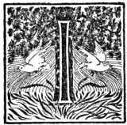

  
[Intangible Textual Heritage](../../index)  [Native American](../index) 
[Index](index)  [Previous](ait03)  [Next](ait05) 

------------------------------------------------------------------------

*American Indian Fairy Tales*, by Margaret Compton, \[1907\], at
Intangible Textual Heritage

------------------------------------------------------------------------

p. 1

### THE STORY-TELLER HIMSELF

|                     |
|---------------------|
|  |

AGOO, the story-teller of the Indians, is a little, old man with a face
as black as the shell of the butternut and a body like a twisted stick.
His eyes are twice as large as other men's, so that when a bird flies
past him he sees twice as many feathers on it, and all the little colors
underneath are bright to him. His ears are twice as large as other
men's, so that what seems to them but a tiny sound is to him like the
roll of thunder. His legs are supple and his arms are strong, so that he
can run faster and further, and can lift and carry twice as much as
others.

No one believes him, yet every one is eager to listen to him. He tells
of things of which no one else ever saw the like; but the stories are
pleasant to hear, and Iagoo says they are true. When the rivers and
lakes are frozen so that the Indian cannot fish, and the snow has
drifted many feet in thickness so that he cannot hunt, then he goes into
his wigwam, cowers under his heaviest bear-skin wrapper or

p. 2

crouches by the fire, and longs for Iagoo to appear. When the Storm-fool
dances about the wigwam and throws the snowflakes, hard and dry as sand,
in at the doorway, then Iagoo is most likely to visit him.

He vanishes for many moons and comes back with new and wonderful tales.
He has met bears with eyes of fire and claws of steel, mosquitoes whose
wings were large enough for a sail for his canoe and serpents with manes
like horses.

Once he found a water-lily with a leaf so broad that it made a petticoat
for his wife. At another time he saw a bush so large that it took him
half a day to walk round it.

As he sat in his doorway one summer evening he shot an arrow without
taking direct aim. It killed a swan and twenty brace of ducks that were
swimming on the river, then passed on and mortally wounded two Mons on
the bank, bounded back and, as it touched the water, killed an enormous
fish.

He remembers when the oldest oak was an acorn. He says that he will be
alive long after the white man has disappeared from the land.

These are his tales written down for the little Pale-faces. They are of
the fairies, the giants, the dwarfs, the witches and the magicians of
our own land, America.

------------------------------------------------------------------------

[Next: Snowbird and the Water-Tiger](ait05)
