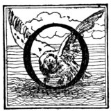
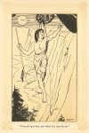

  
[Intangible Textual Heritage](../../index)  [Native American](../index) 
[Index](index)  [Previous](ait06)  [Next](ait08) 

------------------------------------------------------------------------

*American Indian Fairy Tales*, by Margaret Compton, \[1907\], at
Intangible Textual Heritage

------------------------------------------------------------------------

p. 27 p. 28 p. 29

### HOW MAD BUFFALO FOUGHT THE THUNDER-BIRD.

|                     |
|---------------------|
|  |

NCE upon a time the Indians owned all the land around the Big Sea Water.
The Good Spirit had smoked the pipe of peace at the Red-stone quarry and
called all the nations to him. At his command they washed the war-paint
from their faces, buried their clubs and tomahawks and made themselves
pipes of red sand-stone like the one that he had fashioned. They, too,
smoked the peace-pipe, and there was no longer war among the nations,
but each dwelt by its own river and hunted only the deer, the beaver,
the bear, or the bison.

In those happy days there lived on that shore of the Big Sea Water,
which is directly under the hunter's star, an Indian whom all his nation
trusted, for there were none like him in courage, wisdom, and prudence.
From his early childhood they had looked to him to do some great deed.

He had often mastered the grizzly bear

p. 30

and the strong buffalo. Once he captured a buffalo ox, so large and so
strong that a dozen arrows did not kill it, and from that day he was
known as Mad Buffalo.

When the magic horns were needed for medicine for the people, Mad.
Buffalo went forth in the Moon of Flowers and by cunning, not by magic,
cut them from the head of the Great Horned Serpent. For this the people
loved him and he sat with the oldest and the wisest of the tribe.

Their greatest trouble in those days was the mysterious thunder-bird,
which was often seen flying through the air. It had black and ragged
wings, and as it moved swiftly overhead they darkened all the earth. On
moonlight nights no harm came; but when it passed in the daytime, or
when the Moon-princess was journeying to see her brother, the
Sun-prince, and her shining lodge was hidden by the beautiful red, the
thunder-bird did evil to all who fell under its shadow.

Great curiosity existed as to its nest, but no one had dared to follow
it, nor had any hunter discovered a place where it seemed likely that it
could hide. Some thought it lived in a hollow tree, others that its home
was in the sandstone caverns, but it had never been seen to alight.

p. 31

[  
Click to enlarge](img/03100.jpg)  
“Pounced upon him, and lifted him into the air.”  

One day in the winter, Mad Buffalo set out in search of food for his
family. He had to travel to the lodge of the beavers across the Big Sea
Water and far up the river. He trapped a fat beaver, slung it over his
shoulder and started for home just as the full moon showed through the
tree-tops.

While crossing the lake, when he was in sight of his own wigwam, a great
shadow passed before him, shutting out all light. After it had gone he
looked about him for the cause. The night was clear and the moon so
bright that the hunter's star could be seen but faintly, but objects
about him were as plain as in the day.

At first he saw nothing, for the thunderbird was directly over his head;
but as it circled he caught sight of it. It made a swift movement
downwards, pounced upon him and lifted him with all he had into the air.

He felt himself rising slowly till he was far above the earth, yet not
so far as to prevent him seeing what was going on in the village. He
could even see his own wigwam and his children in the doorway. They saw
him and were terribly frightened. Their mother failed to comfort them,
for they knew by heart all the

p. 32

dreadful tales that were told of the thunder-bird. They themselves had
seen the beautiful birch tree which they had often climbed, torn up by
the roots and lie black and dead in the forest. And the oak tree where
the warriors assembled was split to its base by this terrible creature.
The yellow cedar whose boughs were used for the canoe that sailed on the
Big Sea Water was scorched and blighted by the thunder-bird.

Mad Buffalo's heart did not fail him. He grasped his spear firmly and
waited his chance to do battle with the monster. Faster and faster they
went towards the north, straight across the Big Sea Water, rising higher
and higher in the air.

At last they came to a great mountain where no trees grew. The top was a
solid, bare, rugged rock, while the sides were formed of sharp boulders,
with here and there a small patch of coarse grass and a few stunted
furze bushes. In a cleft of the highest rock overhanging the water was
the nest of the thunder-bird. It was made of the tendons of human
beings, woven with their scalp locks and the feathers they had worn when
living.

Still Mad Buffalo was not afraid. As the bird neared its home it croaked
and

p. 33

muttered, and the sound was echoed and re-echoed till the noise was
deafening. Worse than this, the creature tried to dash him against the
rock, driving him towards it with its wings; and when these struck him
his flesh stung and smarted as if touched by coals of fire.

By violently wrenching himself and balancing his spear, he managed to
escape uninjured. At length with one powerful blow the bird drove him
into its nest. It then flew away.

Mad Buffalo was stunned, but only for a moment. On coming to himself he
heard a low crackling noise of thunder and found that he was left to the
mercy of a brood of wild, hungry young thunders, for whose food he had
probably been brought. They began at once to pick at his head, uttering
croaks like the old bird, only not so loud; but as they were many the
sound was, if possible, more dreadful.

Seeing that they were young birds, Mad Buffalo supposed they would be
helpless; and when the old bird was out of sight he ventured to fight
them. Raising himself as well as he could, he struck at one with his
spear. Thereupon they all set upon him, beating him with their wings and
blinking at him with their long, narrow,

p. 34

blood-red eyes, from which darted flashes of lightning that scorched his
hands and face. In spite of the pain he fought bravely; though, when
they struck him with their sharp wings, it was like the prick of a
poisoned arrow or the sting of a serpent.

One by one their strength failed them and they were beaten down into the
nest. Mad Buffalo took hold of the largest and strongest, wrung its neck
and threw it over the precipice. On seeing this the others crept close
together and did not offer to touch him again.

He seized another, pulled out its heart, threw the body away and spread
the skin over the edge of the nest to dry. Then filling his pipe from a
pouch of wolf skin suspended from his belt, he sat down to smoke. While
resting he wrung the necks of the other birds and threw them into the
Big Sea Water, saving only their hearts and claws.

When he had killed them all he took four short whiffs at his pipe,
pointing as he did so to the kingdoms of the four winds, and asking them
for assistance. Then he got inside the dry skin, fastened it round him
with the claws he had saved, put the hearts of the young thunders on

p. 35

his spear and started to roll down the side of the mountain.

As he tumbled from rock to rock the feathers of the skin flashed like
fire-insects. When he was about half way down he straightened himself
out and, lifting the wings with his arms, found that he could fly. He
moved slowly at first, but was soon used to the motion and went as fast
as the great bird could have done.

He crossed the Big Sea Water and winged his way over the forest until he
came to the place from which he had been taken ten days before. There he
alighted, tore off the bird's skin and started homewards.

His wife and children could hardly believe that it was he; for they
supposed the young thunders had long ago picked his bones. He broiled
the hearts of the birds, which crackled and hissed so that they could be
heard a mile from the wigwam, but the meat was juicy and tender.

The old bird was never seen again in that part of the country. Hunters
who came from the Rocky Mountains say that it built a nest on the
highest peak, where it raised another brood that sometimes

p. 36

came down towards the earth, despoiling the forests and the grain
fields. But they flew higher than formerly, and from the day that Mad
Buffalo fought them they never interfered with men. Their nest
henceforth was made of the bones of the, mountain goat and the hair of
his beard.

Now when Indian children hear the fire crackling they say it is the
hearts of the young thunders; for all their nations know of the brave
deed of Mad Buffalo.

------------------------------------------------------------------------

[Next: The Red Swan](ait08)
