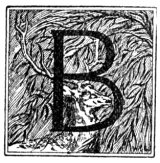

  
[Intangible Textual Heritage](../../index)  [Native American](../index) 
[Index](index)  [Previous](ait08)  [Next](ait10) 

------------------------------------------------------------------------

*American Indian Fairy Tales*, by Margaret Compton, \[1907\], at
Intangible Textual Heritage

------------------------------------------------------------------------

p. 55 p. 56 p. 57

### THE BENDED ROCKS.

#### A STORY OF NIAGARA.

|                     |
|---------------------|
|  |

ENDING WILLOW was the most beautiful girl in a tribe noted for its
handsome women. She had many suitors, but she refused them all; for her
love was given to a young warrior of a distant nation, who, she felt
sure, would some day return to throw a red deer at her feet in token
that he wished to marry her.

Among her suitors was a hideous old Indian, a chief who was very rich.
He was scarred and wrinkled and his hair was as gray as the badger that
burrows in the forest. He was cruel also, for when the young men were
put to the torture to prove themselves worthy to be warriors, he devised
tests more dreadful than any that the tribe had ever known. But the
chief, who was rightly named No Heart, declared that he would marry
Bending Willow, and, as he was powerful, her parents did not dare to
refuse him. Bending Willow begged and pleaded in vain.

p. 58

On the night before the day set for the marriage, she went into the
woods, and throwing herself on the ground, sobbed as if her heart would
break. All night she lay there, listening to the thunder of the great
cataract of Niagara, which was but a woman's journey from the village.
At last it suggested to her a sure means of escape.

Early in the morning before any one was stirring, she went back to her
father's wigwam, took his canoe and dragged it to the edge of the river.
Then stepping into it she set it adrift and it headed quickly towards
the Falls. It soon reached the rapids and was tossed like a withered
branch on the white-crested billows, but went on, on, swiftly and surely
to the edge of the great fall.

For a moment only, she saw the bright, green water, and then she felt
herself lifted and was borne on great, white wings which held her above
the rocks. The water divided and she passed into a dark cave behind the
rainbow.

The spirit of Cloud and Rain had gone to her rescue and had taken her
into his lodge. He was a little, old man, with a white face and hair and
beard of soft, white mist, like that which rises day and

p. 59

night from the base of the Falls. The door of his lodge was the green
wave of Niagara, and the walls were of gray rock studded with white
stone flowers.

Cloud and Rain gave her a warm wrapper and seated her on a heap of
ermine skins in a far corner of the lodge where the dampness was shut
out by a magic fire. This is the fire that runs beneath the Falls, and
throws its yellow-and-green flames across the water, forming the
rainbow.

He brought her dainty fish to eat and delicate jelly made from mosses
which only the water spirits can find or prepare.

When she was rested he told her that he knew her story, and if she would
stay with him he would keep her until her ugly old suitor was dead. "A
great serpent," added he, "lies beneath the village, and is even now
poisoning the spring from which No Heart draws all the water that he
uses, and he will soon die."

Bending Willow was grateful, and said that she would gladly remain all
her life in such a beautiful home and with such a kind spirit.

Cloud and Rain smiled; but he knew the heart of a young girl would turn
towards her own home when it was safe

p. 60

for her to return. He needed no better proof of this than the questions
she asked about the serpent which caused so much sickness among her
people.

He told her that this serpent had lain there many years. When he once
tasted human blood he could never be satisfied. He crept beneath a
village and cast a black poison into the springs from which people drew
water. When any one died the serpent stole out at night and drank his
blood. That made him ravenous for more. So when one death occurred more
followed until the serpent was gorged and went to sleep for a time.

"When you return," said Cloud and Rain, "persuade your people to move
their camp. Let them come near me, and should the serpent dare to follow
I will defend them."

Bending Willow stayed four months with Cloud and Rain, and he taught her
much magic, and showed her the herbs which would cure sickness.

One day when he came in from fishing he said to her: "No Heart is dead.
This night I will throw a bridge from the foot of the waters across the
Falls to the high hills. You must climb it without fear, for I will hold
it firmly until you are on the land."

p. 61

When the moon rose and lighted all the river, Cloud and Rain caused a
gentle wind to raise the spray until it formed a great, white arch
reaching from his cave to the distant hills. He led Bending Willow to
the foot of this bridge of mist and helped her to climb until she was
assured of her safety and could step steadily.

All the tribe welcomed her, and none were sorry that she had not married
No Heart. She told them of the good spirit, Cloud and Rain, of his
wonderful lodge, of his kindness, and of the many things he had taught
her.

At first they would not entertain the idea of moving their village, for
there were pleasant fishing-grounds where they lived, and by the Falls
none but spirits could catch the fish. But when strong men sickened and
some of the children of the Chief died, they took down their lodge poles
and sought the protection of the good spirit.

For a long time they lived in peace and health; but after many moons the
serpent discovered their new camp and made his way thither.

Cloud and Rain was soon aware of his arrival, and was very angry because
the serpent dared to come so near his lodge.

p. 62

\[paragraph continues\] He took a handful
of the magic fire and molded it into thunderbolts which he hurled at the
monster. The first stunned him, the second wounded him severely, and the
third killed him.

Cloud and Rain told them to drag the body to the rapids and hurl it into
the water. It took all the women of the tribe to move it, for it was
longer than the flight of twenty arrows. As it tossed upon the water, it
looked as though a mountain had fallen upon the waves, and it drifted
but slowly to the edge of the Great Fall. There it was drawn between the
rocks and became wedged so firmly that it could not be dislodged, but
coiled itself as if it had lain down to sleep. Its weight was so great
that it bent the rocks, and they remain curved like a drawn bow to this
day. The serpent itself was gradually washed to pieces and disappeared.

In the Moon of Flowers the young warrior whom Bending Willow loved came
and cast a red deer at her feet, and they were happy ever after.

------------------------------------------------------------------------

[Next: White Hawk, the Lazy](ait10)
