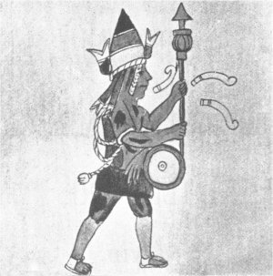

[Sacred-Texts](../../../index)  [Native American](../../index) 
[Aztec](../index)  [Illustrations](illust) 

------------------------------------------------------------------------

# RIG VEDA AMERICANUS.

##### SACRED SONGS OF THE ANCIENT MEXICANS, WITH A GLOSS IN NAHUATL.

###### BY

### DANIEL G. BRINTON

#### \[1890\]

------------------------------------------------------------------------

[Introduction](rva00)  
[I. The Hymn of Huitzilopochtli.](rva01)  
[II. War Song of the Huitznahuac](rva02)  
[III. Hymn of Tlaloc](rva03)  
[IV. Hymn to the All-Mother.](rva04)  
[V. Hymn to the Virgin-Mother.](rva05)  
[VI. Hymn to the God of Fire.](rva06)  
[VII. Hymn of Mixcoatl.](rva07)  
[VIII. Hymn to the God of Flowers.](rva08)  
[IX. Hymn to the Goddess of Artists](rva09)  
[X. Hymn to the God of Fishing.](rva10)  
[XI. Hymn of the Otomi Leader.](rva11)  
[XII. Hymn to the Goddess of Childbirth.](rva12)  
[XIII. Hymn to the Mother of Mortals](rva13)  
[XIV. Hymn at a Fast.](rva14)  
[XV. Hymn to a Night-God.](rva15)  
[XVI. Hymn to the Goddess of Food.](rva16)  
[XVII. Hymn to the Gods of Wine.](rva17)  
[XVIII. Hymn to the Master of Waters.](rva18)  
[XIX. Hymn to the God of Flowers.](rva19)  
[XX. Hymn to the God of Merchants.](rva20)  
[Glossary](rvagloss)  
[Index](rvaidx)  
