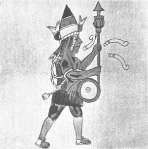

[Sacred-Texts](../../../index)  [Native American](../../index) 
[Aztec](../index)  [Illustrations](illust)  [Index](index) 
[Next](rva01) 

------------------------------------------------------------------------

#### BRINTON'S LIBRARY OF ABORIGINAL AMERICAN LITERATURE. NUMBER VIII.

# RIG VEDA AMERICANUS.

##### SACRED SONGS OF THE ANCIENT MEXICANS, WITH A GLOSS IN NAHUATL.

#### EDITED, WITH A PARAPHRASE, NOTES AND VOCABULARY,

###### BY

### DANIEL G. BRINTON

\[1890\]

Scanned at Intangible Textual Heritage, March 2001

XIPPE TOTEC, GOD OF SILVERSMITHS, IN FULL COSTUME. HYMN XV.

{p. iii}

# PREFACE.

In accordance with the general object of this series of volumes--which
is to furnish materials for study rather than to offer completed
studies--I have prepared for this number the text of the most ancient
authentic record of American religious lore. From its antiquity and
character, I have ventured to call this little collection the RIG VEDA
AMERICANUS, after the similar cyclus of sacred hymns, which are the most
venerable product of the Aryan mind.

As for my attempted translation of these mystic chants I offer it with
the utmost reserve. It would be the height of temerity in me to pretend
to have overcome difficulties which one so familiar with the ancient
Nahuatl as Father Sahagun intimated were beyond his powers. All that I
hope to have achieved is, by the aid of the Gloss--and not always in
conformity to its suggestions--to give a general idea of the sense and
purport of the originals.

The desirability of preserving and publishing these texts seems to me to
be manifest. They reveal to us the undoubtedly authentic spirit of the
ancient religion; they

{p. iv}

show us the language in its most archaic form; they preserve references
to various mythical cycli of importance to the historian; and they
illustrate the alterations in the spoken tongue adopted in the esoteric
dialect of the priesthood. Such considerations will, I trust, attract
the attention of scholars to these fragments of a lost literature.

In the appended Vocabulary I have inserted only those words and
expressions for which I can suggest correct--or, at least,
probable--renderings. Others will have to be left to future
investigators.

{p. v}

# CONTENTS.

|                                                     |      |
|-----------------------------------------------------|------|
|                                                     | PAGE |
| [PREFACE](#pref)                                    | iii  |
| [INTRODUCTION](#intro)                              | ix   |
| [I. HYMN OF HUITZILOPOCHTLI](rva01)                 | 15   |
| [II. WAR SONG OF THE HUITZNAHUAC](rva02)            | 19   |
| [III. HYMN OF TLALOC](rva03)                        | 22   |
| [IV. HYMN TO THE ALL-MOTHER](rva04)                 | 27   |
| [V. HYMN TO THE VIRGIN MOTHER](rva05)               | 31   |
| [VI. HYMN TO THE GOD OF FIRE](rva06)                | 33   |
| [VII. HYMN OF MIXCOATL](rva07)                      | 36   |
| [VIII. HYMN TO THE GOD OF FLOWERS](rva08)           | 39   |
| [IX. HYMN TO THE GODDESS OF ARTISTS](rva09)         | 41   |
| [X. HYMN TO THE GOD OF FISHING](rva10)              | 43   |
| [XI. HYMN OF THE OTOMI LEADER](rva11)               | 45   |
| [XII. HYMN TO THE GODDESS OF CHILDBIRTH](rva12)     | 47   |
| [XIII. HYMN TO THE MOTHER OF MORTALS](rva13)        | 49   |
| [XIV. HYMN SUNG AT A FAST EVERY EIGHT YEARS](rva14) | 52   |
| [XV. HYMN TO A NIGHT GOD](rva15)                    | 56   |
| [XVI. HYMN TO THE GODDESS OF FOOD](rva16)           | 59   |
| [XVII. HYMN TO THE GODS OF WINE](rva17)             | 61   |
| [XVIII. HYMN TO THE MASTER OF WATERS](rva18)        | 63   |
| [XIX. HYMN TO THE GOD OF FLOWERS](rva19)            | 65   |
| [XX. HYMN TO THE GOD OF MERCHANTS](rva20)           | 67   |
| [GLOSSARY](rvagloss)                                | 69   |
| [INDEX](rvaidx)                                     | 89   |

{p. vii}

## LIST OF ILLUSTRATIONS.

|                                                                    |              |
|--------------------------------------------------------------------|--------------|
| [XIPPE TOTEC, GOD OF SILVERSMITHS, IN FULL COSTUME](rva00.jpg)     | FRONTISPIECE |
| [PRIEST OF XIPPE TOTEC, DRINKING AND PLAYING ON A DRUM](rva01.jpg) | HYMN XV      |
| [CHICOMECOATL, GODDESS OF FOOD AND DRINK](rva02.jpg)               | HYMN XVI     |
| [TOTOCHTIN, THE RABBITS, GODS OF THE DRUNKARDS](rva03.jpg)         | HYMN XVII    |
| [ATLAUA, SINGING AND DANCING HYMN](rva04.jpg)                      | XVIII        |

{p. ix}

# INTRODUCTION.

As in a previous number of the Library of Aboriginal American Literature
I have discussed in detail the character of the ancient Mexican poetry,
I shall confine myself at present to the history of the present
collection. We owe its preservation to the untiring industry of Father
Bernardino de Sahagun, one of the earliest missionaries to Mexico, and
the author of by far the most important work on the religion, manners
and customs of the ancient Mexicans.

By long residence and close application Sahagun acquired a complete
mastery of the Nahuatl tongue. He composed his celebrated *Historia de
las Casas de la Nueva España* primarily in the native language, and from
this original wrote out a Spanish translation, in some parts
considerably abbreviated. This incomplete reproduction is that which was
published in Spanish by Lord Kingsborough and Bustamente, and in a
French rendering with useful notes by Dr. Jourdanet and M. Rémi Simeon.

So far as I know, the only complete copy of the Nahuatl original now in
existence is that preserved in the Bibliotheca Laurentio-Mediceana in
Florence, where I examined it in April, 1889. It is a most elaborate and
beautiful MS., in three large volumes, containing thirteen hundred and
seventy eight illustrations, carefully drawn by hand, mostly colored,
illustrative of the native mythology, history, arts and usages, besides
many elaborate head and tail pieces to the chapters.

{p. x}

There is another Nahuatl MS. of Sahagun's history in the private library
of the King of Spain at Madrid, which I examined in May, 1888, and of
which I published a collation in the *Mémoires de la Sociètè
Internationale des Américanistes*, for that year. It is incomplete,
embracing only the first. six books of the Historia, and should be
considered merely as a *borrador* or preliminary sketch for the
Florentine copy. It contains, however, a certain amount of material not
included in the latter, and has been peculiarly useful to me in the
preparation of the present volume, as not only affording another reading
of the text, valuable for comparison, but as furnishing a gloss or
Nahuatl paraphrase of most of the hymns, which does not appear in the
Florentine MS. As evidently the older of the two, I have adopted the
readings of the Madrid MS. as my text, and given the variants of the
Florentine MS. at the end of each hymn.

Neither MS. attempts any translation of the hymns. That at Madrid has no
Spanish comment whatever, while that at Florence places opposite the
hymns the following remarks, which are also found in the printed copies,
near the close of the Appendix of the Second Book of the *Historia*:--

"It is an old trick of our enemy the Devil to try to conceal himself in
order the better to compass his ends, in accordance with the words of
the Gospel, 'He whose deeds are evil, shuns the light.' Also on earth
this enemy of ours has provided himself with a dense wood and a ground,
rough and filled with abysses, there to prepare his wiles and to escape
pursuit, as do wild beasts and venomous serpents. This wood and these
abysses are the songs which he has inspired for his service to be sung
in his honor within the temples and outside

{p. xi}

of them; for they are so artfully composed that they say what they will,
but disclose only what the Devil commands, not being rightly understood
except by those to whom they are addressed. It is, in fact, well
recognized that the cave, wood or abysses in which this cursed enemy
hides himself, are these songs or chants which he himself composed, and
which are sung to him without being understood except by those who are
acquainted with this sort of language. The consequence is that they sing
what they please, war or peace, praise to the Devil or contempt for
Christ, and they cannot in the least be understood by other men."

Lord Kingsborough says in a note in his voluminous work on the
*Antiquities of Mexico* that this portion of Sahagun's text was
destroyed by order of the Inquisition, and that there was a memorandum
to that effect in the Spanish original in the noble writer's possession.
This could scarcely have referred to a translation of the hymns, for
none such exists in any MS. I have consulted, or heard of; and Sahagun
intimates in the passage quoted above that he had made none, on account
of the obscurity of the diction. Neither does any appear in the
Florentine MS., where the text of the hymns is given in full, although
the explanatory Gloss is omitted. This last-mentioned fact has prevented
me from correcting the text of the Gloss, which in some passages is
manifestly erroneous; but I have confined myself to reproducing it
strictly according to the original MS., leaving its correction to those
who will make use of it.

The Florentine MS. has five colored illustrations of the divinities, or
their symbols, which are spoken of in the chants. These are probably
copied from the native hieroglyphic books

{p. xii}

in which, as we learn from Sahagun, such ancient songs were preserved
and transmitted. These illustrations I had copied with scrupulous
fidelity and reproduced by one of the photographic processes, for the
present work.

Such is the history of this curious document, and with this brief
introduction I submit it to those who will have the patience and skill
to unravel its manifold difficulties.

------------------------------------------------------------------------

[Next: I. The Hymn of Huitzilopochtli.](rva01) 
