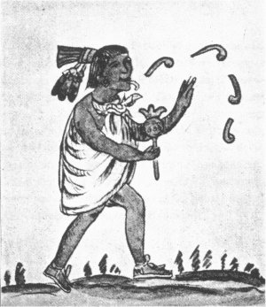

[Sacred-Texts](../../../index)  [Native American](../../index) 
[Aztec](../index)  [Illustrations](illust)  [Index](index) 
[Previous](rva17)  [Next](rva19) 

------------------------------------------------------------------------

# XVIII. Hymn to the Master of Waters.

### XVIII. Atlaua Icuic.

[English](#english)

ATLAUA, SINGING AND DANCING HYMN

1\. Auia nichalmecatl, nichalmecatl, neçaualcautla, neçaualcautla, olya
quatonalla olya.

2\. Ueya, ueya, macxoyauh quilazteutl y tlapani macxoyauh.

3\. Nimitz acatecunotzaya, chimalticpac moneçoya nimitzacatecunotzaya.

4\. Ayac nomiuh timalla aytolloca nacatl nomiuh aca xeliui timalla.

5\. Tetoma amo yolcana tlamacazquinte tometl, açan axcan ye
quetzaltototl, nic ya izcaltiquetla.

6\. Y yopuchi noteuh atlauaquetl, aça naxcan ye quetzaltototl, nic ya
izcaltiquetla.

1\. Neçaualcactla. 2. Itlamani. 4. Aitollaca acatl. Timalli. 5. Tetonac
amo yolcana tlamacaz quin tetometl.

### Gloss.

1\. *Q. n.*, ynichalmecatl, yn ineçaualac oqixicauhteuac y nioholti, y
nioya, ixquatechimal iquatunal.

2\. *Q. n.*, ma xiyauh ti quilazteutl, momactemi in macxoyauh.

3\. *Q. n.*, iniquac onimitznotz, mochimalticpac timiçoya.

4\. *Q. n.*, atle nomiuh yc notimaloa, ca uel itoloc in acatl nomiuh, yn
acatl xeliui yc ninotimaloa.

5\. *Q. n.*, oncan euac in tetuman nitlacochtetumetl. Auh inaxcan ye
quetzaltotol inic ni tlazcaltia.

{p. 64}

6, *Q. n.*, tiacauh in oteuh in atlaua, auh inaxcan yuhqui quetzaltotol
in nitlazcaltia.

### The Hymn of Atlaua.

1\. I Chalmecatl, I Chalmecatl, I leave behind my sandles, I leave my
sandles and my helmet.

2\. Go ye forth and follow the goddess Quilaztli, follow her

3\. I shall call upon thee to arise when among the shields, I shall call
upon thee to arise.

4\. I boast of my arrows, even my reed arrows, I boast of my arrows, not
to be broken.

5\. Arrayed in priestly garb, take the arrow in thy band, for even now I
shall arise and come forth like the quetzal bird.

6\. Mighty is my god Atlaua; truly I shall arise and come forth like the
quetzal bird.

### Notes.

Atlaua, mentioned by Olmos, who translates the word "Master of waters,"
is a divinity of whom little is known. The derivation from *atlatl*,
arrow, would seem more appropriate to the words of this hymn.
Chalmecatl, used as a synonym in v. 1, appears to be from *chalania*, to
beat, to strike, as a drum.

On *Quilaztli* see notes to Hymn XIII.

------------------------------------------------------------------------

[Next: XIX. Hymn to the God of Flowers.](rva19) 
