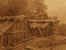

  
[Intangible Textual Heritage](../../../index)  [Native
America](../../index)  [California](../index)  [Index](index) 
[Previous](cma02)  [Next](cma04) 

------------------------------------------------------------------------

[Buy this Book at
Amazon.com](https://www.amazon.com/exec/obidos/ASIN/B002DYIWZ6/internetsacredte)

------------------------------------------------------------------------

  
*Creation Myths of Primitive America*, by Jeremiah Curtin, \[1898\], at
Intangible Textual Heritage

------------------------------------------------------------------------

p. 3

# CREATION MYTHS

###### OF

### PRIMITIVE AMERICA

## OLELBIS

#### PERSONAGES

After each name is given that of the beast, bird, or thing into which
the personage was changed subsequently. Names on which accents are not
placed are accented on the penult. Names of places are explained in the
notes. Kiemila and Herit mean "old" and "young," respectively; they are
applied to male persons. Pokaila and Loimis are applied to females; the
first means "old," the second "Young."

**Bisus**, mink; **Chálilak**, goose; **Chuluhl**, meadow-lark;
**Dokos**, flint; **Hau**, red fox; **Héssiha**, tomtit; **Hilit**,
house-fly; **Hlihli**, white oak acorn; **Hus**, turkey buzzard;
**Kahit**, wind; **Kahsuku**, cloud dog **Kaisus**, gray squirrel;
**Kar**, gray heron; **Karili**, coon; **Katkatchila**, swift;
**Katsi**, chicken-hawk; **Kau**, white crane; **Kiriú**, loon;
**Klabus**, mole; **Klak**, rattlesnake; **Kuntihlé**, fish-hawk;
**Lutchi**, hummingbird; **Mem Loimis**, water; **Mem Tulit**, beaver;
**Min Taitai**, sapsucker; **Móihas**, bald eagle; **Pákchuso**, the
pakchu stone; **Patsotchet**, badger; **Poháramas**, shooting star;
**Sas**, sun; **Sedit**, coyote; **Sosini**, a small web-footed bird;
**Sútunut**, black eagle; **Tede Wiu**, a small bird; **Tilichi**, a
water-bird; **Tilikus**, fire drill; **Titchelis**, ground squirrel:
**Toko**, sunfish; **Tórihas**, blue crane; **Tsárarok**, kingfisher;
**Tsaroki Sakahl**, green snake; **Tsurat**, woodpecker; **Wehl
Dilidili**, road-runner; **Wima Loimis**, grizzly bear; **Wokwuk**, a
large bird, extinct; **Yilahl**, gopher; **Yoholmit**, frog; **Yonot**,
buckeye bush.

\_\_\_\_\_\_\_\_\_\_\_\_\_\_\_

THE first that we know of Olelbis is that he was in Olelpanti. Whether
he lived in another place is not known, but in the beginning he was in
Olelpanti (on the upper side), the highest

p. 4

place. He was in Olelpanti before there was anything down here on the
earth, and two old women were with him always. These old women he called
grandmother, and each of them we call Pakchuso Pokaila.

There was a world before this one in which we are now. That world lasted
a long, long time, and there were many people living in it before the
present world and we, the present people, came.

One time the people of that first world who were living then in the
country about here [1](#fn_0) were talking of
those who lived in one place and another. Down in the southwest was a
person whose name was Katkatchila. He could kill game wonderfully, but
nobody knew how he did it, nor could any one find out. He did not kill
as others did; he had something that he aimed and threw; he would point
a hollow stick which he had, and something would go out of it and kill
the game. In that time a great many people lived about this place where
we are now, and their chief was Torihas Kiemila; these people came
together and talked about Katkatchila.

Some one said: "I wonder if he would come up here if we sent for him."

"Let us send for him," said Torihas; "let us ask him to come; tell him
that we are going to have a great dance. To-morrow we will send some one
down to invite him."

Next morning Torihas sent a messenger to invite Katkatchila; he sent
Tsaroki Sakahl, a very quick traveller. Though it was far, Tsaroki went
there

p. 5

in one day, gave the invitation, and told about Torihas and his people.

"I agree," said Katkatchila. "I will go in the morning."

Tsaroki went home in the night, and told the people that Katkatchila
would come on the following day.

"What shall we do?" asked they.

"First, we will dance one night," said the chief; "then we will take him
out to hunt and see how he kills things."

Katkatchila had a sister; she had a husband and one child. She never
went outdoors herself. She was always in the house. Nobody ever saw the
woman or her child.

When Katkatchila was ready to start he told his sister that he was
going, and said to his brother-in-law: "I am going. You must stay at
home while am gone."

The sister was Yonot. Her husband was Tilikus.

Katkatchila came to a hill up here, went to the top of it, and sat down.
From the hill he could see the camp of the people who had invited him.
He stayed there awhile and saw many persons dancing. It was in summer
and about the middle of the afternoon. At last Katkatchila went down to
where they were dancing, and stopped a little way off. Torihas, who was
watching, saw him and said,--

"Come right over here, Katkatchila, and sit by me."

Olelbis was looking down from Olelpanti at this moment, and said to the
old women, "My grandmothers,

p. 6

\[paragraph continues\] I see many people
collected on earth; they are going to do something."

Katkatchila sat down and looked on. Soon all the people stopped dancing
and went to their houses. Torihas had food brought to Katkatchila after
his journey. While he was eating, Torihas said to him,--

"My grandson, I and all my people have lived here very long. My people
want to dance and hunt. I sent one of them to ask you to come up here.
They will dance to-night and go hunting to-morrow."

Torihas stood up then and said,--

"You my people, we will all dance to-night and to-morrow morning we will
go to hunt. Do not leave home, any of you. Let all stay. We will have a
great hunt. Katkatchila, will you stay with us?" asked he. "I shall be
glad if you go and hunt with us."

"I will go with you," said Katkatchila. "I am glad to go."

They danced all night. Next morning, after they had eaten, and just as
they were starting off to hunt, the chief said to his people,--

"I will send my grandson with Katkatchila, and some of you, my sons,
stay near him."

Some said to others: "When Katkatchila shoots a deer, let us run right
up and take out of the deer the thing with which he killed it, and then
we won't give it back to him."

"Do you stay with him, too," said Torihas to Kaisus, who was a swift
runner.

p. 7

The whole party, a great many people, went to Hau Buli to hunt. When
they got onto the mountain they saw ten deer. Katkatchila shot without
delay; as soon as he shot a deer fell, and Kaisus, who was ready, made a
rush and ran up to the deer, but Katkatchila was there before him and
had taken out the weapon.

He killed all ten of the deer one after another, and Kaisus ran each
time to be first at the fallen body, but Katkatchila was always ahead of
him. When they went home Kaisus carried one deer, and told of all they
had done, saying,--

"Now you people, go and bring in the other deer. I don't believe any man
among us can run as fast as Katkatchila; he is a wonderful runner. I
don't know what he uses to kill game, and I don't think we can get it
away from him."

That night Hau spoke up among his friends and said, "I will go with
Katkatchila to-morrow and see what I can do."

A great many of the people talked about Katkatchila that night,
saying,--

"We do not think that he will ever come to us again, so we must all do
our best to get his weapon while he is here."

Katkatchila was ready to go home after the hunt, but Torihas persuaded
him, saying: "Stay one day more. Hunt with us to-morrow."

Katkatchila agreed to stay. Next morning they went to hunt. Hau went
among others, and stayed near Katkatchila all the time.

On the mountain they saw ten deer again. Katkatchila

p. 8

stood back to shoot. Hau was ready to spring forward to get the weapon.
The moment the weapon was shot, Hau ran with all his strength, reached
the deer first, took out the weapon and hid it in his ear.

That moment Katkatchila was there. You have taken my flint!" cried he.
"Give it back!"

"I have not taken it," said Hau. "I have nothing of yours. I have just
come."

"You have it. I saw you take it," said Katkatchila.

"I took nothing. I only put my hand on the deer's head."

"I saw you take it."

"No, you did not. I haven't it."

Katkatchila kept asking all day for his flint, but Hau would neither
give it back nor own that he had it. At last, when the sun was almost
down. Katkatchila turned to Hau and said,--

"I saw you take my flint. It would be better for you to give it back to
me, better for you and very much better for your people. You want to
keep the flint; well, keep it. You will see something in pay for this,
something that will not make you glad."

He left the hunt and went away in great anger, travelled all night and
was at home next morning.

Torihas's people went back from the hunt, and Hau with the others. He
went into the sweat-house. took the flint out of his ear and held it on
his palm. Every one came and looked at it. It was just a small bit of a
thing.

p. 9

"When I took this," said Hau, "Katkatchila got very angry; he left us on
the mountain and went home."

All the people stood around looking at the flint in Hau's hand.

"You have done wrong, you people," said Patsotchet. "Katkatchila is very
strong and quick; you will see what he will do. He has great power, more
power than you think, and he will have vengeance. He will make us suffer
terribly. He is stronger than we are. He can do anything. You will see
something dreadful before long."

"Now, my people," said Torihas, "come into the sweat-house and we will
see what we can do with that flint."

All went in. Hau went last, for he had the flint. He held it out, showed
it again, and said, "I took this because you people wanted it."

They passed the flint from one to another; all looked at it, all
examined it. One old man said: "Give it to me here, let me see it." He
got it in his hand, and said: "Now all go outside of the sweat-house."

This was Hilit Kiemila. They went out, leaving him alone. Patsotchet
kept on repeating, "Katkatchila is angry, he is malicious; before long
we shall see what will happen."

As soon as Hilit was alone in the sweat-house, he began to rub the flint
with his hands and roll it with his legs (Hilit was turned afterward
into a house-fly, and that is why house-flies keep rubbing their legs
against each other to this day). He

p. 10

wanted to make the flint large. After he had rolled and rubbed the flint
all night, it was four or five feet long, and as thick and wide. He let
the block fall to the ground and it made a great noise, a very loud
noise; people heard it for a long distance. Hilit went out then and
said,--

"Go in, all you people, and look at that good flint."

They went and looked. It was almost daylight at the time, and each one
said,--

"Well. I don't know what is best to do; perhaps it would be best to send
this off It may be had for us to keep it here; bad for us to have it in
the sweat-house or the village."

They did not know who could carry the great block. it was so heavy.
"Perhaps Patsotchet can carry it," said they.

Torihas went outside and called Patsotchet, saying: "Come into the
sweat-house a little while. You come seldom; but come now."

Patsotchet left his house, which was near by, and went into the
sweat-house.

"What are you going to do?" asked he. "It is too late to do anything
now. I have known a long time about Katkatchila. He is very strong. He
will do something terrible as soon as daylight comes.

"Patsotchet," said Torihas, "you are a good man. I wish you would take
this big flint and carry it far away off north."

"I don't want to take it," said Patsotchet. "It is too heavy."

p. 11

Torihas went to Karili, who lived a little way off, and said: "Come into
the sweat-house. I wish to talk with you."

Karili went in. "Take this block," said Torihas. "No one is willing to
carry it away, but you are strong. Carry it north for me."

Karili took up the flint, but when he had it outside the house he said:
"I cannot carry this. It is too heavy. I am not able to carry it."

Torihas called in Tichelis, and said: "My uncle, will you take this
north for me?"

"Why will not others take it? Why are they unwilling to carry it?" asked
Tichelis. "Well, I will take it said he, after thinking a little; and he
made ready.

"Take it and start right away," said Torihas.

"Daylight is coming. Go straight. I will go, too, and when I am on the
top of Toriham Pui Toror I will shout, and show you where to put the
block."

Tichelis put the flint on his back and hurried away with it.

When Katkatchila reached home he told his brother-in-law, Tilikus, and
his brother-in-law's brother, Poharamas, and Yonot, his sister, how his
flint had been stolen.

It was just before sunrise. Tilikus and Poharamas went out in front of
the house and swept a space clean and smooth; then they ran off to the
east and got pine as full of pitch as they could find it. They brought a
great deal of this, split some very fine, and made a large pile there on
the smooth place.

p. 12

just at this time Torihas's people were in his sweat-house talking about
the theft. "Nothing will happen," said most of them; "old Patsotchet is
always talking in that way, foretelling trouble. We will dance to-day.
Tichelis has carried that thing far away; all will be well now."

Yonot, Katkatchila's sister, had one child, a little baby which she
called Pohila (fire child). The woman never left the house herself, and
never let any one carry the child out.

"Now, my sister," said Katkatchila, "bring your child here; bring my
nephew out, and put him on that nice, smooth place which we have swept
clean; it will be pleasant there for him."

She brought the boy out, put him on the smooth place. Poharamas was on
the southeast side all ready, and Tilikus on the southwest side. As soon
as Yonot put down the baby, they pushed pitch-pine sticks toward it.
That instant fire blazed up. When the fire had caught well Poharamas
took a large burning brand of pitch-pine and rushed off to the
southeast; Tilikus took another and ran to the southwest. Poharamas,
when he reached the southeast where the sky comes to the earth, ran
around northward close to the sky; he held the point of his burning
brand on the ground, and set fire to everything as he ran. When Tilikus
reached the southwest, at the place where the sky touches the earth, he
ran northward near the sky. The two brothers went swiftly, leaving a
line of flame behind them, and smoke rose in a cloud with the fire.

After the two had started Yonot snatched up

p. 13

\[paragraph continues\] Pohila, and as she
raised the boy a great flame flashed up from the spot. She ran into the
house with her son, and put him into the basket where she had kept him
till that morning.

Torihas's people had begun to dance. Some time after sunrise they saw a
great fire far away on the east and on the west as well.

"Oh, look at the fire on both sides!" said one.

"It is far off and won't come here," said another.

"I feel the heat already!" cried a third.

Soon all saw that the fire was coming toward them from the east and the
west like waves of high water, and the line of it was going northward
quickly. The fire made a terrible roar as it burned; soon everything was
seething. Everywhere people were trying to escape, all were rushing
toward the north. By the middle of the forenoon the heat and burning
were so great that people began to fall down, crying out,--

"Oh, I'm hot! Ah. I'm hot!"

Torihas made a rush toward the north, and reached the top of Toriham Pui
Toror. When he saw the fire coming very near he called out to Tichelis,
who was struggling along with the great block of flint on his back,--

"Go ahead with the flint! Go on, go on, the fire is far from here, far
behind us!"

Tichelis heard the shouting, but said nothing kept going northward
steadily. When he was northeast of Bohem Puyuk, he saw the fire coming
very fast, a mighty blaze roaring up to the sky. It was coming from the
south, east, west. Tichelis

p. 14

could go no farther; there was no place for escape above ground; the
fire would soon be where he was. The flint had grown very hot from the
burning; he threw it down; it had skinned his back, it was so hot and
heavy. He ran under the ground, went as far as he could, and lay there.
Presently he heard the fire roaring above him, the ground was burning,
he was barely alive; soon all blazed up, earth, rocks, everything.

Tichelis went up in flames and smoke toward the sky.

When the brothers Tilikus and Poharamas had carried the fire around the
world and met in the north, just half-way between east and west, they
struck their torches together and threw them on the ground. The moment
before they joined the burning brands two persons rushed out between
them. One was Klabus and the other Tsaroki, who had carried the
invitation from Torihas to Katkatchila. They just escaped.

The flint rock that Tichelis dropped lies there yet, just where it fell,
and when the Wintu people want black flint they find it in that place.

Poharamas and Tilikus ran home as soon as they struck their torches
together.

Katkatchila had a little brother. He put the boy on his back, and went
beyond the sky where it touches the earth in the south.

Yonot, the mother of Pohila, took her son and went behind the sky; her
husband, Tilikus, went with her. Poharamas went to Olelpanti. He flew up
to where Olelbis is.

p. 15

Olelbis looked down into the burning world. He could see nothing but
waves of flame; rocks were burning, the ground was burning, everything
was burning. Great rolls and piles of smoke were rising; fire flew up
toward the sky in flames, in great sparks and brands. Those sparks
became kolchituh (sky eyes), and all the stars that we see now in the
sky came from that time when the first world was burned. The sparks
stuck fast in the sky, and have remained there ever since the time of
the wakpohas (world fire). Quartz rocks and fire in the rocks are from
that time. There was no fire in the rocks before the wakpohas.

When Klabus escaped he went east outside the sky, went to a place called
Pom Wai Hudi Pom. Tsaroki went up on the eastern side of the sky,--ran
up outside.

Before the fire began Olelbis spoke to the two old women and said:--"My
grandmothers, go to work for me and make a foundation. I wish to build a
sweat-house."

They dug out and cleared a place for the sweat-house the day before the
world-fire began. Olelbis built it in this way: When the two women had
dug the foundation, he asked,--

"What kind of wood shall I get for the central pillar of the house?"

"Go far down south," said the old grandmothers, "and get a great young
white oak, pull it up with the roots, bring it, and plant it in the
middle to support the house."

He went, found the tree, and brought it.

p. 16

"Now, my grandmothers, what shall I do next?"

"Go north and bring a black oak with the roots. Go then to the west, put
your hand out, and there you will touch an oak different from others."

He went north and west, and brought the two trees.

"Now," said Olelbis, "I want a tree from the east."

"Go straight east to a live-oak place, you can see it from here, get one
of those live-oaks." He brought it with the roots and said,--

"Now I want two trees more."

"Go to the southeast," said they, "where white oaks grow, and get two of
them."

He went and got two great white oak trees, pulled them up with the
roots, brought them with all the branches, which were covered with
acorns.

Olelbis put the great white oak from the south in the middle as the
central pillar; then he put the northern black oak on the north side; he
put it sloping, so that its branches were on the south side of the
house; over against this he put a southeastern white oak sloping in like
manner, so that its head came out on the north side. The western oak he
planted on the west side, sloping so that its branches hung on the east
side; then he put up the two white oaks from the southeast on the east
side: six trees in all. The top of each tree was outside opposite its
roots; acorns from it fell on the opposite side. Olelbis wished to
fasten the trees firmly together so they should never loosen.

p. 17

"Stop, grandson," said one of the old women.

"How will you bind the top?"

"I have nothing to bind it with," answered Olelbis.

She put her hand toward the south, and on it came humus koriluli (a
plant with beautiful blossoms). She took it with roots, stem, and
blossoms and made a long narrow mat, the stem and roots all woven
together inside and the blossoms outside. "Here, grandson," said she,
"put this around the top of the house and bind the trees with it
firmly."

He did this. The binding was beautiful and very fragrant. He wrapped it
around the trees where they came together at the top of the house
inside.

The two old women made four very large mats now, one for each side of
the house. They wove first a mat of yosoŭ (a plant about a foot high,
which has no branches and only a cluster of red flowers at the top).
When they had finished it they told Olelbis to put it on the north side
of the house.

"Now, my grandmothers," said Olelbis, "I want a cover for the east
side."

"My grandson," said each, "we are sorry that you are alone, sorry that
you have no one to help you in building this house. Now take this mat
and put it on the east side."

They gave him a mat made of the same plant that was used for a binding
to hold the top of the house.

"I want a cover now for the south side."

p. 18

The old women put their hands to the east, and a plant came to them a
foot high with white blossoms, of very sweet odor. A great deal of this
plant came, and they made a mat of it. They put all the blossoms
outside. The mat covered the south side.

"Now, how shall I cover the west side?"

"We have the covering here already, made of kin-tekchi-luli" (a plant
with blue and white blossoms).

They put that mat on the west side, the blossoms turned outward.

The old women gave him all kinds of beautiful plants now, and flowers to
form a great bank around the bottom of the sweat-house. All kinds of
flowers that are in the world now were gathered around the foot of that
sweat-house, an enormous bank of them; every beautiful color and every
sweet odor in the world was there.

When they went into the sweat-house, the perfume was delightful. The two
old women said then:

"All people to come in the world below will talk of this house, and call
it Olelpanti Hlut when they tell about it and praise the house on high."

Olelbis said: "I want to lay something lengthwise on each side of the
door. What shall I get?"

The two said: "We will get sau" (acorn bread made in a great round roll
like a tree-trunk).

They got sau, and put a roll at each side of the door; these rolls were
put there for people to sit on.

Olelbis walked around, looked at everything, and said,--

"I want this house to grow, to be wide and

p. 19

high, to be large enough for all who will ever come to it."

Then the house began to extend and grow wider and higher, and it became
wonderful in size and in splendor. Just as daylight was coming the house
was finished and ready. It stood there in the morning dawn, a mountain
of beautiful flowers and oak-tree branches; all the colors of the world
were on it, outside and inside. The tree in the middle was far above the
top of the house, and filled with acorns; a few of them had fallen on
every side.

That sweat-house was placed there to last forever, the largest and most
beautiful building in the world, above or below. Nothing like it will
ever be built again.

"Now, my grandson," said the old women, "the house is built and
finished. All the people in the world will like this house. They will
talk about it and speak well of it always. This house will last forever,
and these flowers will bloom forever; the roots from which they grow can
never die."

The world fire began on the morning after the sweat-house was finished.
During the fire they could see nothing of the world below but flames and
smoke. Olelbis did not like this.

"Grandson," said the old women, "we will tell you what to do to put out
that terrible wakpohas. There is a very old man, Kahit Kiemila, and he
lives far north toward the east, outside the first sky. He stays there
in one little place; he is all alone, and always in the same place. Tell
him what to do,

p. 20

and he will do it. If you don't like the fire and smoke down below, tell
the old man to turn his face toward you, to come this way and to bring
with him Mem Loimis. He sits with his head between his hands and his
face to the north, and never looks up. The place where he sits is called
Waiken Pom Pui Humok Pom."

The first person who came to Olelbis on the day of the fire was Kiriu
Herit. He came about daylight.

"You have finished the sweat-house, my nephew," said he.

"I have," said Olelbis, "but we are going to have trouble, and do you,
my uncle, go up on the west side of the sweat-house, look around
everywhere, and tell me what you see."

Kiriu went to the top of the house and looked. Soon another man came and
said, "My brother, you have finished the sweat-house."

"Yes," said Olelbis, and do you, my brother, go up on the east side of
the house, stand there, and call to Kahit."

This was Lutchi Herit. Two more came and saluted Olelbis. "Go into the
sweat-house," said he. These were the two brothers, Tilichi. A fifth
person came, Kuntihle, and then a sixth, Sutunut, a great person. Lutchi
kept darting around, looking toward the north and calling:--"Kahit
cannot take me! Kahit cannot take me!" Kahit was getting angry by this
time, and thinking to turn and look at Lutchi, for though far away, he
heard the noise of his darting and his calling. "That old Kahit

p. 21

may come out, but he cannot catch me!" called Lutchi, as he darted
around, always watching the north.

Now Olelbis called Lutchi and Sutunut, and said: "You, Lutchi, go north,
pry up the sky and prop it; here is a sky pole and a sky prop." Turning
to Sutunut, he plucked a feather from each of his wings and said: "Go to
Kahit in Waiken Pom Pui Humok Pom; tell him to come south with Mem
Loimis. She lives not far from him. Her house is in the ground. And tell
him to blow his whistle with all his breath. Put these two feathers on
his cheeks just in front of his ears."

Lutchi went quickly. No one could travel as fast as he. He reached the
sky on the north, raised and propped it. Sutunut gave the message to
Kahit, who raised his head from between his hands slowly and turned
toward the south. Sutunut put the feathers in his cheeks then, as
Olelbis had commanded.

One person, Sotchet, who lived just south of Kahit, spoke up now and
said,--

"Go ahead, Kahit. I am in a hurry to see my father, Olelbis. I will
follow you. I am drinking my mother's milk." (He was doing that to bring
great water.) His mother was Mem Loimis.

"Come with me, Mem Loimis," said Kahit to Sotchet's mother. "When I
start, go ahead a little. I will help you forward."

Olelbis was watching, and thought, "Kahit is ready to start, and Mem
Loimis is with him."

Olelbis made then an oak paddle, and hurled it

p. 22

to where Sotchet was. Sotchet caught the paddle, made a tail of it, put
it on, and went plashing along through the water. Not far from Kahit
lived an old woman, Yoholmit Pokaila. She made a basket of white willow,
and finished it just as Mem Loimis was ready to start. In the same place
was Sosini Herit, just ready to move. In one hand he held a bow and
arrows, with the other he was to swim.

Olelbis saw all this,--saw and knew what people were doing or preparing
to do. "Grandmothers," said he, "Mem Loimis is ready to move. Kahit is
ready. All the people around them will follow."

The great fire was blazing, roaring all over the earth. burning rocks,
earth, trees, people, burning everything.

Mem Loimis started, and with her Kahit. Water rushed in through the open
place made by Lutchi when he raised the sky. It rushed in like a crowd
of rivers, covered the earth, and put out the fire as it rolled on
toward the south. There was so much water outside that could not come
through that it rose to the top of the sky and rushed on toward
Olelpanti.

Olelbis went to the top of the sweat-house and stood looking toward the
north. Sula Kiemila and Toko Kiemila had come that morning. "Take your
places north of the sweat-house," said Olelbis, and they did so. Olelbis
saw everything coming toward him in the water from the north, all kinds
of people who could swim. They were so many that no one could count
them. Before he had

p. 23

built the sweat-house, the two grandmothers had said to Olelbis: "Go far
south and get pilok, which is a tall plant with a strong fibre, and make
a cord." He did so, and twisted a strong cord from pilok. Of this he
made a sling. He put his hand to the west, and kilson came on it, a
round white stone an inch and a half in diameter. He put the stone in
the sling, tied the sling around his head, and kept it there always.

He took this sling in his hand now, and stood watching ready to throw
the stone at something that was coming in the water. Olelbis threw with
his left hand. He was left-handed, and for this reason was called
Nomhlyestawa (throwing west with the left hand).

Mem Loimis went forward, and water rose mountains high. Following
closely after Mem Loimis came Kahit. He had a whistle in his mouth; as
he moved forward he blew it with all his might, and made a terrible
noise. The whistle was his own; he had had it always. He came flying and
blowing. He looked like an enormous bat, with wings spread. As he flew
south toward the other side of the sky, his two cheek feathers grew
straight out, became immensely long, waved up and down, grew till they
could touch the sky on both sides.

While Kahit flew on and was blowing his whistle, old Yoholmit lay in her
basket; she floated in it high on the great waves, and laughed and
shouted, "Ho! ho!"

"How glad my aunt is to see water; hear how she laughs!" said Olelbis.
And he gave her two

p. 24

new names, Surut Womulmit (hair-belt woman) and Mem Hlosmulmit
(water-foam woman). "Look at my aunt," said Olelbis again. "She is glad
to see water!"

As Yoholmit was laughing and shouting she called out,--

"Water, you be big! Grow all the time! Be deep so that I can float and
float on, float all my life."

Olelbis was watching everything closely. Sosini Herit was coming. He
held a bow and arrows in one hand and swam with the other. He was next
behind old Yoholmit.

"Look at my brother, Sosini, look at him swimming," said Olelbis. When
mountains of water were coming near swiftly, Olelbis said to the two old
women, "Go into the sweat-house." The two brothers, Kuntihle and Tede
Wiu, went in also. Olelbis stood ready to use his sling. When Yoholmit
was coming near, he hurled a stone at her. He did not hit her. He did
not wish to hit her. He hit the basket and sent her far away east in it
until the basket struck the sky.

When the water reached Toko, it divided, went east and west, went no
farther south in Olelpanti. At this time Olelbis saw a hollow log coming
from the north. On it were sitting a number of Tede Memtulit and Bisus
people. Just behind the log came some one with a big willow-tree in his
mouth, sometimes swimming east, sometimes swimming west. He slapped the
water with his new tail, making a loud noise. This was Sotchet, the son

p. 25

of Mem Loimis. Olelbis struck the log with a stone from his sling, and
threw it far away west with all the Memtulits on it except one, which
came to the sweat-house and said,--

"My brother, I should like to stay with you here." This was Tede
Memtulit.

"Stay here," said Olelbis.

Next came Wokwuk. He was large and beautiful, and had very red eyes.
When Kahit came flying toward the sweat-house, and was still north of
it, Olelbis cried to him,

"My uncle, we have had wind enough and water enough; can you not stop
them?"

Kahit flew off toward the east and sent Mem Loimis back. "Mem Loimis,"
said he, "you are very large and very strong, but I am stronger. Go back
I If not, I will stop you. Go home!"

Mem Loimis went back north, went into the ground where she had lived
before. Kahit went east, then turned and went north to where he had been
at first, and sat down again in silence with his head between his hands.

When Mem Loimis and Kahit had gone home, all water disappeared; it was
calm, dry, and clear again everywhere. Olelbis looked down on the earth,
but could see nothing: no mountains, no trees, no ground, nothing but
naked rocks washed clean. He stood and looked in every
direction,--looked east, north, west, south, to see if he could find
anything. He found nothing. After a time he saw in the basin of a great
rock some water, all that was left. The rock was in Tsarau Heril.

p. 26

"My grandmothers," asked Olelbis, "what shall I do now? Look everywhere,
there is nothing in the world below but naked rocks. I don't like it."

"Wait a while, grandson," said they. "We will look and see if we can
find something somewhere. Perhaps we can."

On this earth there was no river. no creek, no water in any place but
that water at Tsarau Heril. This was the morning after Mem Loimis had
gone home.

Now a person came from the east to Olelpanti, Klabus Herit. "My uncle,"
said Olelbis to Klabus, "I am looking all over the world below, but can
see nothing on it. Do you know any place beyond the sky on the north,
south, east, or west, where there is earth?"

"I know no place where there is earth," said Klabus.

Soon another person, Yilahl Herit, was seen coming from the west. When
he came up, Olelbis asked,--

"My uncle, do you know of earth, or trees, or people in any place beyond
the sky?"

"I do not," answered Yilahl. "But are you all well here?"

"We are well and unharmed," answered Olelbis.

"How did you come here? Which way did you come? Where did you stay that
the world fire did not burn you?" asked Klabus of Yilahl.

"I will tell you," said Yilahl. "When the fire began. I went west, I
went under the sky where it

p. 27

touches the lower world. I went out to the other side. The fire did not
go there. There is earth now in that place."

"My uncles, said Olelbis, "I want you both to go down, to go west, and
get that earth for me."

"I will go," said Klabus; and turning to the two old women he said:
"Give me two baskets, very large round baskets."

The old women made two very large baskets. Klabus took these and went
west with Yilahl. As soon as they started Olelbis took a great sky net
(kolchi koro), and it spread out; it reached to the ends of the sky in
every direction; it was full of small, fine holes, like a sieve. He
spread it out in Olelpanti; put it under his sweat-house. It is above
this world yet, but we cannot see it.

Klabus and Yilahl went west to where the earth was. Klabus dug it up and
filled the baskets quickly; went to the north side of the sweat-house
and threw the earth into the great net, then hurried back and brought
more earth and threw it on the net. It went through the net and fell
down here, fell on the rocks in this world like rain.

Klabus hurried back and forth very quickly, carrying one basket on each
arm. He was going and coming for five days and five nights; fine earth
was falling all this time, till the rocks were covered, and there was
plenty of earth everywhere.

Yilahl gave no help. He went down the first time with Klabus, showed him
the earth, and stayed there, but he did not help to carry earth or to
dig it.

p. 28

When Klabus had covered all the rocks with good earth, Olelbis told him
to rest.

"Go west and tell Yilahl to help you," said Olelbis to Klabus the next
morning, after he had rested. "Tell him to work with you, fixing the
earth which you have thrown down. Go, both of you; make mountains,
hills, and level country; arrange everything."

No fire was visible anywhere; every bit had been quenched by the flood
which came in after Lutchi propped up the sky. Yilahl came out into this
world below from under the edge of the sky in the west, and Klabus came
out from under it in the east. Both met and went to work. Yilahl made
the small hills and fixed the rolling country. Klabus raised the great
mountains and mountain ranges. There was nothing but earth and rock yet;
no people at work only these two, Klabus and Yilahl.

Olelbis stood watching and looking; he looked five days, found no fire
in any place. Next day he saw a little smoke in the southwest coming
straight up as if through a small opening. Olelbis had a Winishuyat on
his head tied in his hair, and the Winishuyat said to him,--

"My brother, look; there is a little fire away down south; a woman there
has fire in a small basket."

This woman was Yonot, the mother of Pohila, who had gone back to live in
her old house.

"My brother," said Olelbis, turning to Tede Wiu, "do you see that place
there? Go and bring fire from it."

p. 29

Tede Wiu went quickly to the place where Olelbis had seen the smoke. He
found a house, and looking through a crack he saw the glow of fire, but
not the fire itself.

Tede Wiu stayed five days and nights watching. He could not get into the
house where the basket was. That house was closed firmly, and had no
door. At last he went back to Olelpanti without fire.

"I should like to catch the fish which I see jumping in that southern
water," said Kuntihle, "but we could not cook fish if we had it, for we
have no fire."

"You would better go yourself and try to get fire," said Olelbis.

Kuntihle went and watched five days. He could not get into the house,
and no fire fell out. He went back to Olelpanti.

"We need fire," said Olelbis, "but how are we to get it? Go again and
try," said he to Tede Wiu; "watch till fire falls out, or go in and take
some."

Klabus and Yilahl were at work yet.

Tede Wiu went. crept under the house, watched five days and nights,
stayed right under the basket in which Pohila was. On the sixth morning,
very early, just at daybreak, a spark of fire fell out. Tede Wiu caught
the spark, ran off quickly to Olelbis, and gave it to him.

They had fire in Olelpanti now, and were glad. Neither Yonot, the
mother, nor Tilikus, the father of Pohila, knew that fire had been
carried away to Olelpanti.

p. 30

Klabus and Yilahl were still at work making the mountains and valleys,
and had almost finished.

Now that there was fire in Olelpanti, Kuntihle said: "I will go and see
that fish. Tilitchi, will you come with me?"

Tilitchi went. Before they started Olelbis gave them a fish net. They
caught a fish, and went back, dressed, cooked, and ate it.

"This is a good fish," said Olelbis. "How did it get into that water?
That pond in the rock is small and round; there is no water to run into
it. Grandmothers, what shall we do with this pond and the fish in it?"

"We will tell you," said the old women. "Go to the west under the sky,
break off a strip of the sky, bring it here, and make a pointed pole of
it."

Klabus and Yilahl were just putting the top on Bohem Puyuk; all the
other mountains in the world were finished.

Olelbis went west, got the sky pole, and pointed one end of it. He stuck
the pole down at the foot of Bohem Puyuk, drew the point of it along
southward, making a deep furrow. Then he stuck the pole far north, and
made a second furrow to join the eastern end of the first one. There was
no water in either furrow yet, and Olelbis said,--

"Now, my grandmothers, what shall I do next?

"Take this grapevine root," said they. "Throw it to the place where you
thrust in the pole at the foot of Bohem Puyuk."

He threw the root. One end of it went into the

p. 31

mountain, the other hung out; from this water flowed.

"This will be called Wini Mem," said the grandmothers. "The country
around it will be good; many people will go there to live in the
future."

The grandmothers gave a second root, a tule root, and Olelbis threw this
far up north, where one end stuck in the ground as had the grapevine
root, and from the other end flowed Pui Mem--there is much tule at the
head of Pui Mem to this day.

Olelbis took his sky pole again and made deep furrows down southward
from Bohema Mem, large ones for large rivers and smaller ones for
creeks. Water flowed and filled the furrows, flowed southward till it
reached the place where Kuntihle found the first fish; and when the
large river reached that little pond, fish went out of it into the
river, and from the river into all creeks and rivers.

When the rivers were finished, and water was running in them, Olelbis
saw an acorn tree in the east, outside the sky. He looked on the north
side of the tree and saw some one hammering. He hurled a stone from his
sling, struck down the person, and sent Tilitchi to bring him. Tilitchi
brought him.

"Of what people is this one?" asked he of the old women.

"He is of a good people," answered they. "Put him on the central pillar
of the sweat-house; we call him Tsurat."

p. 32

Tsurat was only stunned. When Tsurat was taken to the central pillar, he
climbed it, stopping every little while and hammering. The sound which
he made, "Ya-tuck! ya-tuck!" was heard outside the sweat-house,--a good
sound; all liked to hear it.

Olelbis saw on the same tree another of the same family. When he was
brought, the old women said, "This is Min Taitai; put him on the ground
east of the fire"--the fire was in the middle.

Min Taitai began to talk to himself. They could hear two words, "Wit,
wit!" (coming back, coming back).

Olelbis stunned a third person, who was brought by Tilitchi. The old
women said, "He, too, is of a good people, he is Hessiha; let him be
with Min Taitai, and put a basket of red earth and water near them."

Min Taitai talked on to himself, "Wit, wit!"

"Who is 'Wit, wit?'" asked Hessiha.

"Sas" (the sun), answered Min Taitai, "was going down, and now he is
coming back; that is who 'Wit, wit' is."

"Who is coming back?" asked Hessiha.

"Sas is coming back."

"Sas is not coming back, he is going on."

(In winter Sas goes down south, and in summer he comes back north. Min
Taitai was saying Sas is coming back, up north. Hessiha thought he was
saying Sas has gone down toward the west, and now is coming back east
without setting.)

"Wit, wit" (coming back, coming back), said Min Taitai.

p. 33

"Cherep, cherep!" (going on, going on), said Hessiha.

Soon they came to blows, began to fight; when fighting, Hessiha took red
mud from the basket and threw it. Min Taitai took mud, too, and threw it
at Hessiha. Both were soon covered with mud and water.

Clover, beautiful grasses, and plants of all kinds were growing around
the sweat-house in Olelpanti. The whole place was a mass of blossoms.
"Now, my grandmothers," said Olelbis, "tell me what you think. All that
ground below us is bare; there is nothing on it. What can we do for it?"

"My grandson, in a place southeast of this is a house in which people
live. The place is called Hlihli Pui Hlutton \[acorn eastern sweat-house
place\]. An old man lives there. Send Tsurat to bring that old man to
us."

"I will," said Olelbis; and he sent Tsurat, who brought Hlihli Kiemila,
who had lived all his life in that eastern sweat-house. When Olelbis
looked at the old man, he said to Tsurat: "Go to the world beneath us
with Hlihli. Carry him all over it,--north, south, east, and west."

Hlihli was like an old worm-eaten acorn outside; inside he was like meal
or snuff, and when he moved this inside sifted out of him. He had a
daughter, Hlihli Loimis, and she had many sons.

Tsurat carried Hlihli all over the world, and when he had carried him
five days little oak bushes were springing up everywhere from the dust
which fell from him. They took seeds of clover growing

p. 34

around the sweat-house in Olelpanti and scattered them; clover grew up
in every place. Olelbis threw down all kinds of flower seeds from the
flowers blossoming in Olelpanti.

A little way east of Olelbis's sweat-house lived Sedit. At the time of
the fire he ran through under the sky in the south and went up on the
sky to Olelpanti. He stayed there with Olelbis until the fire and water
stopped. Then he went east a short distance, and made a house for
himself During the great water Sedit caught Wokwuk, and afterward built
a house near his own for him.

There was a big rock east of Sedit's house. Olelbis saw Chuluhl sitting
on this rock, and he said,--

"My brother, I have put clover on the earth. I want you to go down there
and stay with that clover, stay with it always. The place is a good one
for you." This place was Tokuston on Pui Mem. "Take this pontcheuchi
\[headband made of dew\], wear it around your head, wear it always,
guard the clover, put your head among its leaves, and keep the grass and
clover wet and green all the time. I will take that rock from near
Sedit's house, and put it down on the earth for you." (The rock stands
now about fifty miles above Paspuisono. It is called Pui Toleson--rock
leaning east.)

Wokwuk at the time of the great water lost the middle and longest finger
on one hand; it went far north, and after a time became a deer, and from
that deer came all the deer in the world after the

p. 35

fire. When Kahit and Mem Loimis went east on the way home, Wokwuk lost a
small feather from above one of his eyes. It went west and was turned
into the beautiful shells tsanteris. He also lost two neck feathers.
They went west and became kalas, and from that came all pearl shells. He
lost the tip of his little finger. It went west and became the Wokwuk
bird down here. He lost some spittle. It went east on the water and
turned to blue beads, such as people wear now around their necks. Wokwuk
lost a small bit of his intestines. It went south on the water and
became mempak; from that come all mempak (water bone). He lost a piece
of his backbone. It went east on the water and became an elk, and from
that elk came all elks.

One day Sedit said to Olelbis, when all were telling Olelbis what they
were going to do: "Grandson, I am going to take off my skin and let it
go to the world below."

"Do so," said Olelbis.

Sedit took off his skin as he would a coat, and threw it down to this
world.

"Now there will be Sedits all over down there," said he.

While Olelbis was gathering into Olelpanti all the people from every
place outside this sky above us, Min Taitai and Hessiha were disputing
and throwing red mud at each other.

Olelbis gathered people from every side till he had gathered them all at
his house. They were there in crowds and in thousands, singing

p. 36

and talking inside and outside, everywhere in Olelpanti.

One morning Olelbis said to the old women,--

"My grandmothers, I cannot tell what to do nor how to get what I want,
but far west of here is a ridge that stretches from the south to the
north, and on that ridge people of some kind come from the south and
hurry north; they do that every day; they go north along that ridge, and
I do not know what kind of people they are. When they are on the top of
the ridge, they run north very swiftly. As soon as Klabus and Yilahl
finished the level ground and the hills and mountains in the world
below, these people began to travel along the ridge in this way, and
they have been going north ever since."

"You do not know those people," said the old women, "but we know them,
the Katkatchila brothers know them; they are Kahsuku, the cloud dogs,
the cloud people. If you wish to know more about these cloud people, ask
the elder Katkatchila; he knows them; he lives far west at this time; go
and ask him, go yourself."

Olelbis set out next morning early, and just before he reached
Katkatchila's house in the west he came upon some one who was stooping
and looking toward the south. It was the elder Katkatchila, who was
watching the cloud people.

"Stop, my brother," said Katkatchila, "and watch with me."

The two looked along the ridge toward the south--it was before sunrise
then--and they saw

p. 37

a person come a little way in sight, then turn and go back. He did not
come nearer because he saw Olelbis. The cloud people are very timid;
they can see a long distance, and have a very keen scent. When he saw
Olelbis, this one ran away home.

"My brother," said Katkatchila to Olelbis, "we have been watching here
to drive back these cloud people. We have watched night and day, I and
my little brother. My brother is near the eastern slope of this ridge
which runs north and south; he stays there and watches."

"What do you mean by cloud people?" asked Olelbis; "what kind of people
are they? I have seen only the head and neck of one; what I saw looked
well, seemed good. I wish you, my brothers, would catch one of these
people, if you can.

"How is it that you do not know these people?" asked Katkatchila. "You
ought to know them; you have seen every place, every person, everything;
you ought to know these people. I will tell you how they came. My sister
and I made the great world fire; we made the wakpohas because Torihas
and his people stole my flint. I was angry. I told my sister to put her
baby outside the house. We put pitch-pine around it, and fire blazed up
from the baby. When the fire was burning all over the earth and there
were great flames and smoke, a big water and a strong wind came; the
water filled the whole world with steam, and the wind drove the steam
and smoke

p. 38

from the great fire, and carried them far off to the south, where they
became a people,--the cloud people. These people are red or white or
black, all of them, and they are going north always. They have good
heads and long necks."

"I should like to stand near some of these people and look at them,"
said Olelbis.

"I do not like to see them go north," said Katkatchila. "My brother and
I are here trying to drive them back; but they go north in spite of us.
My brother is on the other slope over there to frighten them back; but
they turn to the east a little and go around him."

"Bring your brother here," said Olelbis.

Katkatchila brought his brother, and the two said,--

"These cloud people are very wild; we cannot go near them. But we should
like to drive them back or catch them."

"Go west. my brothers," said Olelbis. "and get something to stop that
gap on the east where the cloud people pass you and go north. Stop that
opening on the east, and stop the western slope also, leaving only a
narrow place for them to go through. Get yew wood, make a very high
fence with it, and stop the eastern slope."

They brought the yew wood and made a very high fence on the eastern
slope, and then one on the west, leaving only a narrow gap open.

"Go to the east now," said Olelbis, "get katsau, which is a strong,
fibrous plant, and make strings of it. Make a rope of the string and set
a snare

p. 39

in the opening of the fence across the western slope to catch those
cloud people."

The elder brother was on the ridge near the western slope, and the
younger on the ridge near the eastern slope. The brothers made the snare
and set it on the western slope. Both watched and waited for the clouds
to come.

"Now, my brother," said Olelbis, when he saw this work, "watch these
people well, frighten them into the trap, and I will go back to
Olelpanti."

Next morning early the two brothers were watching, and very soon they
saw a great many cloud people coming. Both brothers were lying flat on
the middle of the ridge, so that the clouds could not see them. The
clouds watched closely. They came to the place where they had always
turned east to go past little Katkatchila; they ran against the fence
and could not pass. They turned and went toward the west to pass
northward along the central ridge; but when both brothers stood up, the
clouds rushed to the western slope and fell into the trap.

Olelbis saw this and said: "Now, my brothers are driving them in. I must
go and see!" And he ran off quickly.

"Oh, my brother," said the Katkatchilas when he came, "we have caught
one cloud. All the rest went through the fence. They broke it--we caught
one; the others burst away."

Olelbis looked at the cloud and said,--

"This is a black one! They broke down the fence and ran away! They are a
strong people."

p. 40

"Now, my brother," said the elder Katkatchila, "we will skin this cloud,
and you may have the skin. We will give it to you."

"I shall be glad to have it," said Olelbis.

They stripped the skin from the cloud, and, when giving it to Olelbis,
the elder one said, "You must tan this carefully."

"Make another fence," said Olelbis, "but make it stronger. You will
catch more of these people."

"A great many clouds have broken through our fence to-day and gone
north. Others went before we made the fence. We shall see these people
by and by," said Katkatchila. (He meant that clouds would stay in the
north and become another people; stay there always.)

Olelbis took the skin, turned toward home, and travelled on. He was
rubbing it in his hands, tanning it as he went. The brothers put the
body in a hole and buried it, not caring for the flesh. They wanted only
the skin.

Olelbis went along tanning the skin of the black cloud, and lie walked
around everywhere as he tanned. He went away west, then north, then
south, then east. At last he came home with the skin well tanned. He
spread it and stretched it smooth. The two Katkatchila brothers had not
been able yet to catch another of the cloud people, but they were
working at it all the time. After Olelbis spread the skin on the ground,
he took it up and said to one of the old women,--

"My grandmother is always cold; let us give

p. 41

her this skin;" and he gave it to her. Each of the two old women said,--

"My grandson, we are glad to have this skin. We shall sleep warm now."

"I must go," said Olelbis, "and see my brothers drive in more of the
cloud people." And he went.

"We cannot catch these clouds," said the older brother; "they go through
our fence, they escape, we cannot catch them; they have gone to the
north, they will stay there and become a new people. We have caught only
one, a white cloud. Those that have escaped will become a new people;
they will be Yola Ka" (snow clouds).

The Katkatchilas stripped the skin from the white cloud and gave it to
Olelbis. He went around north, south, east, and west, tanning it in the
same way that he had tanned the black skin. After he had--tanned it well
he spread the skin, stretched it, straightened it; then he gave it to
the other grandmother.

Both old women were glad now. Both said: "We shall sleep warm at night
now all the time."

Next day the two brothers caught a third cloud, a red one, but they kept
that skin for themselves. They did not give it to Olelbis, because he
told them to keep it. We see this skin now often enough, for the
brothers hang it up when they like in the west and sometimes in the
east.

"Now," said the two old women, "we have this white skin and this black
one. When we hang the white skin outside this house, white clouds will
go from it,--will go away down south, where its

p. 42

people began to live, and then they will come from the south and travel
north to bring rain. When they come back, we will hang out the black
skin, and from it a great many black rain clouds will go out, and from
these clouds heavy rain will fall on all the world below."

From that time the old women hang out the two skins, first the white,
then the black skin, and when clouds enough have gone from them they
take the skins into the sweat-house again; and from these two skins
comes all the rain to people in this world.

"The cloud people who went north will stay in the northwest," said
Olelbis, "and from them will come snow to people hereafter."

All this time the people in Olelpanti were singing and talking. Any one
could hear them from a distance. Olelbis had brought in a great many
different kinds of people, others had come themselves, and still others
were coming. After the tanning of the two cloud skins a man came and
took his place above the sweat-house door, and sat there with his face
to the east. This was Kar Kiemila. Right after him came Tsararok, and
took his place at the side of Kar. Next came Kau; then the two brothers
Hus came, and Wehl Dilidili. All these people in the sweat-house and
around it asked one another,--

"What shall we do? Where shall we live? We should like to know what
Olelbis will do with us."

"You will know very soon where we are going,"

p. 43

said Toko and Sula. "Olelbis will put us in our places; he is chief over
all."

Next morning Olelbis said: "Now, my grandmothers, what do you think
best? What are we to do with the people here? Is it best for them to
stay in Olelpanti?"

"Our grandson," answered the old women, "send all that are not needed
here to the lower world; turn them into something good for the people
who are to come soon,--those fit for this place up here. The great
people, the best ones, you will keep in Olelpanti, and send down only a
little part of each of them to turn into something in the world below
and be of use to people there."

Olelbis called all who were in the sweat-house to come out, and he began
to send them to their places.

To Kar he said: "Go and live on Wini Mem. Be a gray heron there; that is
a good country for you." (Before white people came there were many of
these birds on that river.)

To Toko he said: "Go to Kawiken on Pui Mem. Be a sunfish and live there
always. You, Sula, go to the south of Bohem Puyuk on Wini Mem. Be a
trout, and live at Sulanharas."

To Torihas he said: "You will be a blue crane," and to Chalilak: "You
will be a goose. You both will have two places to live in, one in the
south and the other in the north. You will go north in the spring and
live there all summer; you will go south in the fall and live in the
south all winter. Do this always; travel that way every year."

p. 44

To Kiriu he said: "Go and live along the water. You will be a loon, and
you will go up and down great rivers all your life."

To Katsi he said: "You will be a fish hawk, catch fish and eat them,
live along rivers."

Olelbis plucked one small feather from the neck of Moihas. This he threw
down and said, "Be an eagle, and live on high mountains." All bald
eagles on earth came from that feather, but the great Moihas remained
above with Olelbis, where he is now.

From Lutchi Olelbis plucked one feather, threw it down, and said: "You
will be a humming-bird. Fly around in spring when the green grass comes
and the trees and flowers bloom. You will be on blossoms and dart from
one to another everywhere." Lutchi himself stayed in Olelpanti.

Olelbis pulled a feather from Kau, threw it down, and said: "You will
fly along rivers, be a white crane, and live near them always." The
great Kau stayed in Olelpanti with Olelbis.

From the elder Hus brother Olelbis plucked a feather from the right
side, sent the feather down on this earth, and said,--

"You be a buzzard down there, and in spring go up on Wini Mem. and look
for dead salmon and other fish along Pui Mem, Bohema Mem, and other
rivers, eat dead salmon and other fish. When people kill a snake or
something else which they do not like, you will go and eat the snake or
other dead thing. The Wintu, the coming people, will feed you always
with what is dead."

p. 45

Tilitchi had been sent for three persons, and now he brought the first.

"Who is this?" asked Olelbis of the old women.

"This is Dokos", said they; "he is bad."

Dokos was placed a little northeast of the sweat-house. He sat looking
toward the west. Tilichi brought in a second and third person.

"Who are these?" asked Olelbis.

"These are both bad people," said the old women. "These are Wima Loimis
and Klak Loimis."

"Put them with Dokos," said Olelbis. After he had called all the people
out of the sweat-house to send them to their proper places, Olelbis had
put something on their teeth to make them harmless.

"Come here, Wima Loimis," said Olelbis. "I have something to put on your
teeth so that they may harm no one."

"I want nothing on my teeth," said Wima, Loimis. "If something were put
on them I could not eat." He asked again, but she shook her head,
saying: "I want nothing on my teeth, I could not eat if anything were
put on them."

"If she will not come, come you, Klak Loimis." Klak Loimis would not go
to him.

"Why not come when I call you?" asked Olelbis.

"My sister Wima will not go. She says that she could not eat if her
teeth were touched. I want nothing on my teeth. I am afraid that I could
not eat."

"Very well," answered Olelbis, "you, Wima,

p. 46

and you, Klak, want to be different from others. Come, Dokos, I will
touch your teeth."

"My sisters, Klak and Wima, want nothing on their teeth. I want nothing
on mine. I am angry at my sisters; my heart hates them. I do not wish to
be good. I am angry at my sisters. I will be wicked as well as they."
Then turning to his sisters he said: "After a while people will employ
me against you whenever they are angry at you. Whenever you bite people
or hurt them, they will call me to fight against you, and I will go with
them. I will go into your bodies and kill you. Then you will be sorry
for what you have done to-day. Olelbis asked you to be good. He wants
you to be good, but you are not willing. I will be bad to punish you."

When the two women heard these words they cried, and Wima said, "Well,
my brother, we can put something on our teeth yet."

Dokos placed his head between his hands and sat awhile in that posture.
Then he straightened himself and said,--

"You two have talked enough; you would better stop. You are not like me;
I am stronger than both of you, and I shall be so always. You, Wima, and
you, Klak, will hate people only, but I shall hate all living things. I
shall hate you, hate every one; kill you, kill every one. I want nothing
of any one. I want no friend in any place."

"Well," said Olelbis, "you go as you are."

"I will go first," said Dokos.

p. 47

"Go," said Olelbis, "to Koiham Nomdaltopi, be flint there, and spread
all around the place. You, Klak Loimis, will go to Klak Kewilton, be a
rattlesnake there, increase and spread everywhere. I will send you,
Wima, to Wima Wai Tsarauton; you will be a grizzly bear there. After a
while a great family will come from you and spread over all the country.
You will be bad; and, Klak, you will be bad, but, Dokos, you will be the
worst, always ready to hurt and kill; always angry, always hating your
sisters and every one living.

"You, Klak, and you, Wima, when you see people you will bite them, and
people will take Dokos to kill you, and Dokos will go into your bodies,
and you will die. Wima, you will be sorry that you would not let me
change your teeth. You, Klak, will be sorry. You will bite people, and
they will kill you because you cannot run away from them. Your dead body
will lie on the ground, and buzzards will eat it.

"Dokos, you will go to your place and increase. People will go there and
get you to kill your sisters and others for them, and when you have
pleased them and killed all the people they wished you to kill, when
they want you no longer, they will throw you down on a rock and break
you to pieces, then you will be nothing. You will be dead forever. Now
go!"

To all those who let their teeth be made innocent, Olelbis said: "You
will go to where I send you,--one here, another there." And he gave
their places to all. To some he said: "After a

p. 48

while the new people will use you for food," and to the others he said:
"The new people will use your skins, and you will be of service to them,
you will be good for them."

The first person taken up to Olelbis's sweat-house was Tsurat; and now
Olelbis spoke to Tsurat last of all and said,--

"Pluck one feather from your back."

Tsurat plucked it.

Olelbis threw the feather to the earth and said,--

"The place where this falls will be called Tsuratton Mem Puisono. This
feather will become woodpeckers, and their place will be there. Their
red feathers will be beautiful, and every one will like their red scalps
and will use them for headbands. The woodpeckers will be also called
Topi chilchihl" (bead birds).

All people that were good on this earth only, of use only here, Olelbis
sent down to be beasts, birds, and other creatures. The powerful and
great people that were good in Olelpanti and useful there he kept with
himself, and sent only a feather or a part of each to become something
useful down here. The good people themselves, the great ones, stayed
above, where they are with Olelbis now.

------------------------------------------------------------------------

### Footnotes

[4:1](cma03.htm#fr_0) That is, in the Upper
Sacramento Valley.

------------------------------------------------------------------------

[Next: Olelbis and Mem Loimis](cma04)
