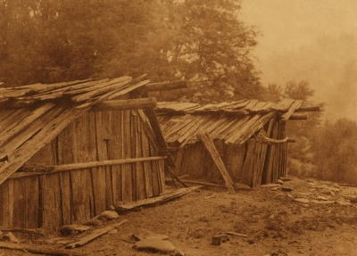

  
[Intangible Textual Heritage](../../../index)  [Native
America](../../index)  [California](../index) 

------------------------------------------------------------------------

[Buy this Book at
Amazon.com](https://www.amazon.com/exec/obidos/ASIN/B002DYIWZ6/internetsacredte)

------------------------------------------------------------------------

<table width="75%">
<colgroup>
<col style="width: 50%" />
<col style="width: 50%" />
</colgroup>
<tbody>
<tr class="odd">
<td width="50%" data-valign="TOP"></td>
<td width="50%" data-valign="CENTER"><h1 id="creation-myths-of-primitive-america" data-align="CENTER">Creation Myths of Primitive America</h1>
<h2 id="by-jeremiah-curtin" data-align="CENTER">By Jeremiah Curtin</h2>
<h3 id="section" data-align="CENTER">[1898]</h3></td>
</tr>
</tbody>
</table>

------------------------------------------------------------------------

[Contents](#contents)    [Start Reading](cma00)    [Page
Index](pageidx)    [Text \[Zipped\]](cma.txt.gz)

------------------------------------------------------------------------

|                                                                                                                           |
|---------------------------------------------------------------------------------------------------------------------------|
|  |

Despite the title, which suggests that this is a comprehensive study of
Native American creation myths, this is actually a very good set of
animal myths from two tribes of California, the Wintu and Yana. These
tribes inhabited the northern Central Valley; the Yana are closely
related to the Yahi, the tribe of Ishi, the 'last wild Indian'. Also,
these are not creation myths per se; they are tales from an epic cycle
about the proto-animal inhabitants of the California dreamtime, the
beings who existed before the arrival of humans. That said, this is a
very reputable collection which is cited to this day in scholarly papers
about native California. Curtin treats this this lore with great
respect, and because he is also a first-rate story teller, this is also
a great read. Curtin, a distinguished folklorist and author, also wrote
[Tales of Fairies and of the Ghost-World](../../../neu/celt/tfgw/index),
a collection of Irish supernatural folklore.

------------------------------------------------------------------------

 [Title Page](cma00)  
[Contents](cma01)  
[Introduction](cma02)  

### Wintu Myths

[Olebis](cma03)  
[Olelbis and Mem Loimis](cma04)  
[Norwan](cma05)  
[Tulchuherris](cma06)  
[Sedit and the Two Brothers Hus](cma07)  
[Hawt](cma08)  
[Norwanchakus And Keriha](cma09)  
[Kele and Sedit](cma10)  
[Kol Tibichi](cma11)  

### Yana Myths

[The Winning Of Halai Auna At The House Of Tuina](cma12)  
[The Hakas and the Tennas](cma13)  
[Ilhataina](cma14)  
[Hitchinna](cma15)  
[Tirukala](cma16)  
[Sukonia's Wives And The Ichpul Sisters](cma17)  
[The Finding of Fire](cma18)  
[Haka Kaina](cma19)  
[Titindi Maupa and Paiowa, the Youngest Daughter of Wakara](cma20)  
[The Two Sisters, Haka Lasi And Tsore Jowa](cma21)  
[The Dream of Juiwaiyu and his Journey to Damhauja's Country](cma22)  
[The Flight of Tsanunewa and Defeat of Hehku](cma23)  
[The First Battle in the World and the Making of the Yana](cma24)  

### Notes

[Notes](cma25)  
[The Wintus](cma26)  
[Olelbis](cma27)  
[Mem Loimis](cma28)  
[Norwan](cma29)  
[Tulchuherris](cma30)  
[Sedit and the Two Brothers Hus](cma31)  
[Hawt](cma32)  
[Norwanchakus and Keriha](cma33)  
[Kele and Sedit](cma34)  
[Kol Tibichi](cma35)  
[The Making of Doctors Among the Wintus](cma36)  
[Songs of Spirits](cma37)  
[The Yanas](cma38)  
[The Winning of Halai Auna](cma39)  
[The Hakas and the Tennas](cma40)  
[Ilhataina](cma41)  
[Hitchinna](cma42)  
[Tirukala](cma43)  
[Sukonia's Wives and the Ichpul Sisters](cma44)  
[The Finding of Fire](cma45)  
[Haka Kaina](cma46)  
[Titindi Maupa and Paiowa the Youngest Daughter of Wakara](cma47)  
[The Two Sisters Haka Lasi and Tsore Jowa](cma48)  
[Juiwaiyu](cma49)  
[The Flight of Tsanunewa and Defeat of Hehku](cma50)  
[The First Battle in the World and the Making of the Yanas](cma51)  
[Wintu Places Mentioned in the Myths](cma52)  
[Yana Places Mentioned in the Myths](cma53)  
[Value of Letters in the List of Places and in the Names of Persons
Throughout the Volume](cma54)  
