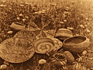

  
[Intangible Textual Heritage](../../../index)  [Native
American](../../index)  [California](../index)  [Index](index) 
[Previous](coli02)  [Next](coli04) 

------------------------------------------------------------------------

  
*The Culture of the Luiseño Indians*, by Philip Stedman Sparkman,
\[1908\], at Intangible Textual Heritage

------------------------------------------------------------------------

### INTRODUCTION.

The Luiseños belong to the large Shoshonean linguistic family, which
includes the Bannocks of Idaho and Oregon, the Utes, Paiutes, Comanches,
Mokis, and other tribes. Indians of Shoshonean family occupied the coast
of California from the mouth of Agua Hedionda creek to about Point Duma.
They also occupied the islands of San Nicolas, Santa Catalina, and
perhaps San

p. 189

\[paragraph continues\] Clemente also. The
first European to visit their territory was Juan Rodriguez Cabrillo, a
Portuguese in the Spanish service, who in 1542 saw Santa Catalina island
and visited what is now known as San Pedro bay.

That branch of the family known as Luiseños occupied the coast from
above San Juan Capistrano to the mouth of Agua Hedionda, and are thus
the most southwesterly tribe of the Shoshonean linguistic family in the
United States. We cannot pretend to give the exact boundary of their
former habitat, but will do so as nearly as possible. Beginning at the
mouth of Agua Hedionda, it ran so as to include what was afterwards the
San Marcos rancho, also most of the Escondido rancho, one of their
villages being situated in the ravine near the gold mine. From here the
boundary ran so as to include the Mendenhall and Maxey ranches, also
most of Guejito; from here to the San José valley, part of which it
included; from here to near Cahuilla valley; from here so as to include
Saboba and Temescal; and from there to the sea near San Juan Capistrano.
The language spoken at San Juan Capistrano, as well as that of Saboba,
differs considerably from that of the remainder of the Luiseños, and by
some the people of those places are not included among the Luiseños.

"Rio San Luis Rey de Francia," River St. Louis King of France, was the
name given by the Franciscan friars to what is now known as the San Luis
Rey river. Four miles up the river from its mouth was established the
mission of San Luis Rey de Francia in 1798. Twenty miles higher up the
river the mission of Pala, an outpost of San Luis Rey de Francia, was
established in 1816. The Indians who were gathered at these two missions
were called "San Luiseños" by the Franciscans. "San Luiseños," the
equivalent of "St. Louisans" in English, has now been shortened
generally to "Luiseños," and adopted by the tribe as their designation,
they, like many Indians, having no name for themselves, except one
merely meaning "people."

The neighbors of the Luiseños on the south are the Diegueños, who belong
to the Yuman linguistic family. On the north and east are other
Shoshoneans known as Cahuillas. This appellation they were given by the
Mexicans; it is not, as has been supposed, their native name.

p. 190

The Luiseños of whom we more particularly write are those living in the
valley of the San Luis Rey between Pala and the San José valley. These
formerly occupied not only the river valley but also Palomar mountain,
and there is a tradition among them that they formerly went to the coast
in winter. It must not be supposed that they wandered at will over this
territory; on the contrary, each band had its allotted district, in
which it alone had the right to gather food and hunt. Thus each band had
its tract in the San Luis Rey valley, and another on Palomar, to which
it moved during the acorn-gathering season. The land of each band seems
to have been sometimes again subdivided among the different families of
which the band was composed; at least that part of the land which was
valuable for certain food products was thus subdivided.

Each band seems to have guarded its allotted territory with the greatest
jealousy, and more quarrels are said to have arisen over trespassing
than from all other causes combined. When questioned as to when or how
the land was divided and subdivided, the Indians say they cannot tell,
that their fathers told them that it always had been thus. Many of the
older ones remember how they were cautioned when young never to trespass
on the land of others in pursuit of game or food without permission. Yet
occasionally a band would become dissatisfied with its habitat, and
forcibly intrude itself into that of another. An instance of this took
place so recently as still to be remembered and spoken of.

Luiseño geographical names are very numerous indeed, every small tract
with any distinguishing feature being named. Sometimes there will be a
name for a large tract of country, and then other names for small
portions of such a tract. This is not, however, the rule. Usually each
small tract has its name, without any general name for the larger area.
But large tracts outside of Luiseño territory are known by a general
name. Some geographical names are descriptive, but most of them are not.
Many of the names given below are those of old village sites near modern
localities and settlements, but now applied to these localities. Many
names are derived from plants and animals which are or were abundant
near the locality named after them.

p. 191

|                   |                                                                                |
|-------------------|--------------------------------------------------------------------------------|
| Totakamilum       | Coronado Islands [1](#fn_0)                             |
| Kimki harasa      | San Clemente Island [2](#fn_1)                          |
| Ponga’            | Santa Catalina Island [2](#fn_1)                        |
| Palimai           | Slough at mouth of Agua Hedionda Creek                                         |
| Exla tovotva      | Colorado desert                                                                |
| Paauw             | Palomar mountain                                                               |
| Yamiwa            | San Jacinto mountain                                                           |
| Wikyo             | Highest peak of Palomar mountain                                               |
| Takwish poshapila | Rocky peak east of Wikyo                                                       |
| Pewipwi           | San Bernardino mountain                                                        |
| Kachikchi         | Cuyamaca mountain                                                              |
| I’pax             | Highest peak of Volcan mountain                                                |
| Taakwi            | Cahuilla mountain                                                              |
| Pashkwo           | Monkey hill, San José valley                                                   |
| Katukto           | Moro hill, near Fallbrook                                                      |
| Kolo              | Mountain nearly opposite where Escondido ditch comes out of San Luis Rey river |
| Ponawuk           | Hill near Pala flour mill                                                      |
| Ta’i              | Peak of Palomar, near Bougher's                                                |
| Kaxpa             | Antonio Serrano's house on Pauma ranch                                         |
| Akipa             | The small flat on Pauma ranch                                                  |
| Hunalapa          | Oak flat (Pauma ranch)                                                         |
| Tutukvimai        | Rodeo (Pauma ranch)                                                            |
| Yami’             | Site of Potrero ranch house                                                    |
| Tomka             | Valley above same                                                              |
| Kuka              | Old Potrero village                                                            |
| Tumau             | Site of Pala flour mill                                                        |
| Malamai           | Agua Tibia                                                                     |
| Pa’i              | Agua Tibia warm spring                                                         |
| Kupa              | Agua Caliente                                                                  |
| Temeko            | Temecula                                                                       |
| Pichaang          | Pichanga                                                                       |
| Keish             | San Luis Rey                                                                   |
| Alapi             | San Pascual                                                                    |
| Malakash          | Santa Ysabel village                                                           |

p. 192

|            |                                                                                             |
|------------|---------------------------------------------------------------------------------------------|
| Saumai     | Site of J. Q. Adams’ store at Valley Center                                                 |
| Shakishmai | Site of house on Maxey ranch                                                                |
| Yangi’wana | Mesa Grande                                                                                 |
| Ushmai     | Las Flores                                                                                  |
| Woshha     | Rincon                                                                                      |
| Pala       | Pala                                                                                        |
| Paisvi     | Iron spring on Palomar                                                                      |
| Wavam      | Where the Pauma Indians had their encampment during the acorn-gathering season on Palomar   |
| Shoau      | Where the Pala Indians had their encampment during the acorn-gathering season on Palomar    |
| Shautushma | Where the Yapicha Indians had their encampment during the acorn-gathering season on Palomar |
| Sulpa      | Where J. Frey lives                                                                         |
| Akwo       | Spring where S. Gamez lives                                                                 |
| Mutamai    | Where Luis Majel lives                                                                      |
| Yuimai     | Where Juan Despierto lives                                                                  |
| Ahuya      | Old village site above Rincon on road to Potrero                                            |
| Topamai    | Old village site on Santa Margarita Ranch near ranch house                                  |
| Malava     | Old village site on Palomar                                                                 |
| Wiya’      | Old village site on Palomar                                                                 |
| Chakuli    | Old village site on Palomar                                                                 |
| Ashachakwo | Old village site on Palomar                                                                 |
| Pahamuk    | Old village site on Palomar                                                                 |
| Tokamai    | Old village site on Palomar                                                                 |
| Pavla      | Where Indians of Kuka or Potrero encamped while gathering acorns on Palomar                 |
| Mokwonmai  | Old village site on Palomar                                                                 |
| Pakuka     | Spring on east side of Palomar                                                              |
| Atupa      | Spring on east side of Palomar                                                              |
| Awa’       | Aguanga                                                                                     |
| Pawi       | Warm spring in middle of village at Cahuilla valley                                         |
| Chawimai   | Los Duraznos, Cahuilla valley                                                               |

------------------------------------------------------------------------

### Footnotes

[191:1](coli03.htm#fr_0) Compare the names of
places given in the present series of publications, IV, 142-150, 1907,
and VIII, 108 *seq*., 1908.

[191:2](coli03.htm#fr_2) The names and
identifications of these islands were variously given by different
informants of the author. Cf. ibid., VIII, 108, note 80. A San Juan
Capistrano Indian in 1907 said: "Santa Catalina es Kinke (qīnqe). San
Clemente no tiene nombre, esta pegado a Santa Catalina, es la misma
cosa."

------------------------------------------------------------------------

[Next: Vegetable Food](coli04)
