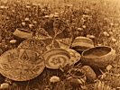

  
[Intangible Textual Heritage](../../../index)  [Native
American](../../index)  [California](../index)  [Index](index) 
[Previous](coli25) 

------------------------------------------------------------------------

  
*The Culture of the Luiseño Indians*, by Philip Stedman Sparkman,
\[1908\], at Intangible Textual Heritage

------------------------------------------------------------------------

p. 228

## APPENDIX.

### PLANTS USED BY THE LUISEÑOS.

The following is a list of plants known to have been utilized by the
Luiseños for various purposes, with their Luiseño, botanical, and
English names when known.

The writer is under obligations to Miss Alice Eastwood of the California
Academy of Sciences for the identification of these plants. The
equivalent Cahuilla names are from Dr. D. P. Barrows’ Ethno-Botany of
the Cahuilla Indians of Southern California.

*Compositae*. Sunflower Family.

*Ambrosia artemisiaefolia*. Pachavut. Used as an emetic.

*Artemisia dracunuloides*. Wachish. The seeds are used for food. The
plant is used for medicinal purposes.

*Artemisia heterophylla*. Pakoshish. Mugwort. Small boys’ arrows are
sometimes made from this plant, and it is also used medicinally.

*Carduus*, species unknown. Chochawish. Thistle. Used as greens. The
buds are also eaten raw.

*Layia* (or *Blepharipappus*) *glandulosa*. Solisal. Tidy-tips. The
seeds are used for food.

*Malacothrix Californica*. Makiyal. The seeds are used for food.

Sonchus asper. Posi’kana. Sow thistle. Used for greens.

*Helianthus annuus*. Paukla. Wild sunflower. The seeds are used for
food.

*Pluchea borealis*. Hangla. Arrow weed. Arrows are sometimes made from
this plant. It was also formerly used to roof houses with.

*Heterotheca grandiflora*. Humut. The mainshafts of arrows are sometimes
made from the tall stems of this plant.

*Chrysoma* (*Bigelovia*) *Parishii*. Sanmikut. The seeds are used for
food. This plant is much used for medicinal purposes. Sanmikut
kawingwish, literally, sanmikut of the mountain, is the name of a
glutinous-leaved variety of the preceding. Its seeds are also used for
food, and the plant itself medicinally.

*Baccharis Douglasii*. Morwaxpish. A decoction of the leaves is used to
bathe sores and wounds. The wood of this shrub was that mostly used for
drilling fire.

p. 229

*Cucurbitaceae*. Gourd Family.

*Cucurbita foetidissima*. Wild squash. The seeds are used for food. The
fruit is used when ripe as a substitute for soap.

*Echinocystis macrocarpa*. Enwish. Spanish, chilicothe. A purgative is
made from the roots. The seeds are used in the manufacture of a red
paint.

*Caprifoliaceae*. Honeysuckle Family.

*Sambucus glauca*. Kutpat. Elderberry. The fruit is much used for food,
both fresh and dried. The wood is esteemed for making bows. The flowers
are sometimes used as a remedy for female complaints. Cahuilla, hunkwat.

*Orobanchaceae*. Broom Rape Family.

*Orobanche tuberosa*. Mashal. Cancer root. The roots are used for food.

*Scrophulariaceae*. Figwort Family.

*Adenostegia* (or *Cordylanthus*). Yumayut. Used as an emetic.

*Solanaceae*. Nightshade Family.

*Nicotiana*, species unknown. Pavivut. Formerly used as tobacco.
Cahuilla, pivat-isil, "coyote tobacco," *Nicotiana attenuata*.

*Datura meteloides*. Naktomush. Jimson-weed, thorn-apple; Spanish,
toloache. The juice of the root was formerly used at the boys’ puberty
ceremony to induce stupefaction in the novices. Cahuilla, kikisowil.

*Solanum Douglasii*. Takovshish. Black nightshade. The leaves are used
for greens. The juice of the berries is used for inflamed eyes, and also
formerly used for tattooing.

*Labiatae*. Mint Family.

*Monardella lanceolata*. Huvawut. A tea is made from this plant which is
used both medicinally and as a beverage.

*Salvia carduacea*. Palit. Thistle sage. The seeds are used for food.

*Salvia columbariae*. Pashal. Spanish, chia. The seeds are much esteemed
for food. Cahuilla, pasal.

*Micromeria Douglasii*. Huvaumal. Yerba buena. A tea is made from this
plant which is used partly as a beverage and partly as a medicine.

*Ramona stachyoides*. Kanavut. Black sage. The seeds are used for food.

*Ramona* (*Audibertia*) *polystachya*. Kashil. White sage. The tops of
the stems when tender are peeled and eaten uncooked. The seeds are
eaten.

p. 230

*Cactaceae*. Cactus Family.

*Opuntia*. Navut. This is the general name for the numerous species of
the prickly-pear cactus with flat joints. The fruit is eaten both fresh
and dried. The seeds are ground into meal and used for food. Cahuilla,
navit; the fruit, navityuluku.

*Mutal*. A cactus with cylindrical stems. Cholla. Seeds used for food.
Cahuilla, mutai; the seeds, wial.

*Hydrophyllaceae*. Phacelia Family.

*Eriodictyon Parryi*. Atovikut. Used for medicinal purposes.

*Eriodictyon tomentosum* or *crassifolium*. Palwut. Spanish, Yerba
santa. Much valued for medicinal purposes.

*Phacelia ramosissima*. Sikimona. Used for greens.

*Polemoniaceae*. Gilia Family.

*Gilia staminea*. Chachwomal. The seeds are used for food.

*Asclepiadaceae*. Milkweed Family.

*Asclepias eriocarpa*. Tokmut. Milkweed. A string fiber is obtained from
the stems. A chewing gum is made from the sap which exudes from the
stems when cut. Cahuilla, *Asclepias erosa*, keat; *Asclepias sp*.,
wichsal; chewing gum, chilse.

*Philibertia heterophylla*. Towunla. It is used for food, being eaten
raw with salt.

*Apocynaceae*. Dogbane Family.

*Apocynum cannabinum*. Wicha. Indian hemp, dogbane. A string fiber is
obtained from the bark. Cahuilla wish is *Phragmites communis*, also
used for string.

*Gentianaceae*. Gentian Family.

*Erythraea venusta*. Ashoshkit. Spanish, Canchalagua. Tea made from this
is used as a remedy for fever.

*Ericaceae*. Heather Family.

*Arctostaphylos Parryi*. Kolul. Manzanita. The pulp of the berries is
ground and used for food. Cahuilla, fruit of A. glauca, tatuka.

*Umbelliferae*. Parsley Family.

*Apium graveolens*. Pa’kil. Common celery. Probably not native. Used for
greens.

*Deweya arguta*. Kaiyat. The root is much esteemed for medicinal
purposes.

*Violaceae*. Violet Family.

*Viola pedunculata*. Ashla. Violet. The leaves are used as greens.

p. 231

*Malvaceae*. Mallow Family.

*Sidalcea malvaeflora*. Pashangal. Wild hollyhock. Used as greens.

*Malvastrum* sp. Kaukat. A decoction of the leaves is used as an emetic.

*Vitaceae*. Grape-vine Family.

*Vitis girdiana*. Makwit. Wild grape-vine. The fruit is cooked and used
for food.

*Anacardiaceae*. Sumach Family.

*Rhus trilobata*. Shoval. Sumach, squaw bush, Indian lemonade. From this
shrub are obtained the splints that are used to wrap the coil in Luiseño
baskets. The berries are ground and used for food. A seed-fan for
beating the seeds off plants is made from the twigs of this shrub.
Cahuilla, the berry, selittoi.

*Rutaceae*. Rue Family.

*Cneoridium dumosum*. Navish. Used for medicine.

*Euphorbiaceae*. Spurge Family.

*Croton Californicus*. Shuikawut. Said to be used to procure abortion.

*Euphorbia polycarpa*. Kenhamal. Spanish, Yerba golondrina. Reputed to
be beneficial in the case of rattlesnake bites.

*Leguminosae*. Pea Family.

*Psoralea orbicularis*. Shi’kal. Used for greens.

*Psoralea macrostachya*. Pi’mukvul. A yellow dye is made from the roots
of this plant; also a medicine for ulcers and sores.

*Lotus strigosus*. Tovinal. Used for greens.

*Lupinus* sp. Mawut. Used for greens.

*Trifolium ciliolatum*. Mukalwut. Eaten both cooked and raw. The seeds
are also used.

*Trifolium gracilentum*. Ke’kesh. It is eaten both cooked and raw.

*Trifolium microcephalum*. Pehevi. It is eaten cooked.

*Trifolium tridentatum*. Chokat. Eaten both cooked and raw. The seeds
are also used.

*Trifolium obtusiflorum*. Shoo’kut. It is eaten cooked.

*Prosopis juliflora*. Ela. Mesquite. The beans are ground into meal and
used for food to a limited extent in some localities. Cahuilla,
*Prosopis pubescens*, mesquite screw, kwinyal.

p. 232

*Rosaceae*. Rose Family.

*Adenostoma fasciculatum*. U’ut. Chamisal. Foreshafts of arrows are made
of this shrub. A gum, the deposit of a scale-insect, is also obtained
from it. Cahuilla, oot.

*Rubus parviflorus*. Pavlash. Thimbleberry. The fruit is eaten.

*Rubus vitifolius*. Pikwlax. Wild blackberry. The fruit is eaten. The
juice of the berries is sometimes used to stain articles made of wood.

*Prunus demissa*. Atut. The fruit is eaten. Cahuilla, the fruit, atut.

*Cerasus* (*Prunus*) *ilicifolia*. Chamish. Spanish, Islaya. The fruit
is eaten. The kernels are ground into flour and used for food. Cahuilla,
chamish.

*Heteromeles arbutifolia*. Achawut. Toyon, Christmas berry. The berries
are used for food.

*Saxifragaceae*. Saxifrage Family.

*Ribes indecorum* or *malvaceum*. Kawa’wal. The root is used to cure
toothache.

*Ribes speciosum*.

*Crassulaceae*. Stonecrop Family.

*Dudleya* (*Cotyledon*). Topnal. Hen-and-chickens. The juice of the
leaves is used.

*Cruciferae*. Mustard Family.

*Brassica nigra*. No Luiseño name. Black mustard. Probably not native.
Much used for greens.

*Lepidium nitidum*. Pakil. Peppergrass. The seeds are used for food. The
leaves are also used as greens.

*Nasturtium officinale*. No Luiseño name. Water-cress. Used for greens.

*Papaveraceae*. Poppy Family.

*Eschscholtzia Californica*. Ataushanut. California poppy. The leaves
are used for greens. The flowers are chewed with chewing gum.

*Ficoideae*. Carpet-weed or Fig-marigold Family.

*Mesembryanthemum aequilaterale*. Panavut. Fig marigold. The fruit is
eaten.

*Portulacaceae*. Purslane Family.

*Portulaca oleracea*. Pokut. Common purslane. Used for greens.

*Calandrinia caulescens*. Puchakla. Red Maids. Used when tender for
greens. The seeds are also used for food.

*Montia perfoliata*. Towish popa’kwa. Indian lettuce. Used for greens
and also eaten raw.

*Nyctaginaceae*. Four-o'clock Family.

*Mirabilis Californica*. Nanukvish or tisi. A decoction of the leaves is
used as a purgative.

p. 233

*Chenopodiaceae*. Pigweed Family.

*Chenopodium album*. Ket. Lamb's quarter, pigweed. The leaves are used
for greens.

*Chenopodium Californicum*. Kahawut. Soap plant. The root is used for
soap. The seeds are used for food. Cahuilla, kehawut.

*Saururaceae*. Lizard-tail Family.

*Houttuynia* (*Anemopsis*) *Californica*. Chevnash. Spanish, Yerba
Mansa. A decoction of the root is used internally and externally.

*Polygonaceae*. Buckwheat Family.

*Rumex*, species unknown. Ipelwut. Dock. A decoction of the root is used
medicinally.

*Urticaceae*. Nettle Family.

*Urtica holosericea*. Shakishla. Stinging nettle. A fiber is obtained
from this, but is not much esteemed.

*Cupuliferae*. Oak Family.

*Quercus Californica*. Kwila. Black oak, Kellogg's oak. The acorns of
this oak are more esteemed for food than those of any other species.

*Quercus chrysolepsis*. Wiat. Valparaiso oak, drooping live oak, golden
cup oak. Acorns esteemed for food, though not so much as those of
*Quercus agrifolia* and *Californica*. A gambling toy is made from the
large acorn-cups of this oak.

*Quercus dumosa*. Pawish. Acorns little esteemed for food. The gall-nuts
are used to doctor sores and wounds. They are said to possess powerfully
astringent properties. Cahuilla, the acorn, kwinyil.

*Quercus Engelmanni*. Tovashal. White oak. Acorns little esteemed for
food. From a deposit made on this oak by a scale insect a chewing gum is
obtained. A fungus growing on its decayed wood was formerly used for
tinder, when fire was kindled with flint and steel.

*Quercus agrifolia*. Wiashal. Live oak, red oak, field oak, encina.
Acorns esteemed for food, though not so much as those of *Quercus
Californica*.

*Quercus Wislizeni*. I’mushla. Acorns little esteemed for food.

*Salicaceae*. Willow Family.

*Populus Fremonti* (probably). Avahut. Cottonwood. Inner bark formerly
used to make apron-like garment worn behind by women.

*Salix sp*. Willow. Wood much used for making bows.

*Iridaceae*. Iris Family.

*Sisyrinchium bellum*. Patumkut. Blue-eyed grass. A purgative is made
from the roots.

p. 234

*Liliaceae*. Lily Family.

*Bloomeria aurea*. Kawichhal. The bulb is eaten.

*Brodiaea capitata*. Tokapish. Wild hyacinth. The bulb is eaten.

*Chlorogalum parviflorum*. Kenut. The bulb is eaten.

*Chlorogalum pomeridianum*. The fibers covering the bulb are used to
make a brush.

*Yucca Mohavensis*. Hunuvut. The flowers are boiled and eaten. The pods
are roasted and eaten. The fiber of this plant is little used by the
Luiseños. Cahuilla, hunuvut; the fruit, ninyil.

*Yucca Whipplei*. Panal. Spanish bayonet or Spanish dagger. The head is
used for food. The flowers are boiled and eaten. The scape or stalk is
also used for food. Cahuilla, the stalk, panuul; the seed-bags, wawal.

*Juncaceae*. Rush Family.

*Juncus Mertensianus*. Pivut. An openwork basket is made from this rush.
It is used for gathering acorns, cactus, etc. Another basket made from
it is used to cook acorn meal, and another is used as a sieve.

*Juncus* sp. Shoila. The lower part of this rush furnishes the brown
color seen in Luiseño baskets. A mat is also made from it in which
articles used at religious ceremonies are kept by the religious chief of
the clan. Cahuilla, seil.

*Cyperaceae*. Sedge Family.

*Scirpus* sp. Pevesash. Bulrush, tule. The tender young shoots are eaten
raw.

*Gramineae*. Grass Family.

*Avena fatua*. Arus or Urns. Wild oats. The seed is ground into flour
and used for food.

*Bromus maximus*. Woshhat. The seeds are used for food.

*Elymus condensatus*. Huikish. The mainshafts of arrows are made from
this plant. Cahuilla, pahankis.

Epicampes rigens Californica. Yulalish. The body of the coil of Luiseño
baskets is composed of this grass. Cahuilla, *Cinna macroura* (synonym),
suul.

*Cryptogamia*.

*Pellaea ornithopus*. Wikunmal. Tea fern, bird-claw tern. A decoction of
the fronds is used medicinally, and also as a beverage by people who are
not ill.

*Woodwardia radicans* (probably). Mashla. Brake fern. A decoction of the
root is used both externally and internally to relieve pain from
injuries to the body.

Shakapish. Tree mushroom. Much esteemed for food when growing on
cottonwood and willow trees.

 

 

 

 
