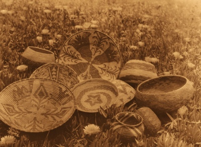

  
[Intangible Textual Heritage](../../../index)  [Native
American](../../index)  [California](../index) 

------------------------------------------------------------------------

<table width="75%">
<colgroup>
<col style="width: 50%" />
<col style="width: 50%" />
</colgroup>
<tbody>
<tr class="odd">
<td width="50%" data-valign="TOP"> 
Basketry of the Mission Indians, Photograph by Edward Curtis, The North American Indian Pl. 502 [1926] (Public Domain Image)</td>
<td width="50%" data-valign="CENTER"><h1 id="the-culture-of-the-luiseño-indians" data-align="CENTER">The Culture of the Luiseño Indians</h1>
<h2 id="by-philip-stedman-sparkman" data-align="CENTER">by Philip Stedman Sparkman</h2>
<h4 id="section" data-align="CENTER">[1908]</h4></td>
</tr>
</tbody>
</table>

------------------------------------------------------------------------

[Contents](#contents)    [Start Reading](coli00)    [Page
Index](pageidx)    [Text \[Zipped\]](colitxt.zip)

------------------------------------------------------------------------

*The earth hears you, the sky and wood-mountain see you. If you will
believe this you will grow old. And you will see your sons and
daughters, and you will counsel them in this manner, when you reach your
old age.*--Lecture given to initiated boys. [p.
223](coli23.htm#page_223)

This monograph is a posthumous publication; the author died in 1907.
Sparkman spent years studying the Luiseño people, who resided in the
approximate area of Orange County in California. The text mostly covers
material culture, but includes descriptions of shamans and healing
plants, folklore and mythological creatures, as well as puberty and
mourning ceremonies. It appears that Sparkman had a special interest in
ethnobotany, and there is an appendix with a listing of the most
important plants in the area, with Latin and Luiseño nomenclature, and a
description of their use by Native Californians.

------------------------------------------------------------------------

 [Title Page](coli00)  
[Contents](coli01)  
[Editor's Note](coli02)  
[Introduction](coli03)  
[Vegetable Food](coli04)  
[Flesh and Hunting](coli05)  
[Fishing](coli06)  
[Clothing](coli07)  
[Pottery](coli08)  
[Articles Made of Plant Fibers](coli09)  
[Bows and Arrows](coli10)  
[Stone Implements](coli11)  
[Feather Objects](coli12)  
[Fire Making](coli13)  
[Gums, Dyes, and Paint](coli14)  
[Miscellaneous Arts](coli15)  
[Games](coli16)  
[Houses](coli17)  
[Marriage](coli18)  
[Government](coli19)  
[Shamanism](coli20)  
[Changichnish, The Raven](coli21)  
[Spirits and Monsters](coli22)  
[Boys’ Puberty Ceremonies](coli23)  
[Girls’ Puberty Ceremonies](coli24)  
[Mourning Ceremonies and Mourning](coli25)  
[Appendix: Plants Used by the Luiseños](coli26)  
