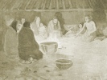

  
[Intangible Textual Heritage](../../../index)  [Native
American](../../index)  [Native California](../index)  [Index](index) 
[Previous](dow50)  [Next](dow52) 

------------------------------------------------------------------------

[Buy this Book at
Amazon.com](https://www.amazon.com/exec/obidos/ASIN/B002DPTXIK/internetsacredte)

------------------------------------------------------------------------

  
*The Dawn of the World*, by C. Hart Merriam, \[1910\], at Intangible
Textual Heritage

------------------------------------------------------------------------

### PO'-KO-MOO THE POISON SPIDER

*The Northern Mewuk say*:

*Po'-ko-moo* the small black spider with a red spot under his belly is
poison. [22](#fn_20) Sometimes he scratches
people with his long fingers, and the scratch makes a bad sore.

The *Wal'-le*-kah'-pah hills at the north opening are evidently the same
as the Thunder Mountain of other tribes, which is always close by the
north hole in the sky, in the region of extreme cold.

p. 215

\[All the tribes know that this spider is poisonous and some of them
make use of the poison.\]

------------------------------------------------------------------------

### Footnotes

[214:22](dow51.htm#fr_20) This is true. The name
of the poison spider is *Lathrodectus mactens*.

------------------------------------------------------------------------

[Next: Where *Koo'-tah* the Money-clam Came From](dow52)
