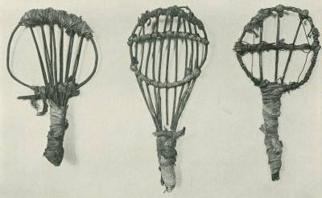

  
[Intangible Textual Heritage](../../../index)  [Native
American](../../index)  [California](../index) 

------------------------------------------------------------------------

<table width="75%">
<colgroup>
<col style="width: 50%" />
<col style="width: 50%" />
</colgroup>
<tbody>
<tr class="odd">
<td width="50%" data-valign="TOP"> 
Seed-beaters, pl. 3 [1908] (Public Domain Image)</td>
<td width="50%" data-valign="CENTER"><h1 id="ethnography-of-the-cahuilla-indians" data-align="CENTER">Ethnography of the Cahuilla Indians</h1>
<h2 id="by-a.-l.-kroeber" data-align="CENTER">by A. L. Kroeber</h2>
<h4 id="section" data-align="CENTER">[1908]</h4></td>
</tr>
</tbody>
</table>

------------------------------------------------------------------------

[Contents](#contents)    [Start Reading](eci00)    [Page
Index](pageidx)    [Text \[Zipped\]](ecitxt.zip)

------------------------------------------------------------------------

This is a short ethnography of the Cahuilla, who inhabited the desert of
Southern California. This mostly covers material culture. However,
Kroeber also includes some notes on place names, which solves the debate
about where the city names Cucamonga, Yucaipa, Chino, and (notably)
Azusa came from. (And no, it's not 'From A to Z in the USA.') --They are
all Native American place names. We also learn that the original name of
Los Angeles was Wenot.

In a short section on social and religious life, Kroeber notes that the
'large low-flying meteor' (Cahuilla *dakush*) is distinguished from
ordinary shooting stars (*ngamngam*), which just deepens *that* mystery.

------------------------------------------------------------------------

 [Title Page](eci00)  
[Contents](eci01)  
[Geography](eci02)  
[Culture](eci03)  
[Basketry](eci04)  
[Stone Implements](eci05)  
[Pottery](eci06)  
[Implements of Wood and Fibre](eci07)  
[Ceremonial Objects and Beads](eci08)  
[Houses](eci09)  
[Social and Religious Life](eci10)  
[Catalogue Numbers of Specimens Shown in Plates](eci11)  
[Plates](eci12)  
