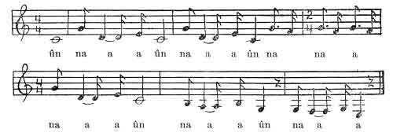

  
[Intangible Textual Heritage](../../../index)  [Native
American](../../index)  [California](../index)  [Index](index) 
[Previous](hut46)  [Next](hut48) 

------------------------------------------------------------------------

p. 324

# XLIV.

### Formula of Medicine for Making Baskets. [1](#fn_93)

 

 

 

p. 326

A Kīxûnai maiden did this at Isdiname (the south head, at the entrance
of Humboldt Bay). She used to go down to the water every morning and sit
on the beach facing the west with her legs half under water. One time as
she was sitting there making baskets the wind blew gently from the
north. [She always sang](#img_32400) as she made baskets. The wind,
which blew gently at first, increased in violence until it blew very
hard. Suddenly a gust came along and blew the basket from her hands. She
saw where the wind had blown it into the water, far to the south. She
crawled along after it. Failing to get it, she went back to the house.

The next morning when she went down to the beach she was surprised to
see her basket floating there. She took it out of the water. The hazel
ribs were covered all over with sucking

p. 327

dentalia. Returning to the house she took down a little canoe from the
earthen bank back of the fire. This canoe had come into existence at the
same time as herself. She put the dentalia into. it.

When she went down to the beach again to work on her basket, she found
it had floated around the world to every place where the dentalia-maker
had grown. Her basket always did that way. Then she thought, "I
shouldn't wonder if I did it for Indians. I wish long life for the woman
who always has a basket in her bands. That one will think about me. My
experience will come to her mind. She will do the way that I have done.
I didn't do this for every one. I did it only for smart women who shall
come into existence. When the dawn comes my formula will come to her
mind," she thought.

PRAYER FOR THE MEDICINE.

Ha ha ha ha! You, I believe, I have heard, Kīxûnai maiden, did this at
Isdiname. Loan me your medicine.

"Yes," she said, "I am the one that did it."

------------------------------------------------------------------------

### Footnotes

[324:1](hut47.htm#fr_93) Told at Hupa, October
1902, by Emma Dusky (Tasentce), the wife of Henry Frank. She is about 40
years of age and very conservative. She surpasses all other Hupa women
in basket-making.

------------------------------------------------------------------------

[Next: XLV. Formula of Medicine for Wounds Made by Flint
Arrowheads](hut48)
