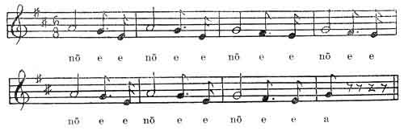

  
[Intangible Textual Heritage](../../../index)  [Native
American](../../index)  [California](../index)  [Index](index) 
[Previous](hut48)  [Next](hut50) 

------------------------------------------------------------------------

p. 332

# XLVI.

### Formula of Medicine for Going to War. [1](#fn_96)

p. 333

 

 

 

p. 334

In the middle of this world, chicken hawk grew with her younger brother.
She said to him, "To-morrow a company will come to kill us." The girl
always remained under the age of puberty. When the sun was here they
heard the war party. They came from the east where the sunrises. "Eat
first, "she told him. When he had eaten and had enough he said, "Who
will go out first?"

p. 335

\[paragraph continues\] "I will go out first," his sister said. Then the
girl stood on the north side of the door. She had on leaves of the black
oak for a dress. She had left off her other dress. The boy took out a
bundle of twigs, pulled out the knot of the string that tied them, and
threw them at her. They all missed her; not one struck her. Then she
went to the south side. Again from the north side he pulled out a bundle
of twigs and threw them at her. Then she went out and they all fought
with her. When the sun was here in the west she had killed all of that
company of one hundred men who had come to kill her. When she was
through fighting she went in. She took off her dress and put on another.

That dress of black oak leaves is the one that flies around her. [She
has a song which she sings](#img_33300). She sings it in the morning.
When the war party used to hear it they would say, "Come, let's run
away." Then they always ran off. Here southeast of the middle of the
world they used to lie until morning, and then they went home. When
there was to be a fight she always sang a song. She sang it in the
morning and again when she went to bed. None could affect her by singing
or saying formulas. The hearts of the men always went along the way that
lays behind this world. The song did it.

Again another night the girl found out they were coming "Again a party
is coming to kill us," she told her brother. "Indians are about to
become," she said. "This will be the medicine. The Indians will say of
me when they become, 'This one, I hear, did that way.' Even if many men
come against him, there will not be blood on him. When he puts the twigs
and black oak leaves on his head, tied together this way, he will be
ready to fight."

------------------------------------------------------------------------

### Footnotes

[332:1](hut49.htm#fr_96) Told at Hupa, December
1901, by Henry Hostler often called "Packer Henry."

------------------------------------------------------------------------

[Next: XLVII. Formula of Medicine for Acquiring Wealth](hut50)
