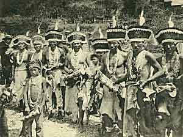

  
[Intangible Textual Heritage](../../../index)  [Native
American](../../index)  [California](../index) 

------------------------------------------------------------------------

<table width="75%">
<colgroup>
<col style="width: 50%" />
<col style="width: 50%" />
</colgroup>
<tbody>
<tr class="odd">
<td data-valign="CENTER" width="50%"></td>
<td data-valign="CENTER" width="50%"><h1 id="hupa-texts" data-align="CENTER">Hupa Texts</h1>
<h2 id="by-pliny-earle-goddard" data-align="CENTER">By Pliny Earle Goddard</h2>
<h6 id="university-of-california-publications-in-american-archaeology-and-ethnology-vol.-1-no.-2" data-align="CENTER">University of California Publications in American Archaeology and Ethnology Vol. 1, No. 2</h6>
<h4 id="section" data-align="CENTER">[1904]</h4></td>
</tr>
</tbody>
</table>

------------------------------------------------------------------------

This is a collection of texts from the Hupa, who lived in Northern
California, Humboldt County, on the Trinity River. The texts are
unfiltered translations of stories related by Hupa at the start of the
20th century in an ethnographic context. They largely take place in a
time before the arrival of human beings, populated by trickster gods and
supernatural beings called Kīxûnai. The texts include a number of
shamanistic formulas for healing, protection and good luck.

The following files contain music notation for songs: [IX](hut12),
[XLIV](hut47), and [XLVI](hut49).

------------------------------------------------------------------------

[Title Page](hut00)  
[Contents](hut01)  
[Introduction](hut02)  
[Key to the Sounds Represented by the Characters Used](hut03)  

### Myths and Tales

[I. Yīmantūwiñyai.--Creator and Culture Hero](hut04)  
[II. XaxōwilwaL.--Dug-from-the-ground.](hut05)  
[III. Xontcūwditcetc.--Rough-nose](hut06)  
[IV. Yīnûkatsisdai.--He-lives-South.](hut07)  
[V. Naxkekōsnadūwûl.--Two-neck.](hut08)  
[VI. Litcūwdiñ yadeLtse.--At Sand-place They Lived](hut09)  
[VII. Xonsadiñ Kûntcūwiltcwil.--Xonsadiñ Young Man](hut10)  
[VIII. Datcwindiñ Xonaïswe.--Gooseberry-place Brush Dance](hut11)  
[IX. Mīmedakût Kyūwintsit.--At Mīmedakût She Pounded Acorns](hut12)  
[X. Tōdiñ KeïtLō.--By the River She Made Baskets](hut13)  
[XI. The Cause of the Lunar Eclipse](hut14)  
[XII. Origin of Fire](hut15)  
[XIII. The Coming of White Men](hut16)  
[XIV. The Coming of White Men](hut17)  

### Relating to Dances and Feasts

[XV. The Young Man who Threw Himself with the Arrow](hut18)  
[XVI. The Scabby Young Man](hut19)  
[XVII. The Passing of the Kīxûnai](hut20)  
[XVIII. The Spoiling of the World](hut21)  
[XIX. Formula of the Jumping Dance](hut22)  
[XX. Daily Prayer of the Priest at the Jumping Dance](hut23)  
[XXI. Origin of the Jumping Dance](hut24)  
[XXII. Formula of the Acorn Feast](hut25)  
[XXIII. Formula used at the Tcexōltcwe Rocks](hut26)  
[XXIV. Formula of the Spring Dance.](hut27)  
[XXV. Origin of the KinaLdûñ Dance](hut28)  
[XXVI. Directions and Formula for the Brush Dance](hut29)  
[XXVII. Formula for the Eel Medicine](hut30)  
[XXVIII. Formula for the Salmon Medicine](hut31)  
[XXVIII. Formula of the Rain-rock Medicine](hut32)  

### Formulas of Private Medicines

[XXX. Formula of Medicine for Pregnant Women (Deer's
Medicine.)](hut33)  
[XXXI. Formula of Medicine for Pregnant Women (Bear's
Medicine.)](hut34)  
[XXXII. Formula of Medicine for Childbirth](hut35)  
[XXXIII. Formula of Medicine for the Birth of the First Child](hut36)  
[XXXIV. Formula of Medicine to Cause the Infant to Grow Fast](hut37)  
[XXXV. Formula of Medicine to Cause the Infant to Grow Strong](hut38)  
[XXXVI. Formula of Medicine to Insure Long Life for an Infant](hut39)  
[XXXVII. Formula of Medicine to Protect Children in Strange
Places](hut40)  
[XXXVIII. Formula of Woman's Love Medicine](hut41)  
[XXXIX. Formula of Medicine to Shorten Period of Exclusion after
Menstruation](hut42)  
[XL. Formula of Medicine for Going in Dangerous Places with a
Canoe](hut43)  
[XLI. Formula of Medicine for Going Among Rattlesnakes](hut44)  
[XLII. Formula of a Deer Medicine](hut45)  
[XLIII. Formula of a Deer Medicine](hut46)  
[XLIV. Formula of Medicine for Making Baskets](hut47)  
[XLV. Formula of Medicine for Wounds Made by Flint Arrowheads](hut48)  
[XLVI. Formula of Medicine for Going to War](hut49)  
[XLVII. Formula of Medicine for Acquiring Wealth](hut50)  
[XLVIII. Formula of Medicine for Green Vomit](hut51)  
[XLIX. Formula of Medicine for Spoiled Stomach](hut52)  
[L. Formula of Medicine for Purification of One Who has Buried the
Dead](hut53)  
[LI. Formula of Medicine for the Purification of Those Who Have Buried
the Dead](hut54)  
