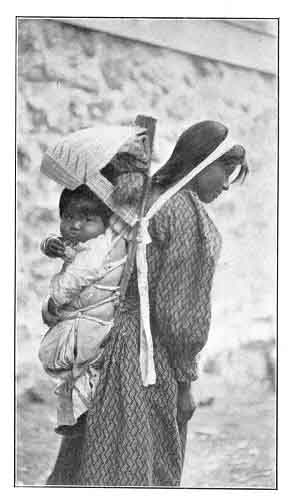

  
[Intangible Textual Heritage](../../../index)  [Native
American](../../index)  [California](../index) 

------------------------------------------------------------------------

<table width="75%">
<colgroup>
<col style="width: 50%" />
<col style="width: 50%" />
</colgroup>
<tbody>
<tr class="odd">
<td data-valign="CENTER" width="50%"></td>
<td data-valign="CENTER" width="50%"><h1 id="indians-of-the-yosemite-valley-and-vicinity" data-align="CENTER">INDIANS OF THE YOSEMITE VALLEY AND VICINITY</h1>
<h4 id="their-history-customs-and-traditions" data-align="CENTER">Their History, Customs and Traditions</h4>
<h2 id="by-galen-clark" data-align="CENTER">by GALEN CLARK</h2>
<h4 id="section" data-align="CENTER">[1904]</h4></td>
</tr>
</tbody>
</table>

------------------------------------------------------------------------

[Contents](#contents)    [Start Reading](ioy00)

------------------------------------------------------------------------

This short little book was written by one of the pioneers of Yosemite
National Park, Galen Clark. In 1857 Clark was the first white person to
view the Mariposa Grove, a stand of old-growth redwoods which are some
of the largest living organisms on the planet. Clark was one of the
first full-time white residents of Yosemite and is considered the first
ranger of that park. Although obviously Clark had no training in
ethnography, he lived for many years with the last generation of
pre-contact Native Americans of Yosemite. It is apparent that the
Yosemite Miwok, who had a disasterous first contact, were extremely
reluctant to open up about the details of their mythology and culture,
even to comparatively benign individuals such as Clark. However, this is
one of the few first-hand accounts from this period, and the information
in this book has been rehashed in many others, such as [The Lore and
Lure of the Yosemite](../lly/index).

--J. B. Hare

------------------------------------------------------------------------

 [Title Page](ioy00)  
[Contents](ioy01)  
[List of Illustrations](ioy02)  
[Introduction and Sketch of the Author](ioy03)  
[Chapter One: Early History](ioy04)  
[Chapter Two: Effects of the War.](ioy05)  
[Chapter Three: Customs and Characteristics](ioy06)  
[Chapter Four: Sources of Food Supply](ioy07)  
[Chapter Five: Religious Ceremonies and Beliefs](ioy08)  
[Chapter Six: Native Industries](ioy09)  
[Chapter Seven: Myths and Legends](ioy10)  
[Appendix](ioy11)  
