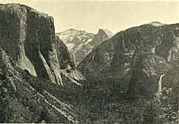

  
[Intangible Textual Heritage](../../../index)  [Native
American](../../index)  [California](../index) 

------------------------------------------------------------------------

<table width="75%">
<colgroup>
<col style="width: 50%" />
<col style="width: 50%" />
</colgroup>
<tbody>
<tr class="odd">
<td data-valign="CENTER" width="50%"></td>
<td data-valign="CENTER" width="50%"><h1 id="the-lore-and-the-lure-of-the-yosemite" data-align="CENTER">The Lore and the Lure of the Yosemite</h1>
<h5 id="the-indians-their-customs-legends-and-beliefs-and-the-story-of-yosemite" data-align="CENTER">The Indians 
Their Customs, Legends and Beliefs, and the Story of Yosemite</h5>
<h2 id="herbert-earl-wilson" data-align="CENTER">Herbert Earl Wilson</h2>
<h4 id="section" data-align="CENTER">[1922]</h4></td>
</tr>
</tbody>
</table>

------------------------------------------------------------------------

[Jump to contents](#contents)    [Start Reading](lly00)

------------------------------------------------------------------------

This short book about Yosemite Valley and its original inhabitants was
written early in the 20th century. Of particular interest are the
photographs, which are all in the public domain; while not as gorgeous
as those taken in later years by Ansel Adams, they adequately convey the
magnificent landscape.

This book has a few factual inaccuracies, but only because of the limits
of contemporary knowledge. For instance, at the time of writing, Ribbon
Falls was thought to be the highest waterfall in the world; today we
know that Angel Falls in Venezuela has this distinction. Also, the small
but signficant survival of Chinese Redwoods was likewise unknown at the
time, so we can today qualify the statement that this tree only exists
in California. However, for the most part this book is fairly accurate;
in particular, the geological description is not obsolete.

The core of this book is a description of the beliefs and material
culture of the Miwok of Yosemite, and the disgraceful history of their
ejection from the valley. The historical and ethnographic information is
fairly accurate; in contrast, the information on religion is the
thinnest part of this book. Wilson writes of a 'Great Spirit'; as far as
I know, this is not a part of Miwok beliefs. There is no concept of an
overarching deity. Rather, Miwok mythology revolves around Coyote and
the other animal-people inhabitants of the dreamtime.

------------------------------------------------------------------------

[Title Page](lly00)  
[Contents](lly01)  
[List Of Illustrations](lly02)  
[Introductory Note](lly03)  

### Chapter I. The Coming of the White Man to Yosemite

[Chapter I. The Coming of the White Man to Yosemite](lly04)  

### Chapter II. The Story of Yosemite

[The Story of Yosemite](lly05)  
[The Gateway](lly06)  
[Bridal Veil Fall](lly07)  
[El Capitan](lly08)  
[Ribbon Fall](lly09)  
[The Valley](lly10)  
[Cathedral Rocks](lly11)  
[Cathedral Spires](lly12)  
[The Three Brothers](lly13)  
[Sentinel Rock](lly14)  
[Yosemite Fall](lly15)  
[Glacier Point](lly16)  
[Half Dome](lly17)  
[North Dome and Basket Dome](lly18)  
[Happy Isles](lly19)  
[Mirror Lake](lly20)  
[Clouds Rest](lly21)  

### Chapter III. Sunset in the Yosemite

[Chapter III. Sunset in the Yosemite](lly22)  

### Chapter IV. Big Trees of the Mariposa Grove

[Chapter IV. Big Trees of the Mariposa Grove](lly23)  
[Introduction to Myths and Legends](lly24)  

### Chapter V. Indian Myths and Legends

[The Legend Of Tu-tok-a-na](lly25)  
[The Legend Of Tu-tok-a-nu-la And Tis-sa-ack](lly26)  
[The Legend of the Lost Arrow](lly27)  
[The Legend Of Tis-sa-ack](lly28)  
[The Legend Of Po-ho-no](lly29)  
[The Legend Of Yo-sem-i-te](lly30)  
[The Legend Of Pi-wy-ack](lly31)  
[The Legend Of Loi-ya](lly32)  
[Legend of the Origin of Thunder and Lightning](lly33)  
[Legend of the Fish-Women (Mermaids)](lly34)  

### Chapter VI. Creation

[Chapter VI. Creation](lly35)  

### Chapter VII. The Coming of the Indian to Yosemite

[The Coming of the Indian to Yosemite](lly36)  
[Acorns](lly37)  
[Grasshoppers](lly38)  
[Clover Grasses, Grass Seeds, and Edible Roots](lly39)  
[Berries and Nuts](lly40)  
[Fish](lly41)  
[Deer](lly42)  
[Small Game, Mushrooms, Worms, and Beetles](lly43)  
[Dwellings](lly44)  
[Bedding](lly45)  
[Sweat-Houses](lly46)  
[Clothing](lly47)  
[Baskets](lly48)  
[Weapons](lly49)  

### Chapter VIII. His Customs, Religious Beliefs, and Ceremonies

[His Customs, Religious Beliefs, and Ceremonies](lly50)  
[Division of Territory](lly51)  
[Commerce](lly52)  
[Communications](lly53)  
[Annual Feasts](lly54)  
[Dances](lly55)  
[Hand Game](lly56)  
[Medicine Men](lly57)  
[Marriage](lly58)  
[Widows](lly59)  
[Children](lly60)  
[Disposal of Their Dead](lly61)  
[The Present Day Indian in Yosemite](lly62)  

### Chapter IX. Retrospection and Prophecy

[Chapter IX. Retrospection and Prophecy](lly63)  

### Chapter X. Geology of the Yosemite Valley

[Chapter X. Geology of the Yosemite Valley](lly64)  
