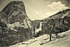

  
[Intangible Textual Heritage](../../../index)  [Native
American](../../index)  [California](../index)  [Index](index) 
[Previous](lly04)  [Next](lly06) 

------------------------------------------------------------------------

p. 30

 [  
Click to enlarge](img/03000.jpg)  
LIBERTY CAP  

# CHAPTER II.

### THE STORY OF YOSEMITE

It is not generally known that the Yosemite Valley is a very small part
of the Yosemite National Park. Nearly all visitors to Yosemite are
surprised to learn that the Park embraces over eleven hundred square
miles of territory.

To those who are at all interested in nature the woods and streams of
the Park present a fascinating study. To the naturalist they will reveal
a wealth of forms, in fact, out-door scientists of almost every kind
find the area a particularly fortunate spot for the pursuit of their
studies. Within its boundaries are to be found more than

p. 31

eighty species of animal life, over two hundred different varieties of
birds, about twelve hundred varieties of ferns and flowering plants,
thirty-five species of trees, including three groves of the giant
sequoia, or "Big Trees," ten varieties of trout, twenty-one species of
reptiles, eleven different varieties of amphibians or batrachians, and a
myriad of insects. Throughout the region the legibility of the records
left by the glaciers and other tools used by nature in forming the
continent is a source of unending interest to geologists.

However, despite its size, one of the charming features of this
playground is the easy accessibility of its higher reaches. Leading from
the Valley are easy trails up which the out-of-doors devotee may strike
into a mountain land of surpassing grandeur and charm. A land sprinkled
with park-like glades, dotted with lakes of exceeding beauty so numerous
as to preclude the possibility of distinguishing them by name, watered
by sparkling streams that are the children of mountain glacier and
eternal snow, and whose banks are often wholly hidden in luxuriant
masses of fern and flowering growth of many kinds and colors, clothed
with endless forests of magnificent trees, and blessed with an enchanted
climate.

Just to have seen the Valley, to have stood in the awe inspiring and
thought inducing presence of its combination of majesty and loveliness,
is itself satisfaction, but to wander through the higher reaches, to
stand in the mighty shadows of the heaven reaching mountains, to climb
into their embrace, to penetrate into their intimate

p. 32

recesses, to know their flower-strewn glacier-chiseled canyons and
granite cradled lakes, to stand upon their bare, ice-bound summits and
hold communion with the sky is an unforgettable experience.

------------------------------------------------------------------------

[Next: The Gateway](lly06)
