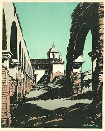

  
[Intangible Textual Heritage](../../../index)  [Native
American](../../index)  [California](../index) 

------------------------------------------------------------------------

<table data-witdh="75%">
<colgroup>
<col style="width: 50%" />
<col style="width: 50%" />
</colgroup>
<tbody>
<tr class="odd">
<td width="50%" data-valign="CENTER"></td>
<td width="50%" data-valign="CENTER"><h1 id="mission-memories" data-align="CENTER">Mission Memories</h1>
<h2 id="by-john-steven-mcgroarty" data-align="CENTER">by John Steven McGroarty</h2>
<h6 id="illustrated-by" data-align="CENTER">ILLUSTRATED BY</h6>
<h3 id="frederick-v.-carpenter" data-align="CENTER">Frederick V. Carpenter</h3>
<h4 id="no-renewal" data-align="CENTER">[1929, no renewal]</h4></td>
</tr>
</tbody>
</table>

------------------------------------------------------------------------

The author of this book, John Steven McGroarty (1862-1944) was poet
laureate of California, an author, journalist, dramatist, and unabashed
booster for the preservation and celebration of the California Missions.
He also served in Congress from 1935 to 1938. His drama, The Mission
Play, a three hour pageant spanning the entire history of the California
Missions, ran for twenty years at mission San Gabriel.

The real strength of this book is the illustrations. There is one major
drawing for each of the twenty one missions, plus [a map showing their
locations](mm24). I'm not so thrilled about the introduction, which
trivializes the native people and presents Mission life as utopian. My
policy is to leave these texts intact as a witness to the historical
context in which they were written. That said, it should be noted that
when McGoarty got to Congress, he sponsored legislation to abolish the
Bureau of Indian Affairs, angered over the treatment of Native
Americans. So he wasn't exactly blind to the realities of the situation,
nor unsympathetic.

The Missions had a dark side, none of which is hinted at in this book.
The native Californians had lived a sustainable, rich life for thousands
of years. They were herded into the Missions, stripped of their cultures
and languages, and worked into exhaustion. The Missions, European
diseases, and eventually the arrival of the Americans decimated the
Native Californian population.

------------------------------------------------------------------------

[Title Page](mm00)  
[The Old Missions of California](mm01)  
[Mission San Diego de Alcala](mm02)  
[Mission San Carlos de Carmelo](mm03)  
[Mission San Antonio de Padua](mm04)  
[Mission San Gabriel Arcangel](mm05)  
[Mission San Luis Obispo de Tolosa](mm06)  
[Mission San Francisco de Assisi](mm07)  
[Mission of San Juan Capistrano](mm08)  
[Mission Santa Clara de Assisi](mm09)  
[Mission San Buenaventura](mm10)  
[Mission Santa Barbara](mm11)  
[Mission La Purisima Concepcion](mm12)  
[Mission Santa Cruz](mm13)  
[Mission La Soledad](mm14)  
[Mission San Jose de Guadalupe](mm15)  
[Mission San Juan Bautista](mm16)  
[Mission San Miguel Arcangel](mm17)  
[Mission San Fernando Rey de Espana](mm18)  
[Mission San Luis Rey de Franca](mm19)  
[Mission Santa Ines](mm20)  
[Mission San Rafael Arcangel](mm21)  
[Mission San Francisco de Solano](mm22)  
[Index](mm23)  
[Locations of California Missions](mm24)  
[End page](mm25)  
