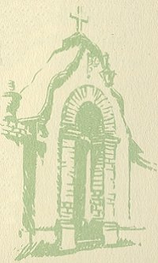
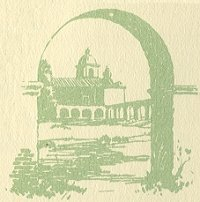
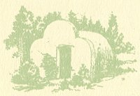
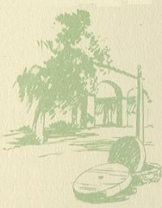

  
[Intangible Textual Heritage](../../../index)  [Native
American](../../index)  [California](../index)  [Index](index) 
[Previous](mm00)  [Next](mm02) 

------------------------------------------------------------------------

p. 7

 

# The Old Missions of California

|                     |
|---------------------|
|  |

HE very soul of romance was woven into the great adventure which brought
the white man's civilization to the Western shores of America. And it is
in California that the soul of this soul burst into flower.

When the Franciscan Mission Fathers arrived at San Diego in the year
1769 our California of today stretched before them a thousand miles of
desert. It was a beautiful desert, but for the purposes of civilized man
it was the desolation of a wilderness.

This wonderful body of trained Franciscan missionaries who came from
Spain up through the mysterious Mexican Peninsula to the bright shores
of the Bay of San Diego wrought upon the desert with magical hands. They
took an idle race and put it to work--a useless race that

p. 8

|                    |
|--------------------|
|  |

they made useful in the world, a naked race and they clothed it, a
hungry race and they fed it, a heathen race that they lifted up into the
great white glory of God. When the vast chain of twenty-one Missions
were at last completed through the toiling and patient years, California
was the happiest land the world has ever known. There was peace and
plenty, and hospitality became a religion. The great oaken doors of the
Missions swung inward with welcome to whomsoever might come. In those
days a man might travel from San Diego to Sonoma, a distance of seven
hundred miles, without a penny in his pocket and never lack for shelter
at night or food by day.

It was around the old Missions that the colorful social life of the
early Spanish inhabitants centered. Song and laughter filled the sunny
mornings. There was feasting and music, the strum of guitars and the
click of castanets under the low hanging moons. Toil was easy and the
burden of existence light. It was a sheer Utopia. Nothing like it ever
existed before, nor has any approach to it existed since.

p. 9

And yet the dream was not without difficulties for those who wrought it.
It was no small achievement to make a desert blossom as the rose and to
make so many blades of grass grow where none grew before. To look back
upon it now is like looking upon a beautiful play upon a stage
harmonized to the ear and eye and which those who see and hear accept so
happily but without a thought of the patient effort that was behind it
all.

When one looks back upon the achievement of the establishment of the
Franciscan Missions in California it is almost unbelievable that so many
difficulties were overcome and so many obstacles conquered.

The first great difficulty that presented itself to the Padres was that
in the different localities between San Diego and San Francisco the
Indian tribes spoke different tongues. It was necessary then to
establish a common language so that the natives of one place could
converse and have intercourse 

|                    |
|--------------------|
|  |

with those of another place. And so the Padres set themselves to work to
teach the Indians to speak the Spanish language. This they accomplished,
and the Indians of California to this day are familiar with the musical
tongue of Castile. Not only

p. 10

|                    |
|--------------------|
|  |

did they teach them to speak Spanish, but they taught them to read it
and to write it.

I think perhaps the least difficult task was the conversion of the
Indians to Christianity. They really had no religion of their own as
other savage peoples have had, and it appears that they willingly and
even eagerly accepted the glamorous creed of Christianity. Anyhow, it is
a fact that the whole race in California was Christianized. And the
remnant of the race that still exists will be found by whoever goes
among them to be very staunch Christians.

The miracle of inducing the California Indians to work was fully
achieved. The proof of it is the chain of twenty-one Mission
establishments which were erected and fashioned in beautiful
architecture, and which now, alas, lie in ruins between San Diego's
Harbor of the Sun and the peaceful and beautiful Sonoma in the Valley of
the Seven Moons.

The Mission Fathers while being primarily missionaries burning with zeal
for the conversion of the heathen Indians to the faith of Christianity,
were essentially practical men. And so they

p. 11

taught the natives to till the fields, to tend their flocks and to work
with marvelous skill at fifty-four different European trades. This race
that had lived idle and useless in a fruitful land was evolved by their
patient and loving teachers into skilled and useful people. The
granaries of the Missions were bursting with plenty, numberless sheep
and cattle roamed the shining hills and valleys, the land was vibrant
with the ring of the anvil and the whirr of looms. Every Mission was a
manual training school where the trades were taught and where the women
became skilled in weaving and all the domestic arts. Even the finer
things of life were taught to them. Music, painting and sculpture came
to be among their achievements and accomplishments.

There is a great deal of mis-information concerning the collapse of this
great dream. Many 

|                    |
|--------------------|
|  |

who are not informed seem to think that the fault is to be laid at the
doors of the Americans who began to come into California in considerable
numbers about the year 1846.

But, we are thankful to say, the black deed--for a black deed it
was--was not done by Americans.

p. 12

|                    |
|--------------------|
|  |

History has written the story down clearly and irrevocably. And what
happened was that the Mexican Government which then owned California,
seeing how rich the Indian had grown in the Missions which they had
builded with their own hands, simply confiscated them. Mexico drove the
Indians away, took the Missions into its own hands without warrant or
the slightest semblance of justice, sold them at auction to the highest
bidders, and pocketed the spoils.

The result was direful and calamitous. The Missions were abandoned and
fell into decay. Every vandal that wandered the King's Highway took from
them whatever suited his fancy, with none to say him nay. The great
domes and towers crumbled and fell in the wind and the weather. The bat
and the owl made their nests in the deserted rafters. The Indians were
driven back into the wildernesses of the mountains to starve and die.

This is, in brief, the story. And there is no other story in the annals
of time quite to compare with it. No other band of so few men
accomplished so much as the brown-robed brothers of St. Francis
accomplished in their day and generation in California.

p. 13

The Franciscans who bore in their beautiful rough brown hands the torch
of civilization to California, considered that the arts were a part of
education. So we find through the ruins evidence of a perhaps crude art
that is yet very beautiful. We find striking frescoes on the walls of
the churches, statuary hewn from wood and hammered from brass. We find
that musical instruments were made, upon which the natives were taught
to play exquisitely. One of the great traditions of the Missions is the
famous Indian orchestra of the Mission San Luis Rey where Fray Antonio
Peyri lived his wonderful life for many long and splendid years.

Through this education was evolved a distinctive architecture which is
today known and highly admired through the civilized world. All the
Mission structures were more or less beautiful, and some of them were
worthy to be classed among the best efforts of architecture in history.
The mission of San Antonio de Padua in Monterey 

|                    |
|--------------------|
|  |

County is said to have been the finest of the Northern Missions, while
San Fernando is considered to have been the finest of the Missions of
the South.

The glory of California today is its schools. The

p. 14

|                    |
|--------------------|
|  |

stranger within our gates is overwhelmed with the lavish beauty of our
school buildings--noble and stately structures that vie with the
architecture of Greece and Rome in their best days. I think that our
schools of today architecturally are the logical outcome of the
Missions. This may be said to be a far-fetched conclusion, but we must
remember that every civilization is builded on the ruins of the
civilization that preceeded it. And, is it to much to say that this is
as true of California as it is of any other land?

In the old days before civilization had reached the tremendous strides
that it has now attained the journey from Mission to Mission was made by
means of ox-carts or on horseback. The Mission Fathers themselves,
obeying the rules laid down by St. Francis, the founder of their order,
always walked.

The great road connecting the Mission establishments was called El
Camino Real, "The King's Highway." A portion of this original road may
still be seen as it was first made, if the traveler will look over the
little barranca adjacent to the Mission San Juan Bautista.

The great main State highway of California, stretching for practically
one thousand miles from

p. 15

north to south, passes nearly all the Missions. It is one of the finest
roads in the world, solidly paved with concrete and free from winter
inconveniences of snow and ice for the reason that snow and ice is
confined in California to the high mountains.

Wherefore, in these modern days the tourist and traveler may step into
an automobile at San Diego, set forth upon the great highway and make a
visit to all the Missions within the space of a few sunny days, finding
marvelous hostelries for shelter at night and food by day.

But, in the old times it was a day's journey alone from one Mission to
the other even on the back of a speedy horse. The Missions stand about
thirty miles apart, the one from the other. And in old times they were
the hospices of the land where travelers stopped and were always welcome
and no price to pay from one end of the journey to the other.

It is a glamorous tale, full of 

|                    |
|--------------------|
|  |

beauty and color and the grace of God. Nor has all the beauty and
romance departed. Though the Missions are in ruin, one can still sense
what glory and splendor once was theirs.

------------------------------------------------------------------------

[Next: Mission San Diego de Alcala](mm02)
