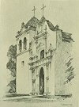

  
[Intangible Textual Heritage](../../../index)  [Native
American](../../index)  [California](../index)  [Index](index) 
[Previous](mm05)  [Next](mm07) 

------------------------------------------------------------------------

p. 24

 

### Mission San Luis Obispo de Tolosa

|                     |
|---------------------|
|  |

T is located in the present thriving city of San Luis Obispo and was
founded in 1772. Like nearly all the other Mission establishments much
of the structure has fallen from long years of neglect and the merciless
onslaughts of the wind and rain. However, the beautiful old church has
been restored and is again being used for the celebration of Divine
services. This Mission met with many discouragements in its early stages
but finally became highly prosperous.

p. 25

 

[  
Click to enlarge](img/02500.jpg)  
Mission San Luis Obispo de Tolosa  

 

------------------------------------------------------------------------

[Next: Mission San Francisco de Assisi](mm07)
