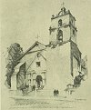

  
[Intangible Textual Heritage](../../../index)  [Native
American](../../index)  [California](../index)  [Index](index) 
[Previous](mm09)  [Next](mm11) 

------------------------------------------------------------------------

p. 32

 

### Mission San Buenaventura

|                     |
|---------------------|
|  |

HIS, the ninth Mission, was founded in 1783 and is located along the
main State Highway of California connecting Los Angeles with San
Francisco. When San Buenaventura was builded no bells were available for
it, and so wooden bells were substituted and the Mission became famous
for them. Another feature of San Buenaventura that will prove of no
small interest is the fact that within its walls may be found the
celebrated "Matrimonial Chair." Any young lady sitting in this chair is
assured of a good husband within a year following.

p. 33

 

[  
Click to enlarge](img/03300.jpg)  
Mission San Buenaventura  

 

------------------------------------------------------------------------

[Next: Mission Santa Barbara](mm11)
