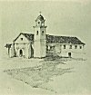

  
[Intangible Textual Heritage](../../../index)  [Native
American](../../index)  [California](../index)  [Index](index) 
[Previous](mm12)  [Next](mm14) 

------------------------------------------------------------------------

p. 38

 

### Mission Santa Cruz

|                     |
|---------------------|
|  |

HE Mission of the Holy Cross, not a trace of which now remains and the
site of which is identified only by a mark, was founded in 1791 where
the present city of the name now stands within the shadow of the great
redwoods and at one end of the shining crescent of the Bay of Monterey.
It was in its time a thriving establishment busy with the day's work and
filled with the anvil's music and the sound of whirring looms.

p. 39

 

[  
Click to enlarge](img/03900.jpg)  
Mission Santa Cruz  

------------------------------------------------------------------------

[Next: Mission La Soledad](mm14)
