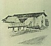

  
[Intangible Textual Heritage](../../../index)  [Native
American](../../index)  [California](../index)  [Index](index) 
[Previous](mm14)  [Next](mm16) 

------------------------------------------------------------------------

p. 42

 

### Mission San Jose de Guadalupe

|                     |
|---------------------|
|  |

HE fourteenth Mission, founded in 1797. Only a little of the structure
now remains but this little is available to sightseers in the Santa
Clara Valley not far from the City of San Jose. It was here that the
renowned Concepcion Arguello spent the last years of her life among the
Dominican Sisters whose community she joined when they came to
California. Her life and love story forms the theme of John Steven
McGroarty's Play "La Golondrina" (The Swallow) which is presented for a
short season each year in the Mission Playhouse at San Gabriel.

p. 43

 

[  
Click to enlarge](img/04300.jpg)  
Mission San Jose de Guadalupe  

 

------------------------------------------------------------------------

[Next: Mission San Juan Bautista](mm16)
