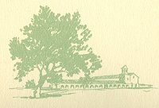
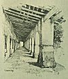

  
[Intangible Textual Heritage](../../../index)  [Native
American](../../index)  [California](../index)  [Index](index) 
[Previous](mm15)  [Next](mm17) 

------------------------------------------------------------------------

p. 44

 

### Mission San Juan Bautista

|                     |
|---------------------|
|  |

AMED in honor of St. John the Baptist and founded in 1797. So much of
the original structure remains, and in such enduring beauty, that no
traveler should miss a visit to it. It is located near the city of
Hollister in San Benito County, not far from Santa Cruz. Considerable
"restoration" has been done at San Juan Bautista. Near the old church
many of the historic adobe houses of California history are still
standing and occupied.

p. 45

 

[  
Click to enlarge](img/04500.jpg)  
Mission San Juan Bautista  

 

------------------------------------------------------------------------

[Next: Mission San Miguel Arcangel](mm17)
