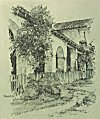

  
[Intangible Textual Heritage](../../../index)  [Native
American](../../index)  [California](../index)  [Index](index) 
[Previous](mm16)  [Next](mm18) 

------------------------------------------------------------------------

p. 46

 

### Mission San Miguel Arcangel

|                     |
|---------------------|
|  |

HRONOLOGICALLY the sixteenth of the Missions, founded in 1797. It is a
familiar sight still to passengers on the railway trains and automobiles
on the State Highway. A view of its ruins bespeaks the fact that it must
have been a thing of great architectural splendor in the days of its
glory. The original church still remains undisturbed with the frescoes
painted by the Indians still bright upon its gray walls. The Franciscan
Fathers have lately returned to its possession.

p. 47

 

[  
Click to enlarge](img/04700.jpg)  
Mission San Miguel Arcangel  

 

------------------------------------------------------------------------

[Next: Mission San Fernando Rey de Espana](mm18)
