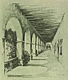

  
[Intangible Textual Heritage](../../../index)  [Native
American](../../index)  [California](../index)  [Index](index) 
[Previous](mm17)  [Next](mm19) 

------------------------------------------------------------------------

p. 48

 

### Mission San Fernando Rey de Espana

|                     |
|---------------------|
|  |

OUNDED in 1797 and located some twenty miles north of the City of Los
Angeles in the great San Fernando Valley this ruin is the most striking
landmark in Southern California. Prent Buell, the eminent authority on
Mission architecture, places San Fernando next to San Luis Rey as the
architectural Mission gem. A great bronze statue of Fray Junipero Serra
has been erected here, and the City of Los Angeles maintains a beautiful
floral park adjacent.

p. 49

 

[  
Click to enlarge](img/04900.jpg)  
Mission San Fernando Rey de Espana  

 

------------------------------------------------------------------------

[Next: Mission San Luis Rey de Franca](mm19)
