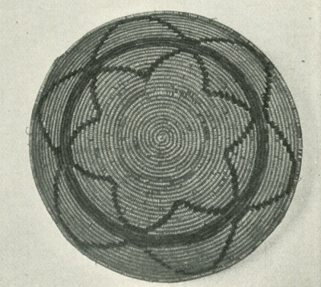

  
[Intangible Textual Heritage](../../../index)  [Native
American](../../index)  [California](../index) 

------------------------------------------------------------------------

<table width="75%">
<colgroup>
<col style="width: 50%" />
<col style="width: 50%" />
</colgroup>
<tbody>
<tr class="odd">
<td width="50%" data-valign="TOP"> 
UCPAAE 8 pl. 4, detail [1908] (Public Domain Image)</td>
<td width="50%" data-valign="CENTER"><h1 id="a-mission-record-of-the-california-indians" data-align="CENTER">A Mission Record of the California Indians</h1>
<h2 id="by-a.-l.-kroeber" data-align="CENTER">by A. L. Kroeber</h2>
<h5 id="ucpaae-vol.-8-no.-1-pp.-1-27" data-align="CENTER">UCPAAE Vol. 8, No. 1, pp. 1-27</h5>
<h4 id="section" data-align="CENTER">[1908]</h4></td>
</tr>
</tbody>
</table>

------------------------------------------------------------------------

[Contents](#contents)    [Start Reading](mrci00)    [Page
Index](pageidx)    [Text \[Zipped\]](mrcitxt.zip)

------------------------------------------------------------------------

This is an 'interrogatorio,' a survey taken in 1811 by the Spanish
government of Mexico regarding the status of the Native Californians at
each mission in Alta California, translated and heavily annotated by
A.L. Kroeber. Along with [Boscana's account](../bosc/index), this one of
the few glimpses we have of the Native Californians, when pre-contact
individuals were still alive. The accounts vary from friar to friar, but
some are very detailed and mention completely unknown placenames and
languages. There are reasonably value-free descriptions of religious
beliefs, mythology, language, dance, music and ethnobotany.

Most notably, this includes one of the few published accounts of the
elusive Esselen people, who inhabited the Big Sur coast (see [San
Carlos](mrci12)). Herein is recorded probably the only remaining
complete sentence in Esselen: *egenoch lalucuimxs talogpami ege salegua
lottos tahezapami laxlachis*, "The men who shoot well with a bow are
esteemed and well liked."

------------------------------------------------------------------------

 [Title Page](mrci00)  
[Introduction](mrci01)  
[San Diego](mrci02)  
[San Luis Rey](mrci03)  
[San Juan Capistrano](mrci04)  
[San Gabriel](mrci05)  
[San Fernando](mrci06)  
[Santa Barbara](mrci07)  
[Santa Ynez](mrci08)  
[San Luis Obispo](mrci09)  
[San Miguel](mrci10)  
[San Antonio](mrci11)  
[San Carlos](mrci12)  
[San Juan Bautista](mrci13)  
[Santa Cruz](mrci14)  
[Santa Clara](mrci15)  
[San Jose](mrci16)  
[San Francisco](mrci17)  
