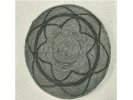

  
[Intangible Textual Heritage](../../../index)  [Native
American](../../index)  [California](../index)  [Index](index) 
[Previous](mrci12)  [Next](mrci14) 

------------------------------------------------------------------------

  
*A Mission Record of the California Indians*, by A.L. Kroeber, \[1908\],
at Intangible Textual Heritage

------------------------------------------------------------------------

#### *San Juan Bautista*. [56](#fn_56)

They say that the first Indians to settle this country came from the
north after a great flood; [57](#fn_57) that
some went back and did not return; and that here sprung the single
common language which is spoken in the seven missions about here,
although somewhat changed \[from place to place.\]

They did not have chiefs. The bravest and strongest were those who went
out to their wars. Every man acted as he wished.

------------------------------------------------------------------------

### Footnotes

[24:56](mrci13.htm#fr_56) The mission of San
Juan Bautista is farthest inland of those in Costanoan territory. The
dialect of San Juan Bautista, named Mutsun after a village near the
mission, is known from a grammar and phrase-book prepared by Father
Felipe Arroyo de la Cuesta, who is probably the author of the following
replies, as he was at San Juan Bautista at the time the report was
called for.

[24:57](mrci13.htm#fr_57) That the Indians of
this region believed in a great flood or primeval water, is corroborated
by such information as there is in existence about their mythology. That
they had a tradition of a migration from the north seems more doubtful,
not so much because there is any positive information to the contrary,
as that the most careful inquiries among nearly all the surviving tribes
of central California have failed to reveal the existence of any
migration legends or historical traditions. See the introduction to a
collection of Indian myths of south central California, published in the
fourth volume of the present series.

------------------------------------------------------------------------

[Next: Santa Cruz](mrci14)
