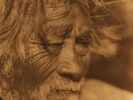

  
[Intangible Textual Heritage](../../../index)  [Native
American](../../index)  [California](../index)  [Index](index) 
[Next](nsd01) 

------------------------------------------------------------------------

  
*Notes on the Shoshonean Dialects of Southern California*, by A. L.
Kroeber, \[1909\], at Intangible Textual Heritage

------------------------------------------------------------------------

##### UNIVERSITY OF CALIFORNIA PUBLICATIONS

###### IN

#### AMERICAN ARCHAEOLOGY AND ETHNOLOGY

|                            |                    |
|----------------------------|--------------------|
| Vol. 8, No. 5, pp. 235-269 | September 16, 1909 |

# NOTES ON SHOSHONEAN DIALECTS OF SOUTHERN CALIFORNIA

###### BY

## A. L. KROEBER

#### BERKELEY

#### THE UNIVERSITY PRESS

\[1909\]

Scanned, proofed and formatted by John Bruno Hare at Intangible Textual
Heritage, April 2008. This text is in the public domain in the US
because it was published prior to 1923.

------------------------------------------------------------------------

[Next: Contents](nsd01)
