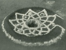

  
[Intangible Textual Heritage](../../../index)  [Native
American](../../index)  [California](../index)  [Index](index) 
[Previous](roli09)  [Next](roli11) 

------------------------------------------------------------------------

  
*The Religion of the Luiseño Indians of Southern California*, by
Constance Goddard DuBois, \[1908\], at Intangible Textual Heritage

------------------------------------------------------------------------

p. 97

### SACRED CHUNGICHNISH OBJECTS.

The Chungichnish worship was a religion of fear. When the people sent
the sun, Temet, into the heavens, he was to watch the people as
Tukmit, [40a](#fn_41) the Sky, also watches
them, to see if anyone does wrong, such as stealing food during a fast.
The North-star was also put there to watch and spy out everything. It is
like our spirit.

The moon, Moyla, was sent up there to look out for everything. In the
day-time the Sky and Sun watch the doings of men ; and in the night the
Moon does this, so no wrong doer can hide himself, for when one goes the
other comes. They keep changing places.

The people were afraid of the sun because he watches everything, and
they made it a rule always to eat before the sun rose in the morning.

Chungichnish still punishes, or did so lately. The Yapiche people went
to give toloache to Pio Amago, the last Indian who took, it, who lived
at La Jolla. Then the Potrero people began the dancing. It was not their
place to do so, and it made the others angry. Chungichnish saw that the
ceremony was not being properly performed. Suddenly the leader of the
dance fell to the ground in terrible pain. The father of Salvador Cuevas
was there and he was a medicine-man. He went to see what he could do.
When he examined the man he soon found out that the people were so angry
at him that he had got sick and that Chungichnish was hurting him. They
must come and be friends and he would get well. So they had a big talk,
and made up, and the man got up and became well.

Tourmaline was used to cure a man punished by illness by Chungichnish.
It was rubbed on his body. But if anyone unauthorized touched it, he was
punished.

All of the things mentioned as First People [40b](#fn_42) were sacred to Chungichnish. There were
many other things not remembered or not given in the list of them
obtained. Tukmul, the sacred winnowing basket, has already been
described.

p. 98

The sacred stick, Sivut paviut, [40c](#fn_43)
was brought from one pueblo to another in a ceremony, and served the
same purpose as money, being given in return for presents of food. These
sticks were painted red, white, and black. The old Diegueño chief, Cinon
Duro, had one of these from Rincon, one from Cahuilla, and one from Hot
Springs, long since lost.

The feather objects were sacred: the feather head-dress, the
eagle-feather skirt, and the feather band or "rope," Luiseño
tuminet, [40d](#fn_44) mentioned in the Diegueño
story of Chaup. Of the only specimen seen by the author, one part is in
the American Museum of Natural History, the remainder at the University
of California, where it is number 1-9580 in the Museum of the Department
of Anthropology ([Pl. 3](roli32.htm#img_pl03)) . This portion, very old
and much worn, is in three pieces, aggregating a total length of over
seven feet, the longest single piece being five feet, with an average
width of seven to eight inches. It is made of black feathers, four to
five inches in length. The base of each feather is stripped to the quill
for an inch and a half. The feathers are laid alternately, pointing in
opposite directions, and sewn together through their bases with two
threads. The backs of the feathers are all on the same side, thus giving
a uniform appearance to both the front and the back of the band.

The ceremonial use of this feather band is now uncertain. According to
the interpreter, this particular specimen was used in latter times in
the cure of men punished by Chungichnish with sickness. Those performing
the ceremony all took hold of it. Each one would then take a piece cut
off from the band and put it in the fire during the ceremony. This was
probably on account of its inherent value as an ancient Chungichnish
object, and not because it was designed for use in that way.

Venegas, quoting Father Torquemada, describes in the Island of Saint
Catherine (Santa Catalina) an Indian "temple," "a large level court, and
in it was a large circular space with an inclosure of feathers of
several birds of different colors, which I understood were those of
birds they sacrificed in great numbers.

p. 99

\[paragraph continues\] Within the circle
was an image strangely bedaubed with a variety of colors . . . holding
in its hand a figure of the sun and moon." Two tame ravens were within
the circle; and when the soldiers killed them the Indians fell into an
agony of fear.

It does not seem at all improbable that this is evidence of a form of
Chungichnish worship in one of "the islands of the ocean" from which it
originally came. The feathers used as an "inclosure" may have been made
exactly like the object in question which my interpreter called a
"feather rope."

The raven is the sacred Chungichnish bird, his messenger and spy.

Among the Diegueños, when the raven flies overhead he caws and says, "I
will kill you." Then the medicine-men would smoke their stone pipes, and
blow the smoke in invocation three times upward, saying, "Please don't
kill us."

Among sacred objects were classed various forms of smooth round pebbles
brought from the seashore, and pieces of crystal colored with lithia in
tourmaline formations.

------------------------------------------------------------------------

### Footnotes

[97:40a](roli10.htm#fr_44) Tukomit, night;
tupash, sky.—S.

[97:40b](roli10.htm#fr_45) See lists given in
the Creation myths below.

[98:40c](roli10.htm#fr_46) Paviut, stick with
crystal inserted in one end, and having a ceremonial use; shi’valum, sea
shells; perhaps sivut or shi’vul denotes pieces of shell glued to the
paviut.—S. The Diegueños call it Kotat.

[98:40d](roli10.htm#fr_47) Tuminut, wide feather
band slung over shoulder at tanish dance.—S.

------------------------------------------------------------------------

[Next: The Image Ceremony](roli11)
